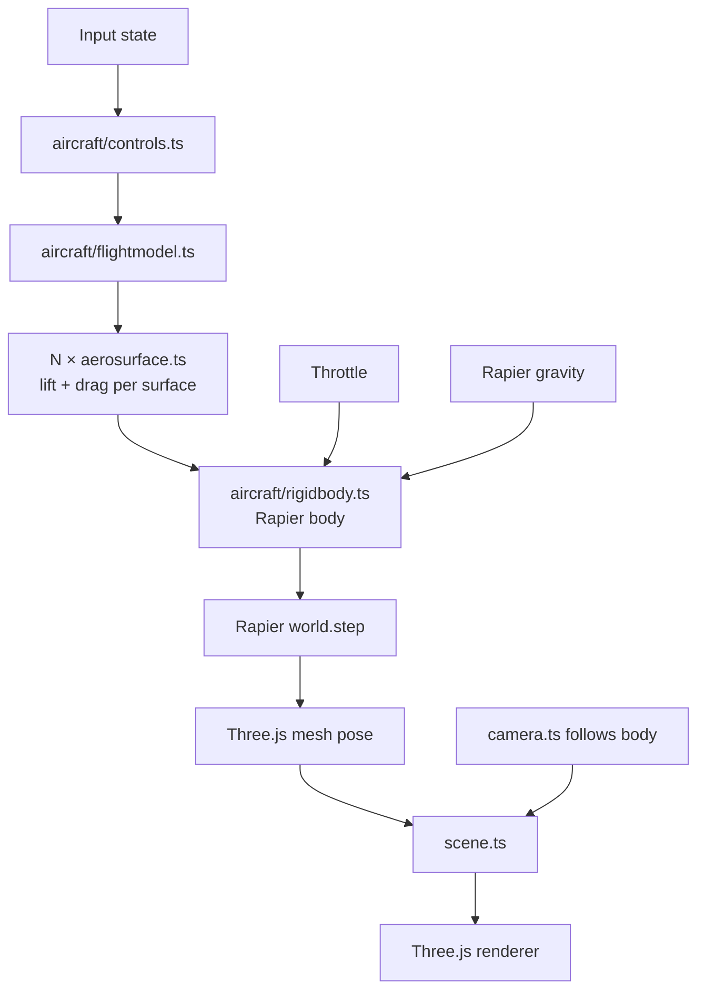

# Architecture

**Phase:** Phase 1 — Flight PoC. Architecture targets Phase 1 explicitly; decisions are chosen to not foreclose Phase 2 (missions) or Phase 3 (polish/ship), but Phase 2-specific systems (mission framework, AI, weapons) are only sketched, not designed.

## Tech Stack

- **Language: TypeScript** (strict mode) — per research. Aircraft physics math benefits from type safety; Three.js + Rapier both ship strong TS types.
- **Framework: none (vanilla Three.js)** — per research. We have minimal DOM UI. A render loop + ECS-lite module layout is simpler than a framework.
- **Rendering: Three.js** (latest stable, r170+) — per research.
- **Physics: Rapier3D** (`@dimforge/rapier3d-compat` for easy bundling; swap to `rapier3d-simd` in Phase 3 if perf needs it) — per research.
- **Build tool: Vite** (TypeScript template) — per research.
- **Dev UI: lil-gui** behind `?debug=true` — per research.
- **Perf: Stats.js** — FPS counter enabled from day one to catch regressions.
- **Database: none** — v1 is stateless. No persistence, no accounts.
- **Infrastructure: static hosting** (Vercel / Netlify / Cloudflare Pages — decide at deploy time; all are equivalent for a static build). No backend in v1.

## System Design

### Module layout

```
src/
  main.ts              # entry: bootstraps engine, starts loop
  engine/
    loop.ts            # fixed-timestep physics + variable-framerate render
    input.ts           # keyboard + mouse state, rebindable map
    assets.ts          # Three.js GLTF / texture loader wrapper
    debug.ts           # lil-gui + Stats.js, gated by ?debug=true
  world/
    scene.ts           # Three.js scene root, lighting, skybox
    terrain.ts         # Phase 1: flat textured plane + landmarks. Phase 3: swap in heightmap.
    camera.ts          # chase + cockpit cameras, swap via key
  aircraft/
    rigidbody.ts       # Rapier rigid body + Three.js mesh binding
    aerosurface.ts     # single lift/drag surface — computes force from local airflow
    flightmodel.ts     # composes aerosurfaces into an aircraft, applies to rigidbody
    controls.ts        # maps input state → control surface deflections
  mission/             # Phase 2 — stub in Phase 1, empty dir
  hud/                 # Phase 2 — stub in Phase 1, empty dir
  index.html
public/
  models/              # GLTF aircraft, textures
  config/
    aircraft.json      # tunable flight model constants (lift, drag, mass, thrust)
```

### Runtime structure



### Game loop

Fixed-timestep physics (60 Hz), variable-timestep render with interpolation:

1. **Input poll** — read keyboard + mouse, update input state.
2. **Controls** — map input → control deflections (elevator, aileron, rudder, throttle).
3. **Flight model** — for each aerosurface: compute local airflow velocity in surface frame, compute angle of attack, look up piecewise-linear CL/CD, produce force + application point.
4. **Apply forces** — sum aerosurface forces + thrust + gravity on the Rapier rigid body.
5. **Physics step** — `world.step()` at fixed dt = 1/60s. Accumulator pattern: run N steps per render frame if behind, skip if ahead.
6. **Sync mesh** — copy Rapier body pose to Three.js mesh transform.
7. **Camera** — chase camera lerps toward target pose; cockpit camera rigidly follows.
8. **Render** — Three.js renderer draws scene.

Separating physics tick from render tick is the standard game-loop pattern ("Fix Your Timestep!" / Glenn Fiedler) and is required for stable aircraft dynamics — Rapier produces wrong results at variable dt.

### Data flow

- **Config** (`public/config/aircraft.json`) → loaded once at boot → flight-model constants.
- **Input** → controls (per-frame) → flight model → rigid body (per physics tick).
- **Rapier world** → body pose (per physics tick) → Three.js mesh (per render frame).
- **No network I/O.** No persistence. Everything in memory.

## Key Decisions

- **D1 — Fixed-timestep physics.** Non-negotiable for flight dynamics. Variable timestep makes aerodynamic integration unstable (stalls oscillate, control response feels laggy on frame drops). Accumulator pattern decouples physics from render framerate.
- **D2 — Aerosurface as first-class primitive.** Every lift-producing part of the aircraft (main wing L, main wing R, horizontal stabilizer, vertical stabilizer, optional control surfaces) is an `AeroSurface` instance with its own position, orientation, area, and CL/CD curves. The flight model is a composition, not a monolith. Rationale: matches Khan & Nahon 2015 model from research; per-surface gives correct-feeling dynamics (banking-to-turn, stall, adverse yaw) automatically without hand-coded rules.
- **D3 — Flight model constants in JSON, not code.** Enables hot-tuning via lil-gui + "Export preset" button that writes back to the config shape. Addresses R2 (flight-feel tuning is iterative) from research. The biggest feel risk is tuning, so we architect for fast iteration.
- **D4 — Flat terrain in Phase 1.** Resolves R3 from research. Phase 1 scope is "plane flies plausibly," not "beautiful world." Flat textured plane + skybox + 2–3 placed landmarks (e.g. a runway, a tower) gives enough spatial reference for flying. Phase 3 polish can swap `terrain.ts` for a heightmap without changing anything else (well-defined interface: provide height-at-xz, provide a Three.js mesh, provide a Rapier collider).
- **D5 — Empty `mission/` and `hud/` dirs in Phase 1.** Explicit Phase 2 stubs. The module layout is intentionally chosen so Phase 2 work is additive — the flight model doesn't need to know about missions, the mission system reads read-only aircraft state.
- **D6 — No ECS.** Single aircraft, flat terrain, no AI in Phase 1. A full ECS (BitECS, miniplex) is overkill. Revisit at Phase 2 if multiple entities (AI enemies, waypoint markers, projectiles) push us past ~5 dynamic things. Swapping in miniplex later is well-scoped — it operates on plain objects.
- **D7 — Three.js + Rapier coordinate alignment.** Both libraries use right-handed Y-up coordinates by default — no transform needed at the sync boundary. One less bug class. Document this in a short `CONVENTIONS.md` when Phase 1 starts so nobody re-derives it.
- **D8 — No framework (React/R3F).** Per research. Revisit if mission-select / HUD grows beyond basic DOM overlays.
- **D9 — Static deploy, backend-less.** Whole game runs client-side. Simplifies infra, aligns with "no-install" vision principle (also: zero server cost).
- **D10 — Per-surface incidence (β1) is the trim mechanism.** Each `AeroSurface` carries an optional `incidenceRad` (default 0) representing the surface's fixed mount angle relative to the fuselage longitudinal axis. At zero body pitch, a wing with `incidenceRad = +2°` sees +2° AoA (positive lift); an h-stab with `incidenceRad = -1°` sees -1° AoA (small downward force behind CG, nose-up moment). This is the textbook airframe-level trim mechanism in real aircraft, and is the schema extension required to make the Phase 1 airframe expressible as a level-trim equilibrium. Rationale + sub-option comparison: see Revision 2026-05-11 below.
- **D11 — Missions are declarative JSON + optional script hook.** Each mission is a JSON file conforming to a `Mission` schema (objectives, win/fail conditions, spawn). Combat (WP16) registers a `scriptHook` for AI enemy behavior; the other three mission types (free flight, waypoint, takeoff/landing) are declarative-pure. Rationale + alternatives: see Revision 2026-05-12 below.
- **D12 — HUD is a DOM overlay.** CSS-absolute `<div>` layered over the canvas, with waypoint arrows positioned via `THREE.Vector3.project()`. Three.js ortho camera is rejected for v1 (no shader-based HUD elements planned). The `HUD` interface is the Phase 3 swap point. Rationale: see Revision 2026-05-12 below.
- **D13 — Per-surface AoA-rate damping (`clAlphaDot`, β5) is the phugoid-mode mechanism.** Each `AeroSurface` carries an optional `clAlphaDot` (default 0) that augments CL by `clAlphaDot · dα/dt`. Damps the phugoid mode (long-period coupled airspeed/AoA oscillation) that SURFACE-2026-05-11-04 logged. Default-zero ships in WP10.5; tuning is Phase 2 per-mission. Rationale + verification: see Revision 2026-05-12 below.
- **D14 — Headless physics harness + automated parameter search is the tuning methodology.** Physics mechanism tuning (β5 first; future βN extensions next) runs against a Node-side headless harness that steps the shipped Rapier physics + flight model at many multiples of wall-clock, scored against an envelope-probing fitness function, driven by a gradient-free optimizer (Nelder-Mead start; CMA-ES fallback). Replaces the manual `build → verify-self → guess` loop for any WP that adjusts `aircraft.json` physics constants. A harness↔browser parity test guards against drift. Rationale + cascade: see Revision 2026-05-12 (afternoon) below.

## Unknowns / deferred to Phase 2 arch pass

- **Mission framework shape** — declarative config? scripted? state-machine? Deferred; Phase 1 proves flight and answers "what does the aircraft expose?" which constrains the mission API.
- **AI enemy architecture** — behavior tree? hand-coded state machine? Deferred. Dependent on mission framework decision.
- **Damage model** — hitpoints? component damage? Deferred.
- **HUD framework** — DOM overlays vs Three.js orthographic layer. Deferred to Phase 2 — depends on what information the HUD needs to render (primarily numeric/iconic → DOM; mixed-world elements like waypoint arrows → Three.js).

These are explicitly Phase 2 concerns. The Phase 1 architecture does not pre-commit to any of them.

## Phase 2 / 3 forward-compat notes

- **Multiple aircraft:** `flightmodel.ts` already takes an aircraft config; multiple instances is just multiple bodies. Rapier handles N dynamic bodies cleanly.
- **Terrain swap:** `terrain.ts` interface (`getHeight(x, z): number`, `getMesh(): Three.Mesh`, `getCollider(): Rapier.Collider`) is chosen so a heightmap implementation is a drop-in.
- **Networking (explicit out-of-scope):** Not forward-compat with v1. Multiplayer would require rewriting physics authority, inputs, and sync. Not a goal.

## Revision 2026-05-11 — Per-surface incidence (trim-spawn schema extension)

**Context.** After the WP7 → AoA-sign-fix → static-margin-geometry-fix-ABANDONED chain, an `arch-handoff-trim-spawn.md` document captured a previously-unresolved architectural gap: the Phase 1 `AeroSurface` schema cannot express a trimmable airframe. With identical symmetric flat-plate curves at zero incidence on every surface, the wing and h-stab AoA are locked together by body attitude — any body pitch that produces wing lift produces proportional h-stab lift behind the CG, generating an unbounded nose-down moment with nothing in the model to counter it. No level-trim equilibrium exists in the current parameter space. Empirical evidence (four refuted hypotheses, including a perfect frame-0 trim-state spawn that diverged within 10 frames) is documented in `workflow/archive/static-margin-geometry-fix-ABANDONED.md` and `arch-handoff-trim-spawn.md`.

**The (2)-vs-(3) framing.** Three possibilities were considered:
1. **Physics is wrong** — Khan-Nahon per-surface model is inadequate. Rejected — the model matches a well-studied reference and is internally consistent.
2. **Physics is right, schema is too restrictive** — the model can express physics correctly but the *parameter manifold* (mass, thrust, areas, surface positions, clSlope, stallAlpha) does not contain a flyable-airplane point. **Accepted as the working hypothesis (~85% confidence).** Strongest evidence: a perfectly-initialized frame-0 trim state (throttle=0.5, +6° body pitch, pRate=0, vSpd=0, airspeed=30 m/s) left the trim state within 0.16 seconds. Local stability would have held it; instead there is no fixed point nearby.
3. **Physics + schema are right, tuning is just hard** — held in reserve. See "Fallback path" below.

**Decision (D10): adopt β1 per-surface incidence.** Per the operator directive of 2026-05-10 ("aircraft must spawn airborne in a stable initial state, fly straight indefinitely"), Option β (airborne trim spawn — requires schema extension) is the path. Among four sub-options considered (β1 per-surface incidence, β2 cambered CL curve, β3 trim-elevator at spawn, β4 `cl_q` pitch-rate damping), **β1 is selected** for these reasons:

- Real airframes solve trim exactly this way (wings at a few degrees positive incidence, h-stab at zero or slightly negative). Mechanically obvious — "this surface is bolted on at angle X."
- Smallest schema change: one optional `incidenceRad` field on `AircraftSurfaceConfig` with default 0. The default-zero behavior is identical to current behavior, so the existing 227 tests continue to pass.
- Preserves the symmetric flat-plate curve as a clean primitive — no per-surface camber asymmetry to reason about.
- ~50 LOC, ~half-day implementation.
- Strong physical priors on parameter values (wings +1°..+3°, h-stab -1°..+1°) bracket WP7 retune to a small search.

β2 (cambered CL curves) was rejected as redundant — same outcome via a less mechanically obvious mechanism with per-surface JSON awkwardness. β3 (trim-elevator) was rejected because it does not solve the lift-source problem alone (wings still need to produce lift at level body attitude) and a permanently-deflected trim elevator creates a poor "first-key-press fights the offset" feel. β4 (`cl_q` damping) is **held in reserve as a follow-up**: damping does not create equilibria, only lets perturbations near one decay; if post-D10 verify-self shows residual integrator-drift wobble around the new trim point, β4 becomes a small follow-up extension.

**Schema specifics (binding for the implementation WP):**

- Add `incidenceRad?: number` to `AircraftSurfaceConfig` (default 0 — backward compatible).
- Plumb through `parseAircraftConfig` → `AeroSurface` constructor.
- In `computeAeroForce`, rotate the surface's local `normal` and `chord` by `incidenceRad` about its span axis before computing local airflow. Equivalently, rotate the local airflow vector by `-incidenceRad` about the span axis before AoA computation; pick whichever produces the cleaner diff against the current implementation.
- Span axis is already pre-baked on each surface (used for control-deflection rotation in WP6). Reuse it.
- Tests: default `incidenceRad=0` must produce bit-for-bit identical force vectors to current behavior on the existing 227 cases. Two new tests assert (a) a level-flow surface with non-zero `incidenceRad` returns non-zero lift in the expected direction, (b) the rotation is independent of body attitude (it's a surface property, not a body property).

**Fallback path (case (3), kept warm).** If a hand-tuned β1 airframe in WP7 Phase E fails to converge on a stable level-trim-and-fly state within ~two tuning sessions — i.e., the parameter space is too high-dimensional, too non-convex, or has too-narrow valid regions for human bracketing — pivot to building automated parameter-search tooling. Fitness function sketch: `spawns airborne ∧ flies straight 30s ∧ max|pRate| < 360°/s ∧ altitude ∈ [spawn ± 50m] ∧ airspeed ∈ [25, 35] m/s`. Search method: gradient-free (CMA-ES or random-restart hill-climb) over `aircraft.json` knobs. This is a meta-task with real opportunity cost (it defers the actual flight-sim work and conflicts with the vision principle "ship a casual flight sim, not a parameter-fitter"), so we explicitly DO NOT build it preemptively. The hedge is recorded here so the WP7 successor handoff has a documented escalation path if hand-tuning runs aground.

**Forward implications:**

- A new WP6.5 (β1 implementation) is inserted in `wbs.md` immediately before WP7 Phase E. Resolves the airborne-stable-spawn blocker.
- WP7 Phase E retune (currently paused) resumes against the β1 baseline after WP6.5 ships.
- WP9 Phase 1 verification remains blocked behind WP7.
- `arch-handoff-trim-spawn.md` is closed by this revision (state: resolved).
- `SURFACE-2026-05-10-02` in `workflow/backlog.md` closes-by-implementation when WP6.5 ships and produces verified airborne stable flight.

## Revision 2026-05-12 — Phase 2 arch revision (mission framework + HUD + β5 phugoid damping)

**Context.** Phase 1 closed 2026-05-11 (WP1–WP9 + WP9.5 + WP9.6 all shipped, 246/246 Vitest + 1/1 Playwright green). The original arch (2026-05-11) explicitly deferred three Phase 2 concerns to a Phase 2 revision: (a) mission framework shape, (b) HUD approach, (c) AI enemy architecture (held for WP16 design). It also left `SURFACE-2026-05-11-04` (phugoid mode undamped) as a Phase 2 candidate. This revision settles (a) and (b) and adopts a small schema extension (β5) to address the phugoid architecturally before Phase 2 feel-tuning begins.

**Driving mode disclosure (operator-as-architect deviation).** Per `feedback_operator_as_external.md`, the operator selected full-autopilot for this session, so the architect role for this revision is performed by the agent rather than by the operator (who would normally be the human-in-the-loop for arch decisions). All three decisions below are made in operator-as-architect mode. **Phase 3 re-validation hook:** all three decisions are reviewable at WP21 (cross-browser QA) or earlier if Phase 2 verification surfaces an integration problem. If a decision turns out to be wrong, the cost is bounded — D11 has a documented swap point (`Mission` interface), D12 has a documented swap point (`HUD` interface), D13 is a per-surface optional field defaulting to 0.

---

### D11 — Mission framework: declarative JSON + optional script hook

**Decision.** Each mission is a JSON file in `public/missions/<name>.json` conforming to a `Mission` schema. The schema declares: `id`, `name`, `type` (free-flight | waypoint | takeoff-landing | combat), `objectives[]` (typed entries — waypoint reach, runway touchdown, target destroyed), `winCondition` (declarative — "all objectives complete" by default), `failCondition` (declarative — timer expiration, crash, etc.), `spawn` (position, velocity, throttle), and an optional `scriptHook` string naming a registered TypeScript callback.

**Loader contract.**
```
loadMission(id: string): Promise<Mission>
```
Returns a `Mission` object. The `mission/runner.ts` module owns the lifecycle (`load → start → tick → complete | fail`), reads aircraft state via the existing `window.__aircraft.getState()`-equivalent typed interface (NOT via the debug global), and emits objective state changes for the HUD to consume.

**Script hooks.** Combat (WP16) is the only mission type that anticipates needing imperative logic beyond declarative objectives — specifically AI enemy behavior. Solution: missions may name an optional `scriptHook` whose implementation lives in `mission/hooks/<name>.ts`, registered at boot. The hook receives `(missionState, aircraftState, dt)` per tick and may mutate mission-local state and spawn/despawn entities. WP13 (free flight), WP14 (waypoint), WP15 (takeoff/landing) require **no** script hook — all four are declarative-pure for those three. **Only WP16 (combat) is expected to register a script hook** for the AI enemy.

**Why declarative JSON over scripted-class or state-machine.**
- **Aligns with D3** (constants in JSON, not code). The mission set is small and tuning-heavy — JSON enables rapid iteration without rebuilds, exactly mirroring `aircraft.json`'s role.
- **Aligns with vision principle 4** ("mission variety over depth"). Four shallow missions × declarative-objectives composition is structurally simple; scripted classes would over-engineer for variety we're not building.
- **Keeps `mission/` small.** A scripted-class approach makes every new mission a new TypeScript file and a new test file. JSON missions need only a schema validator (TypeScript runtime guard, ~30 LOC, same pattern as `parseAircraftConfig`).
- **State-machine alternative** was rejected as a generalization not earned by Phase 2 scope. State machines pay off when missions have multi-phase progression (takeoff → cruise → land), but WP15 is the only such mission, and its phases compose cleanly as ordered objectives in a declarative list. If Phase 3 reveals a mission type that genuinely needs SM semantics (event-driven branching, parallel states), the script-hook escape is the swap point.
- **Script-hook escape preserves the rejected paths' upside.** WP16's AI enemy gets imperative control — the path full-script would have provided — without forcing the other three mission types to pay that complexity tax.

**Trade-off accepted.** Declarative-JSON missions are constrained to the schema. If WP14 (waypoint) or WP15 (takeoff/landing) discovers a need for objective semantics not in the schema, the response is to extend the schema (additive, backward-compatible), not to escape into the script hook. The script hook is reserved for AI-style emergent behavior, not for working around schema gaps.

**Schema sketch (binding for WP11 implementation):**
```ts
type Mission = {
  id: string;
  name: string;
  type: 'free-flight' | 'waypoint' | 'takeoff-landing' | 'combat';
  spawn: { position: Vec3; linvel: Vec3; throttle: number };
  objectives: Objective[];
  winCondition?: 'all-objectives';        // default 'all-objectives'
  failCondition?: FailCondition;          // default 'crash'
  timeoutSec?: number;                    // optional fail-on-timeout
  scriptHook?: string;                    // optional, registered name
};

type Objective =
  | { kind: 'reach-waypoint'; position: Vec3; radius: number; order: number }
  | { kind: 'touchdown'; runway: { center: Vec3; halfExtents: Vec3 }; maxVSpeed: number }
  | { kind: 'destroy-target'; targetId: string };

type FailCondition = 'crash' | 'timeout' | 'out-of-bounds';
```

The exact schema is finalized at WP11. The runtime guard (analogous to `parseAircraftConfig`) and the test suite live in `src/mission/`.

**Phase-3 swap point.** The `Mission` interface (loader + runner + objective state) is the public boundary. If a future mission type needs full-script semantics, replace `loadMission` with a scripted-class factory — `mission/runner.ts` stays the same. Cost of a wrong call at D11 ≈ rewriting `mission/loader.ts` and the missions themselves (~half-day per mission). No physics/render impact.

### D12 — HUD: DOM overlay (CSS-positioned absolute layer on top of the canvas)

**Decision.** v1 HUD is a CSS-absolute `<div>` overlay layered on top of the `<canvas>`. Static elements (altitude readout, airspeed readout, current-objective text, status banner) are plain DOM nodes updated each frame. The one world-anchored element — waypoint directional arrow for WP14 — is a DOM node positioned each frame via `THREE.Vector3.project()`-to-screen-coords (well-trodden pattern, ~20 LOC). HUD lives in `src/hud/`; the existing empty `hud/` dir (D5) becomes populated.

**Why DOM over Three.js orthographic camera.**
- **Aligns with D8** (no framework). HUD content is overwhelmingly numeric/text. DOM text is crisper than 2D-text-rendered-in-WebGL (no anti-alias surprises across Chrome/Safari/Firefox), free DPI handling, and accessible to copy-paste / a11y tooling for free.
- **Cheaper to iterate.** CSS for layout, plain DOM for content. No `OrthographicCamera` second-render-pass cost. The Phase 1 budget is already tight per R5 — adding a second render pass for HUD is a perf risk we don't need to take.
- **Aligns with D9** (static deploy, simple infra). DOM HUD is "open devtools, inspect, edit CSS" — the lil-gui ethos applied to the player-facing UI.
- **Three.js ortho camera was rejected** because its main upside (mixing with in-world particles, shaders, post-processing effects) is a Phase 3 polish concern. v1 HUD shows altitude/airspeed/objective — there is no shader-based HUD element planned for v1.

**HUD interface (binding for WP12 implementation):**
```ts
interface HUD {
  setAircraftState(state: AircraftState): void;     // altitude, airspeed, throttle
  setObjective(text: string | null): void;          // current objective text
  setWaypointArrow(worldPos: Vec3 | null): void;    // world-space target, or null to hide
  setStatus(status: 'flying' | 'won' | 'failed', text?: string): void;
  show(): void;
  hide(): void;
}
```
Implementation in WP12: `src/hud/dom-hud.ts`. The interface is the swap point — a `three-hud.ts` (ortho camera) implementation could be added at Phase 3 if v1 playtesting reveals a HUD design that needs world-shader effects.

**Trade-off accepted.** DOM HUD couples to the page DOM; if the canvas needs to be embedded in a third-party iframe with strict isolation, the HUD overlay would need rework. **This is not a v1 concern** — vision says "open a URL," not "embeddable widget." If embedding becomes a goal, swap to `three-hud.ts`.

**Phase-3 swap point.** The `HUD` interface boundary is the swap point. Cost of a wrong call ≈ reimplementing the four `set*` methods in a Three.js ortho impl (~half-day) plus rewiring waypoint-arrow projection (already lives behind the interface). No mission-framework impact.

### D13 — β5 AoA-rate damping (`clAlphaDot`) — closes SURFACE-2026-05-11-04 architecturally

**Decision.** Extend the per-surface schema with an optional `clAlphaDot?: number` field (default 0 — backward-compatible). At per-surface force computation, lift is augmented by a term proportional to `dα/dt`, the time-rate-of-change of local angle-of-attack. This adds AoA-rate damping that suppresses the phugoid mode (long-period oscillation involving coupled airspeed and AoA changes — the failure SURFACE-2026-05-11-04 documented under non-zero throttle forcing).

**Mechanism (binding for WP10.5 implementation — see WBS).**
At each call to `computeAeroForce`, the surface tracks its previous-tick local AoA. Current `dα/dt ≈ (α_now − α_prev) / dt_physics`. The lift coefficient is augmented:
```
CL_effective(α) = CL_lookup(α) + clAlphaDot · (dα/dt)
```
For `clAlphaDot = 0`, behavior is bit-for-bit identical to current behavior (the existing 246 tests must continue to pass — same default-zero parity contract as β1 and β4).

**Sign convention:** positive `clAlphaDot` produces a lift force opposing rapid AoA increase — i.e., damps the AoA oscillation. Physical analog: a wing whose camber transiently lags as α changes (real airfoils have small but nonzero `cl_α̇` in unsteady aero theory; this is a simplified Theodorsen-like effect).

**Why β5 is in the arch revision, not deferred to a Phase 2 feature WP.**
- **It is a schema extension**, not a tuning value. Schema extensions belong in arch by D2 ("aerosurface as first-class primitive"). Adding `clAlphaDot` mid-Phase-2 to a non-blocking feature WP risks scope creep on that WP.
- **WP10 is the natural moment.** Phase 2 verification (any of WP13–WP17) will hit the phugoid if mission types include level-cruise expectations (waypoint, combat). Better to land β5 in the arch revision and tune in Phase 2 feature WPs than to discover it mid-WP14.
- **Symmetric with the β1/β4 pattern in the original revision.** β1 and β4 were both schema-with-default-zero extensions; β5 follows the same shape. The pattern is established and tested.

**Why not β2 (cambered CL curves) or β6 (full unsteady aero)?**
- β2 was rejected in Rev 2026-05-11; that rejection stands.
- Full unsteady aero (Theodorsen function, indicial response) is study-level fidelity, explicitly out of scope per vision ("plausible over perfect"). β5 is the minimum-mechanism extension that addresses the phugoid divergence — first-order damping on AoA rate.

**Risk + verification approach.**
- **Risk:** β5 may interact with β4 (pitch-rate damping) in ways that look like over-damping or "soggy" feel. Per-surface `clAlphaDot` is tuned independently and starts at 0 until tuned.
- **Verification (binding):** any future tuning of β5 must verify against a **≥30-second** Playwright probe with non-zero throttle (`0.05, 0.15, 0.4`) — single-period observation hides phugoid behavior. Matches the backlog's existing `SURFACE-2026-05-11-04` verification requirement. Memory `feedback_verify_self_envelope.md` applies here.
- **Default `clAlphaDot=0`** ships in WP10.5; actual non-zero tuning is a Phase 2 deliverable when (and only when) a mission requires sustained level cruise (waypoint, combat).

**Schema specifics (binding for WP10.5 implementation):**
- Add `clAlphaDot?: number` to `AircraftSurfaceConfig` and `AeroSurfaceConfig`. Default 0, finite-number validation.
- Plumb through `parseAircraftConfig` → `AeroSurface` constructor.
- Track previous-tick AoA on the `AeroSurface` instance (one new scalar field). Use the physics `dt` (fixed timestep) for finite difference — NOT the variable render `dt`.
- In `computeAeroForce`, compute `dα/dt` and augment CL by `clAlphaDot · dα/dt`. Skip on first tick (prev-AoA undefined) — return baseline CL only. Document this in CONVENTIONS.md.
- Tests: (a) default `clAlphaDot=0` produces bit-for-bit identical force vectors to current behavior on existing 246 cases. (b) Non-zero `clAlphaDot` with constant α produces zero augmentation (dα/dt=0). (c) Non-zero `clAlphaDot` with α_now > α_prev produces additional lift in the +α direction with positive sign (damping convention). (d) First-tick behavior: no augmentation, baseline only.

**Closes-by-implementation:** SURFACE-2026-05-11-04 once `clAlphaDot` is wired AND a Phase 2 mission requires the level-cruise feel and tunes non-zero values. The schema landing in WP10.5 closes the **arch gap**; tuning closes the surface entry.

---

### Forward implications (WBS updates required)

- **Insert WP10.5: β5 (`clAlphaDot`) schema extension** in `wbs.md` Phase 2, between WP10 and WP11. Size: XS (schema-only, default-zero parity). Same shape as WP6.5 + WP6.6.
- **WP11 (mission framework)**: locked to the D11 declarative-JSON + script-hook design.
- **WP12 (HUD)**: locked to the D12 DOM-overlay design with `HUD` interface.
- **WP14 (waypoint)**: implements `setWaypointArrow` via `THREE.Vector3.project()` per D12.
- **WP15 (takeoff/landing)**: declarative `touchdown` objective per D11 schema; no script hook needed.
- **WP16 (combat)**: the one mission with a `scriptHook` for AI enemy. Hook lives in `src/mission/hooks/combat-ai.ts`. AI architecture (behavior tree vs FSM) is **still deferred** to WP16 design — the script hook gives WP16 the freedom to choose without re-opening arch.
- **WP17 (Phase 2 verification)**: must include a ≥30s level-cruise probe to validate β5 (separate from per-mission verification).

### Unknowns / deferred to Phase 3 arch pass

- **AI enemy architecture** (behavior tree, FSM, scripted): still deferred. The `scriptHook` in D11 makes this a per-WP16 decision rather than an arch decision. If WP16 surfaces a generalization need, P12 SURFACE-IN.
- **Damage model**: still deferred. Hitpoints scalar on a destructible-entity type is the v1 minimum; deeper component damage is Phase 3 polish if at all.
- **Bundle size (SURFACE-2026-04-19-01)**: still Phase 3 (WP18/WP21). No arch change.
- **Multiplayer**: out of scope per vision. No arch.

## Revision 2026-05-12 (afternoon) — D14: Physics tuning harness + automated parameter search

**Context.** WP14.5 attempted to tune the β5 (`clAlphaDot`) mechanism that landed in WP10.5 (D13). Three Playwright-driven tuning attempts (+5/+10, +1/+2, -1/-2 on wings/h-stab) all diverged catastrophically — at every sign, every magnitude, every operating regime tested. The WP14.5 retrospect surfaced two findings: (1) the β5 mechanism itself is dimensionally wrong (raw `dα/dt`, no V-normalization — see SURFACE-2026-05-12-03), and (2) the *methodology* of tuning Phase-2 physics by hand-driven `feature-build → verify-self → adjust` loops cannot scale to the search density that real aero coefficients need. Three attempts under `feedback_retune_attempt_budget.md` is the right discipline for refuting a mechanism, but the budget was hit before any meaningful parameter-space coverage was achieved. Per-attempt cost: ~5 minutes of Playwright probe + agent reasoning across three throttle bands. Search density: 3 points in a 2-knob × 3-regime space — sparse to the point of being uninformative.

This revision is the operator-acknowledged escalation from "the β5 mechanism is wrong" to "we lack a systematic way to search physics parameter space at all." It pauses Phase 2 mission progress (post-WP14 line) and routes the next several WPs through harness + optimizer infrastructure rather than further mission content.

**Driving mode disclosure.** Operator-as-architect deviation continues under full-autopilot drive mode per `feedback_operator_as_external.md`. The decision sketch below was reviewed and accepted by the operator before this revision was written; the operator explicitly framed the requirement as "search 100+ combinations, without Playwright, with regression/convergence." All architectural specifics below are the agent's working-out under that framing. **Phase 3 re-validation hook:** D14's design is reviewable at WP21 (cross-browser QA) or sooner if the cascade WPs (14.6/14.7/14.8) surface a problem.

---

### D14 — Physics tuning harness + automated parameter search

**Decision.** Tuning of physics mechanism coefficients in `aircraft.json` (β4 `clQ`, β5 `clAlphaDot`, future βN extensions, plus shared knobs like mass, area, thrust) is performed by a Node-side headless harness that steps the shipped flight model and physics engine without browser, render, or HUD overhead, at as-fast-as-CPU-allows wall-clock. The harness is driven by a gradient-free optimizer that fits a regression to the score surface and converges on parameter values that satisfy an envelope-probing fitness function. Replaces the manual lil-gui + Playwright-probe loop for any WP that adjusts physics constants.

**Why this is arch-level, not feature-level.**
- **Changes module topology.** `src/aircraft/flightmodel.ts` and `src/aircraft/rigidbody.ts` currently bind directly to Rapier-WASM-loaded-in-browser. The harness needs the same physics code executable in Node. That requires extracting a framework-agnostic core, and that's a `src/` reorg — not a tooling add.
- **Changes the tuning workflow.** Phase 2 WPs (WP15, WP16, WP14.5-retry) previously had "tune values in lil-gui" as an implicit verify-self path. With D14, the tuning step becomes a separate harness-run that emits a `aircraft.json`-shaped artifact, which the WP then commits. This is a process change worth codifying in CLAUDE.md alongside the two physics-mechanism discipline rules from the WP14.5 retrospect.
- **Introduces a new test tier.** Vitest (unit), Playwright (e2e), and now **harness sweeps** (slow, parameter-search). CLAUDE.md "Testing" section grows by one tier. Harness sweeps are too slow for CI on the default path; CI runs the harness↔browser parity test only (fast).
- **Has a long-lived dependency on Rapier semantics.** If Rapier is swapped (e.g., to `rapier3d-simd` per D-tech-stack), the harness moves with it. That's an arch-level coupling, not a tooling concern.

---

#### D14.1 — Execution strategy: Rapier in Node, not pure-TS re-implementation

**Three candidate execution strategies were considered:**

1. **Node-side Rapier** (chosen). Use `@dimforge/rapier3d-compat` directly from Node — the same WASM binary that ships to the browser. Step the world manually as fast as the CPU allows in a `while` loop. No render budget, no requestAnimationFrame, no fetch-for-config — just `world.step()` in a tight loop. Expected throughput: 50–200× wall-clock on the operator's mid-range laptop (60 Hz physics × 50× = 3000 simulated seconds/sec, so a 30s probe runs in ~0.6s of CPU).
2. **Pure-TS physics core extraction.** Replace Rapier with a minimal Euler/RK4 integrator we own in TS. Faster (no WASM boundary) and lighter, but **introduces a behavioral fork** between harness and browser. WP14.5's lesson is that pure-math correctness is decoupled from physical correctness; introducing a second physics engine is a second place for those two to diverge. Rejected.
3. **Stub-Rapier shim.** Mock just the methods `flightmodel.ts` calls; keep the rest of Rapier behind a thin protocol. Lighter than (1) but the protocol surface (gravity, collision detection, rigid body integration) is exactly the part where Rapier's correctness matters. Rejected for the same reason as (2).

(1) wins because **harness physics = shipped physics** by construction. No drift class. The cost is paying the WASM boundary overhead per step, which is bounded — `world.step()` in Rapier is microseconds, and we get ~50–200× wall-clock anyway.

**Determinism contract.** Rapier is deterministic at fixed-dt given identical input sequences and identical initial conditions. The harness MUST:
- Seed any RNG inputs explicitly (currently the flight model has none; if Phase 2 adds wind/turbulence, that becomes a seed input).
- Use fixed-dt = 1/60s (matches browser; per D1).
- Take initial conditions (position, linvel, ang vel, throttle, control deflections) as explicit harness input, not from `aircraft.json` spawn defaults (which are mission-coupled and could change).
- Step the world a fixed number of ticks per run; do NOT use any "wall-clock until convergence" loop — the loop is deterministic in tick-count.

A regression-fitting optimizer needs deterministic objective values; non-determinism turns gradient signal into noise.

---

#### D14.2 — Module reorg: extract physics-core layer

To make `flightmodel.ts` callable from Node without dragging Three.js or browser globals, the following reorg is required:

**Current state.**
- `src/aircraft/rigidbody.ts` imports both Rapier AND Three.js. The Three.js dependency is for `syncMesh()` (writes Rapier pose into a Three.js mesh).
- `src/aircraft/flightmodel.ts` imports Rapier types and `BodyState`. No direct Three.js.
- `src/aircraft/aerosurface.ts` is already framework-agnostic — pure math + Rapier scratch types.

**Target state.**
```
src/
  aircraft/
    physics-core/                 # NEW — framework-agnostic, Node-compatible
      aerosurface.ts              # MOVED — already pure
      flightmodel.ts              # MOVED — drop the Three.js leakage if any
      rigidbody-core.ts           # NEW — Rapier-only RigidBody, no Three.js
      state.ts                    # MOVED — AircraftState plain-data (already exists)
      config.ts                   # MOVED — parseAircraftConfig (synchronous parse; loader stays)
      step.ts                     # NEW — composable single-tick step function
    rigidbody.ts                  # KEPT — Three.js mesh binding + delegates to rigidbody-core
    controls.ts                   # KEPT — Three.js-free already; stays here for locality
```

The split criterion is: **can this code run in Node with only `@dimforge/rapier3d-compat` and `aircraft.json` as inputs?** If yes → `physics-core/`. If no (Three.js mesh, DOM input events, lil-gui) → outside.

Modules under `physics-core/` are the only ones the harness imports. The browser entry (`src/main.ts`) imports from both `physics-core/` and the browser-side wrappers. **No behavioral change** — pure file moves + interface tightening. Vitest tests follow their moved modules.

**Why this is safe.** The split criterion is mechanical (does it import `three`?). The 385/385 Vitest suite covers the moved code. The harness↔browser parity test (D14.3) guards against silent drift after the move.

---

#### D14.3 — Parity test: harness must not drift from browser

The single biggest risk in D14 is **harness/browser drift** — the harness's trajectories silently diverging from what the browser actually produces, so the optimizer converges on values that are wrong in the shipped game. Mitigation is structural:

**Parity test contract:**
- A fixed set of initial-condition fixtures (currently: WP14.5's three throttle bands @ 0.05/0.15/0.4 starting from `(0,50,0)` with linvel `(0,0,-30)`). Easily extended.
- The harness runs each fixture for N ticks (start at N=1800 → 30s) and emits a trajectory CSV: `tick, posX, posY, posZ, vX, vY, vZ, pitch, yaw, roll, airspeed`.
- A Playwright spec under `tests/e2e/parity.spec.ts` runs the same fixtures in-browser at fixed-dt (skip render interpolation) and emits the same CSV via `window.__aircraft.getTrajectory()`.
- A Vitest spec diffs the two CSVs column-by-column with a tight tolerance (`|Δ| < 1e-6` per scalar, except angles which use shortest-arc distance). Any divergence fails CI.

The tolerance is tight on purpose. We are using the same Rapier WASM with the same fixed-dt and the same code path — bit-identity is the expected default; any drift indicates the split was not clean.

**Determinism caveat.** If parity-test failures show up cross-platform (Mac vs Linux CI), that's evidence that WASM is non-deterministic across the boundary and we need to either pin a single platform for harness runs or relax tolerance with care. Treat this as a SURFACE if hit.

---

#### D14.4 — Score function: envelope-probing fitness

The optimizer needs a scalar score per parameter point. The score function is the load-bearing piece — see WP14.5's catastrophic failure mode (Attempt 1 *appeared* to work at one throttle and broke at others). Per `feedback_verify_self_envelope.md`, the score MUST probe the operating envelope, not a single nominal initial condition.

**Score function shape (binding for the harness implementation WP):**

```
score(params) = Σ_regime  weight_regime · regime_score(simulate(params, regime))

where regime ∈ {low_throttle, mid_throttle, high_throttle}  (initial set; extensible)
and regime_score is a piecewise function on the trajectory:

   if any NaN/Infinity at any tick:   -1e9 - tick_of_first_NaN  (heavy penalty, prefer-failing-later)
   else:
     altitude_penalty   = max(0, |max(alt) - spawn_alt| - ALT_ENVELOPE) ** 2
     airspeed_penalty   = max(0, max(|airspeed - target_airspeed|) - AS_ENVELOPE) ** 2
     pitch_rate_penalty = max(0, max(|pitch_rate_deg_per_sec|) - PITCH_RATE_LIMIT) ** 2
     phugoid_penalty    = grow_rate_of_alt_envelope_over_window  (positive if growing — phugoid)
     -1 * (alt_penalty + as_penalty + pitch_rate_penalty + phugoid_penalty)
```

**Higher is better.** NaN produces a large negative score that still encodes "how soon did it explode" so the optimizer can move *toward* later-NaN regions even when all sampled points NaN. Crucial for the WP14.5 attack regime where every Attempt-1 point exploded — the optimizer needs *some* gradient, not all-equal sentinel values.

**Envelope constants** (initial values; tunable):
- `ALT_ENVELOPE = 50m` — phugoid allowable amplitude
- `AS_ENVELOPE = 30 m/s` — airspeed allowable amplitude
- `PITCH_RATE_LIMIT = 360°/s` — short-period control health (matches WP6.5 budget)
- `target_airspeed = regime-dependent` (e.g., 25/30/40 m/s for low/mid/high throttle)
- `weight_regime` — equal weights initially; bias toward gameplay-relevant regimes later

The score function lives in `tools/tune/score.ts`. Vitest covers it. The envelope constants live with the score function, not in `aircraft.json` — they're optimizer hyperparameters, not aircraft physics.

---

#### D14.5 — Optimizer: Nelder-Mead with quadratic regression on best simplex; CMA-ES as fallback

**Choice: Nelder-Mead (downhill simplex) as the primary optimizer.**
- Gradient-free — works against the noisy, discontinuous (NaN-cliff) score function above.
- Low-dimensional friendly — physics tuning is typically 2–4 knobs at a time (e.g., `wings.clAlphaDot`, `hstab.clAlphaDot`).
- Cheap to implement — ~150 LOC pure TS, no dependencies. (Well-known reference: Press et al., *Numerical Recipes*.)
- Composes well with the regression layer: once the simplex contracts near a candidate optimum, fit a local quadratic (`score ≈ a + bᵀΔp + Δpᵀ C Δp`) to the simplex vertices and emit it as a status report — "near this point, the response surface looks like X, gradient direction Y, conditioning Z." This is what the operator means by "compute the regression": local Taylor fit on the simplex, used both for convergence diagnosis and for human-readable output.
- **Restarts.** Random-restart Nelder-Mead from K seeded starting points (K=4 initially) bounds the local-minimum risk. Each restart is a fresh harness run, so harness speed is the budget gate.

**Fallback: CMA-ES** if Nelder-Mead repeatedly fails to converge in 2 restart batches. CMA-ES handles multi-modal / ill-conditioned surfaces better but is heavier. Adopt only if needed; we don't pre-build it.

**Stopping criteria:**
- Score plateau: best vertex score changes < `SCORE_TOL = 1e-3` over `N_PLATEAU = 30` iterations.
- Simplex diameter: `max ||p_i - p_centroid|| < PARAM_TOL = 1e-4` (in normalized parameter space).
- Iteration cap: `MAX_ITER = 500` per restart.

**Bayesian optimization explicitly rejected** for this scale. Sample efficiency wins on expensive evaluations (minutes/hour per eval). With harness at 50–200× wall-clock, a 30s probe runs in <1s, and Nelder-Mead's tens-to-hundreds of evals fit in seconds-to-minutes. BayesOpt's GP-fitting + acquisition-function overhead dominates the eval cost at our scale. Reconsider only if score evaluation cost rises (e.g., harness probes go to multi-minute durations for higher-fidelity stability checks).

---

#### D14.6 — Tuning workflow change (codified in CLAUDE.md)

**Before D14.** A physics-tuning WP looked like:
1. `feature-plan` proposes tuning values.
2. `feature-build` edits `aircraft.json`.
3. `feature-verify-self` runs Playwright probe.
4. If fail → back-loop to step 2 with revised guess (budget per `feedback_retune_attempt_budget.md`: 2-3 attempts then option-c).

**After D14.** A physics-tuning WP looks like:
1. `feature-plan` defines the optimizer search space (which knobs, bounds) and validates the score function envelope is appropriate for this mission's regime.
2. `feature-build` runs `npm run tune -- --knobs wings.clAlphaDot,hstab.clAlphaDot --bounds 0..20,0..20 --restarts 4`; harness produces a `tools/tune/results-<timestamp>.json` artifact with the best parameters, score, regression fit, and convergence trace.
3. Commit only if score crosses an explicit acceptance threshold (defined in the plan); otherwise option-c escalates to mechanism revision (same SURFACE shape as WP14.5).
4. `feature-build` writes the chosen parameters into `aircraft.json`.
5. `feature-verify-self` runs Playwright probe to confirm harness↔browser parity holds for the tuned point (catches drift in the mechanism we're tuning, not in physics).

**The 2–3-attempt budget from `feedback_retune_attempt_budget.md` still applies** — but now an "attempt" is one optimizer run (~minutes), not one human-driven probe (~5 minutes + reasoning). The budget is on *optimizer restarts with different starting points or scoring envelopes*, not on individual evaluations. Memory `feedback_retune_attempt_budget.md` will be updated when D14 ships.

This adds a new bullet to CLAUDE.md "Development Conventions" → **Physics-mechanism discipline** section:

> **3. Physics-mechanism tuning runs through the harness, not hand-guessing.** Any WP that adjusts `aircraft.json` physics constants (mass, thrust, areas, β-coefficients, inertia) MUST run the harness optimizer (`npm run tune`) over an explicit parameter space and commit the optimizer's output artifact alongside the JSON change. Hand-guessing physics values is reserved for (a) initial schema-land WPs where defaults must be 0 anyway, and (b) the operator-as-architect explicitly choosing a value for non-physical reasons (e.g., gameplay feel override). **Origin:** WP14.5 exhausted the 3-attempt budget on 3 sparse points in a continuous parameter space; the mechanism may or may not have been tunable — the search density was too low to know.

The two existing rules (no-sign-convention-unit-tests-before-live-observation; schema-land close requires non-default verify-self) remain in force.

---

#### D14.7 — What this is NOT

- **Not a generic ML/AI pipeline.** No neural networks, no learned models, no RL. The score function is hand-written and human-readable; the optimizer is a classical simplex method. The "regression" is local quadratic fit for human-readable convergence diagnosis, not model training.
- **Not a continuous tuning daemon.** The harness runs on-demand from `npm run tune`, produces an artifact, and exits. It does not run in CI by default; parity test runs in CI, full tuning sweeps do not.
- **Not a substitute for verify-self in browser.** Browser verify-self still runs on every WP via Playwright. The harness adds a pre-step for tuning WPs only. Non-physics features (HUD, mission flow, controls) ignore the harness entirely.
- **Not an architectural commitment to long-term parameter search infrastructure.** If Phase 2 closes with WP14.5/15/16 shipped and Phase 3 finds the harness unused for 3+ months, it's allowed to bit-rot or be deleted. The arch decision is "land the harness so we can finish Phase 2"; it is not "we are now a parameter-search shop."

---

#### D14.8 — Forward implications (WBS cascade — binding for `/product-wbs`)

The following new work items land in `wbs.md` Phase 2 in order, before WP14.5-retry. WP15/WP16/WP17 remain blocked behind WP14.5-retry as previously stated. **Existing WP14.5 in WBS is REPLACED in scope** — its current contents (tuning attempts already run and disposed) are archived; the new WP14.5 description (below) is "tune using the harness, ship if any values work, else escalate to mechanism revision."

**WP14.6 — Extract physics-core (D14.2) + parity test (D14.3).** Size: M. Description: file-move reorg per D14.2 with no behavioral change; add `tests/e2e/parity.spec.ts` and a Vitest CSV-diff spec. Acceptance: 385/385 existing tests pass post-move; parity test green in CI; tsc strict clean.

**WP14.7 — Node harness (D14.1).** Size: M. Description: `tools/tune/harness.ts` boots Rapier in Node, loads `aircraft.json`, takes initial conditions + parameter overrides + tick-count from CLI args, emits trajectory CSV. `npm run harness -- --fixture <name> --ticks 1800` runs a single deterministic probe. No optimizer yet — this is the inner loop. Vitest covers CLI parsing + the trajectory emitter; the parity test (WP14.6) is the correctness gate. Includes `tsconfig.tools.json` if Vite's `tsconfig.json` doesn't reach `tools/`.

**WP14.8 — Optimizer + score function (D14.4 + D14.5).** Size: M. Description: `tools/tune/score.ts` implements the envelope-probing score; `tools/tune/optimizer.ts` implements Nelder-Mead with K=4 restarts and quadratic-regression status reporting; `tools/tune/tune.ts` is the CLI entry (`npm run tune -- --knobs ... --bounds ... --regimes ...`). Vitest covers score function on synthetic trajectories (deterministic mocked harness) + Nelder-Mead on synthetic objective functions (Rosenbrock, sphere, etc.) to validate the implementation against known optima.

**WP14.5 (rescoped) — `clAlphaDot` tuning pass via harness.** Size: S–M (depends on outcome). Description: run `npm run tune -- --knobs wings.clAlphaDot,hstab.clAlphaDot --bounds -10..20,-10..20 --restarts 4 --regimes low,mid,high`; commit the result if score crosses acceptance threshold. **If no parameter point produces a passing score across all three regimes**, the mechanism is confirmed unsuitable; surface as a mechanism-revision WP (Options A/B/C from SURFACE-2026-05-12-03), now with regression-gradient evidence to argue for one option over the others. The harness becomes the experiment platform for evaluating Options A/B/C side-by-side.

**WP15 / WP16 / WP17 — unchanged in shape**, but their respective tuning sub-tasks (if any) flow through `npm run tune` now. WP17 Phase 2 verification absorbs the parity test as a permanent CI artifact.

**Critical path update.** New chain:

```
… → WP10.5 → WP11 → WP12 → WP13 ✓ → WP14 ✓ → WP14.6 → WP14.7 → WP14.8 → WP14.5(retry) → WP15/WP16 → WP17 → WP18 → …
```

Net cost: +3 WPs (~2 days of agent work) before Phase 2 mission content resumes. Net benefit: every future Phase 2 + Phase 3 physics tuning runs at minutes-per-attempt instead of hours-per-attempt, and converges on optima we can defend with regression evidence instead of "I tried 3 points."

---

#### D14.9 — Project structure additions

```
tools/                          # NEW — Node-side tools, framework-agnostic
  tune/
    harness.ts                  # WP14.7 — Rapier-in-Node single-probe driver
    score.ts                    # WP14.8 — envelope-probing fitness
    optimizer.ts                # WP14.8 — Nelder-Mead + restarts + regression
    tune.ts                     # WP14.8 — CLI entry point
    results/                    # gitignored — optimizer artifacts (timestamped JSON)
src/aircraft/physics-core/      # NEW — WP14.6 — framework-agnostic physics
tests/e2e/parity.spec.ts        # NEW — WP14.6 — browser-side trajectory emitter
tests/parity-diff.test.ts       # NEW — WP14.6 — Vitest CSV-diff
tsconfig.tools.json             # NEW — WP14.7 — Node-target tsconfig for tools/
```

`package.json` adds two scripts at WP14.7/WP14.8:
```
"harness": "tsx tools/tune/harness.ts",
"tune": "tsx tools/tune/tune.ts"
```

Adopt `tsx` (zero-config TS-on-Node runner) as a devDep — cheaper than maintaining a separate `tsc` build for tools. Locked at WP14.7.

`.gitignore` extends with `tools/tune/results/`.

---

### Open questions / deferred to harness implementation WPs

- **Cross-platform determinism of Rapier WASM.** Assumed bit-identical across Mac/Linux/Windows; will be confirmed by the parity test at WP14.6. If it fails, SURFACE and either pin platform or relax tolerance.
- **Score function envelope constants.** Initial values are educated guesses; the WP14.5-retry run will be the first real calibration. Constants live in `tools/tune/score.ts` and are themselves tunable (but not via the harness — that'd be infinite regress).
- **Whether to wire `npm run tune` into pre-commit hooks for files matching `aircraft.json`.** Tempting but probably wrong — tuning is intentional, not reflexive. Deferred to "see how the WPs feel."
- **Whether the harness needs a Three.js-less mesh stub for collider visualization in trajectory output.** Probably no — the trajectory CSV is sufficient for scoring. Defer until WP14.7 surfaces a need.

---

## Revision 2026-05-16 — D15 + D16: numerical-integration fixes for β4 and β5

**Context.** WP14.5-retry (shipped 2026-05-16, commit `5fa06d1`) ran the D14 harness-optimizer over the joint 4D (clQ, clAlphaDot) parameter space for wing-left + h-stab. 4 Nelder-Mead random restarts + 4 hand-picked supplementary probes — 8 distinct points covering the box `[0..20]×[-10..20]×[0..20]×[-10..20]` — all converged to the NaN-floor score `-2,999,999,985 = 3 × -1e9 + ~15`. The optimizer's quadratic-regression Hessian came back **null** (degenerate — zero score variance across the simplex), indicating no gradient direction exists in the searched space.

**Critically, the current `aircraft.json` baseline (clQ=3,8; clAlphaDot=0,0) is itself NaN in high-throttle at tick 417** — reproducing SURFACE-2026-05-16-01's diagnostic exactly via the new harness. The hand-picked tiny-clAlphaDot=0.1 probe (with WP6.5-stable clQ) NaN's within 85-199 ticks across all 3 regimes — confirming SURFACE-2026-05-12-03's "raw dα/dt dimensionally wrong" hypothesis under controlled conditions.

**Diagnostic conclusion (filed as SURFACE-2026-05-16-04 — the actionable arch-revision driver):** the issue is not in the *physics model* (the continuous-time mechanism is correct) and not in the *parameters* (no point in the searched 4D box stabilizes). The issue is in the **discrete-time integration** of two specific rotational-damping terms at dt=1/60s. Both have well-established fixes in real flight-sim literature; both apply at the **discretization layer**, not the model layer.

**Driving mode disclosure.** Continues `feedback_operator_as_external.md` deviation: operator-as-architect, full-autopilot. The decision sketch below was framed by the operator's reading of the WP14.5-retry diagnostic ("the problem is the physics simulation, not the parameters") and is the agent's working-out under that framing. **Phase 3 re-validation hook:** both D15 and D16 are reviewable at WP21 (cross-browser QA) or sooner if downstream WPs surface a problem.

**Why D15 + D16 are separate decisions, not a single "β-numerics revision".** They address two distinct mechanisms (β4 / pitch-rate damping; β5 / AoA-rate damping). Each could in principle be fixed independently. The cascade WPs (see "Forward implications" below) treat them in parallel because both block WP14.5-retry-2 — but each has its own schema-landing + tuning sequence, its own verify-self gate, and its own SURFACE origin record. Bundling them would entangle the change-impact attribution if either fix needed iteration.

---

### D15 — β4 implicit-Euler integration for pitch-rate damping

**Decision.** Replace the explicit-Euler-in-disguise update of the (`ω × r`) contribution to local airflow at `src/aircraft/physics-core/aerosurface.ts:445-450` with an implicit-Euler form. The current line `_scratchAngVelCross.multiplyScalar(1 + surface.clQ * vScale)` computes the damping coefficient against *this tick's* angular velocity and applies the resulting force to *next tick's* velocity update via Rapier — a classic explicit-Euler shape that goes unstable when the discrete-time damping pole moves outside the unit circle. At dt=1/60s with `clQ=8` (h-stab) and `vScale ∝ v/V_REF` above V_REF=30, this happens around |v|=50-60 m/s and produces the sign-flip cascade documented in SURFACE-2026-05-16-01 (tick 412: angvel −2.4 → −25 → +38 → −262 rad/s; NaN by tick 417).

**Mechanism (binding for WP14.X1 implementation — see "Forward implications").**
The amplification `(1 + clQ · vScale)` is currently applied to the rotational contribution to airflow *before* the airflow → AoA → CL → force chain. In an implicit-Euler form, the damping moment on `ω` must be consistent with `ω_{n+1}` (the result), not `ω_n` (the input). Two implementations are arch-equivalent; the WP picks the cheaper one at schema-landing time:

- **Form A (preferred): semi-implicit ω update inside the aerosurface pipeline.** Compute the force-from-airflow at the un-amplified `ω · r`; compute the would-be damping moment from `clQ`; solve a per-axis scalar equation `ω_{n+1} = ω_n + dt · (M_un_damped − k · ω_{n+1}) / I`, where `k = damping_coefficient(clQ, v)` and `I` is the relevant moment-of-inertia component. The closed-form `ω_{n+1} = (ω_n + dt · M_un_damped / I) / (1 + dt · k / I)` keeps the discrete-time pole inside the unit circle for any positive `k`. Apply this correction to `ω` *before* Rapier's own step. Adds one scalar division per surface per tick.
- **Form B (alternative): clamp the damping moment magnitude.** Cap `|M_damping| ≤ I · |ω_n| / dt` so the damper can never reverse ω in a single tick. Simpler but loses asymptotic correctness — at large `clQ` it caps to "no damping reversal" rather than "smooth exponential decay." Rejected unless Form A measurably costs too much.

**Why Form A is the standard fix.** Real flight-sim and rigid-body-dynamics codes that include stiff aerodynamic damping use implicit or semi-implicit Euler precisely because explicit Euler's stability boundary `dt · k / I < 2` is easily exceeded by realistic damping coefficients at common physics tick rates. The 1/(1 + dt·k/I) factor is one division and trivially fast; the math is in any introductory numerical-methods text under "implicit methods for stiff ODEs."

**Why this is in the arch revision, not deferred to a feature WP.**
- **Changes the integration scheme**, not a tuning value. WP6.5 + WP6.6 added the β4 schema field and its V-scaling formula; D15 changes how that field's effect is *integrated*. Schema-level vs integration-level fix — different layers, both arch.
- **Touches the hot path.** `computeAeroForce` is called per-surface per-tick (4 surfaces × 60 Hz = 240 calls/sec). Any allocation in the implicit-Euler closure must respect the existing allocation-free contract (scratch buffers, no `new`). Worth specifying at arch level.
- **Symmetric with D14's "structural-not-parametric" framing.** D14 said tuning needs systematic search; D15 says when search refutes all parameters, the integrator is the problem. Both are arch-level methodology decisions, not WP-level tweaks.

**Risk + verification approach.**
- **Risk 1: parity drift with WP6.5 calibration.** WP6.5's β4 was calibrated empirically in-browser for low-V (descending-glide) behavior. The implicit-Euler form must reduce to WP6.5's `(1 + clQ)` amplification *exactly* in the low-V regime (`v ≤ V_REF`) to avoid invalidating the WP6.5 tuning. Verification: the harness-vs-browser parity test in `tests/parity-diff.test.ts` MUST stay green at `clQ=3` (wings) and `clQ=8` (h-stab) with the post-D15 implementation. If parity fails, the implicit form is not equivalent enough at low-V — surface and reconsider.
- **Risk 2: interaction with Rapier's own integrator.** Rapier integrates `ω_{n+1} = ω_n + dt · M / I` internally. D15 pre-corrects `ω` before passing to Rapier OR adjusts the applied moment to be Rapier-compatible. The two are mathematically equivalent at small dt but the WP must commit to one and document it.
- **Verification (binding):** the `throttle-high` parity fixture (already exists at `tools/tune/harness.ts` per WP14.7) MUST stay finite through all 1800 ticks at the current baseline `clQ=3,8` after the fix. **This is the non-default verify-self gate per CLAUDE.md physics-mechanism discipline Rule #2** — the fix must demonstrably do its claimed job at a non-default coefficient before the schema-land WP closes. Just default-zero parity is insufficient.
- **Verification (binding, secondary):** after D15 lands AND default coefficients are preserved at `clQ=3,8`, the WP14.5-retry-2 optimizer search MUST find a non-NaN region in the (clQ, clAlphaDot) joint space across all 3 throttle regimes. If it does not, D15 alone is insufficient and D16 alone is the remaining variable to test.

**Default behavior preservation.**
- All current `aircraft.json` values (wings clQ=3, h-stab clQ=8) must produce **identical low-V trajectories** to the pre-D15 code (same parity fixtures, same `|Δ| < 1e-6` tolerance) — this is Rule #2 + Rule #1 of `feedback_asymmetric_fix_no_op.md`. The fix is a no-op in the WP6.5-calibrated regime; it activates above V_REF where the explicit-Euler stability boundary is currently crossed.

**Closes-by-implementation:** SURFACE-2026-05-16-01 (β4-specific origin record) once the implicit-Euler form is in production AND the throttle-high parity fixture stays finite through 1800 ticks at baseline. SURFACE-2026-05-16-04 partially closes when D15 + D16 both land + WP14.5-retry-2 finds a stable parameter point.

---

### D16 — β5 non-dimensional form for AoA-rate damping

**Decision.** Replace the raw-rate update at `src/aircraft/physics-core/aerosurface.ts:475-483` (`cl += surface.clAlphaDot * dAlphaDt` where `dAlphaDt = (alpha - surface.prevAoA) / dt`) with the standard non-dimensional aerodynamic form:

```
cl += surface.clAlphaDot · (dAlphaDt) · referenceChord / (2 · max(V, V_REF))
```

where `referenceChord` is the surface's chord length (derived from the existing `chord` vector — `surface.chord.length()` gives it; cached in the AeroSurface constructor for hot-path efficiency) and `V = |bodyState.linvel|`. The `max(V, V_REF)` floor is the same shape as WP6.6's β4 V-scaling: it avoids the 1/V singularity at low airspeed (taxi/spawn) and preserves a sensible damping scale in the descending-glide attractor regime.

**Why the non-dimensional form.** Standard unsteady-aerodynamics theory (Etkin & Reid, *Dynamics of Flight*, §5.10–5.12; Theodorsen 1935 with simplifications) writes the lift-coefficient correction for AoA rate as `cl_α̇ · (α̇ · c̄ / (2V))`. The factor `c̄ / (2V)` is the standard reduced-frequency normalization — it makes `cl_α̇` a **dimensionless coefficient** of `O(1)` (typical values 1–10) instead of a dimensional coefficient that depends on tick rate and airspeed scales. The current raw-rate code makes `clAlphaDot` an implicit function of dt and V; that's why every tuning attempt diverged regardless of magnitude.

Specifically: at dt=1/60s and AoA changes of 1° per tick (typical during a startup transient), `dα/dt` ≈ 1 rad/s. With raw-rate β5 at clAlphaDot=0.1 (the smallest tested value), CL is augmented by 0.1 — comparable to the entire steady-state CL at moderate α. Positive-feedback loop, immediate divergence. With the non-dimensional form at `c̄ = 1m` and `V = 30 m/s`, the same raw rate gives a CL augmentation of `0.1 · 1 / 60 = 0.0017` — three orders of magnitude smaller, in the right physical range. Tunable values of `clAlphaDot` in the standard form land in the 1–10 range (per textbook), so the optimizer's bounds for D16-cascade tuning should be approximately `[0..15]` or `[-5..15]` per surface.

**Mechanism (binding for WP14.X2 implementation — see "Forward implications").**
- The `referenceChord` value is derived once at AeroSurface construction time (in `parseAircraftConfig` → `AeroSurface` constructor), cached as a numeric field, NOT computed per-tick. The `chord` vector is already required to be unit-length-equivalent for the AoA computation, so a per-surface `chordLength?: number` field can be optional in `AeroSurfaceConfig` (default: `chord.length()` if omitted — typically 1 for the current aircraft.json shape).
- The `max(V, V_REF)` floor uses the same `BETA4_V_REF = 30` constant as β4 (no need for a separate `BETA5_V_REF`; the physical interpretation is "reference airspeed at which the calibration is anchored," shared across β4 and β5 by design).
- The augmentation gate (`clAlphaDot !== 0 && dt !== undefined && dt > 0 && prevAoA !== undefined`) remains as-is — same first-tick-no-augmentation contract.

**Why D16 alone is not enough (and why D15 + D16 must land together).** If D16 lands without D15, β5 becomes tunable but β4 still NaN's in high-throttle (per SURFACE-2026-05-16-01's pre-existing diagnostic). The optimizer would converge on the β4 NaN-floor and never reach informative gradient in (clQ, clAlphaDot) joint space. If D15 lands without D16, β4 becomes stable but β5 is still dimensionally broken — every nonzero clAlphaDot value still destabilizes at the first AoA-transient tick. **Both must land before the WP14.5-retry-2 joint search can find a stable point.** The cascade WPs are ordered to land both before the tuning attempt.

**Risk + verification approach.**
- **Risk 1: parity drift at default clAlphaDot=0.** The current code's β5 contribution is zero when `clAlphaDot=0` (the augmentation block is gated). The new code's β5 contribution is also zero in the same case (`0 · anything = 0`). Default-zero parity is preserved by construction. The harness-vs-browser parity test `tests/parity-diff.test.ts` MUST stay green through D16 with current `aircraft.json` values.
- **Risk 2: WP10.5's sign-convention unit test.** The β5 sign-convention test at `src/aircraft/physics-core/aerosurface.test.ts:1135` (per the project CLAUDE.md retrospect) asserts "positive clAlphaDot + rising α produces additional lift." This relation holds under the non-dim form too (multiplication by `c̄/(2V) > 0` preserves sign). The test will continue to pass — but per CLAUDE.md physics-mechanism discipline Rule #1, the test is **not authoritative** without live-system observation at a non-zero coefficient. WP14.X2 MUST observe live behavior at a non-zero clAlphaDot in at least two operating regimes (low-V and high-V, or rising-α and falling-α) for a ≥10s window before relying on the sign-convention test as a regression anchor.
- **Verification (binding):** at WP14.X2 close, with clAlphaDot set to a non-zero value (per CLAUDE.md Rule #2 — non-default verify-self), the `tests/e2e/phugoid-probe.spec.ts` MUST be un-skipped and produce all-3-throttle-bands finite through 30s. This is the same gate the original D13 promised; D16 delivers it for real.

**Default behavior preservation.**
- All current `aircraft.json` values (clAlphaDot omitted → defaults to 0 on all 4 surfaces) produce identical trajectories pre- and post-D16. Per `feedback_asymmetric_fix_no_op.md`: the fix is a no-op in the working regime (default-zero) and only activates where a non-zero `clAlphaDot` is set.

**Closes-by-implementation:** SURFACE-2026-05-12-03 (β5-specific origin record) once the non-dimensional form is in production AND a non-zero clAlphaDot is tuned at WP14.5-retry-2 to satisfy the phugoid-probe gate across all 3 throttle bands. SURFACE-2026-05-16-04 partially closes when D15 + D16 both land + WP14.5-retry-2 finds a stable parameter point. SURFACE-2026-05-11-04 (the original phugoid-undamped surface) fully closes at that point too.

---

### D15 + D16 jointly — physics-mechanism discipline reinforcement

Both D15 and D16 are direct applications of the physics-mechanism discipline codified in CLAUDE.md after WP10.5's premature-close lesson:

- **Rule #1 (live-observation before sign tests):** WP14.X1 and WP14.X2 schema-landing each require a Playwright probe at a non-zero coefficient before any new sign-convention unit test is written. The D14 harness optimizer's parity fixtures count toward this requirement (they ARE Playwright-driven via `tests/e2e/parity.spec.ts`).
- **Rule #2 (non-default verify-self for schema-landing close):** both WPs must verify at a non-default coefficient against the relevant SURFACE — for D15, against SURFACE-2026-05-16-01's throttle-high regime; for D16, against SURFACE-2026-05-12-03's tiny-clAlphaDot=0.1 destabilization regime. Default-zero parity tests alone do NOT satisfy close.
- **Rule #3 (harness-driven tuning, not hand-guessing):** WP14.5-retry-2 (the post-D15/D16 tuning WP) MUST run through `npm run tune`, not via hand-guessing in lil-gui. The optimizer search is the systematic budget per `feedback_retune_attempt_budget.md`.

---

### Forward implications (WBS updates required)

Three new WPs cascade from this revision, ordered analogously to the D14 cascade (WP14.6 → WP14.7 → WP14.8):

- **WP14.X1: D15 — β4 implicit-Euler integration.** Size: S (one `computeAeroForce` hot-path change + cached chord length pre-compute + Rapier integration boundary documentation). Must preserve harness-vs-browser parity at `clQ=3,8` baseline. Verify-self: throttle-high parity fixture stays finite through 1800 ticks at baseline.
- **WP14.X2: D16 — β5 non-dimensional form.** Size: S (one `computeAeroForce` hot-path change + cached chord length re-use + bounds-of-typical-values comment). Must preserve default-zero parity. Verify-self: non-zero clAlphaDot probe stays finite through ≥10s in at least 2 operating regimes (low-V + high-V, or low-throttle + high-throttle).
- **WP14.5-retry-2: joint (clQ, clAlphaDot) tuning post-D15+D16.** Size: XS-S (mostly harness-run + threshold-evaluation, same shape as WP14.5-retry). Acceptance threshold: all 3 regimes finite through 1800 ticks AND total score ≥ -300 (same threshold as WP14.5-retry; the threshold doesn't change just because the mechanism does). If cross-threshold: commit `aircraft.json` values + un-skip `tests/e2e/phugoid-probe.spec.ts`. If not: file a new SURFACE — but per the diagnostic evidence in SURFACE-2026-05-16-04, both Option-A fixes together SHOULD produce a stable region; failure would indicate a third mechanism layer we haven't surfaced yet.

WP15 (takeoff/landing) and WP16 (combat) remain paused at the post-WP14 line — they can resume once WP14.5-retry-2 closes either way (success: tuning produces a stable airframe; failure: mission content is re-scoped to the descending-glide envelope, but that's a separate decision).

**Schema additions.** D15 adds a per-AeroSurface cached `chordLength: number` field (computed at construction, not in `aircraft.json` — derived from `chord.length()`). D16 uses the same cached field. **No `aircraft.json` schema changes** — `clQ` and `clAlphaDot` keep their existing meaning; only their integration changes.

**Test additions.**
- D15 Vitest: discrete-time pole stability check at `clQ=8, v=60` (post-fix should produce bounded `ω_{n+1}` over many ticks given a fixed external moment); default-clQ parity (existing 516/516 must continue to pass).
- D16 Vitest: non-dim form unit-test for `c̄ = 1, V = 30, dα/dt = 1` produces CL augmentation of `clAlphaDot / 60` (closed form sanity check); default-zero parity (existing 516/516 must continue to pass).
- D15+D16 Playwright: `tests/e2e/phugoid-probe.spec.ts` un-skipped at WP14.5-retry-2 close.

### Open questions / deferred to D15+D16 cascade implementation WPs

- **Whether to wire D15's implicit-Euler correction as a pre-Rapier ω adjustment or a Rapier moment-input adjustment.** Mathematically equivalent at small dt; the WP picks based on Rapier API ergonomics. Documented at WP14.X1 close.
- **Whether `chordLength` warrants a per-surface override in `aircraft.json`.** Currently the chord vector is `(0, 0, -1)` for all 4 surfaces, so `chord.length() = 1` everywhere. If Phase 3 adds aircraft with varying chord lengths, a per-surface override would be needed — deferred until then.
- **Whether D15 needs a per-axis moment-of-inertia split.** The implicit-Euler correction needs `I` (moment of inertia about the damping axis). The aircraft has `inertia: { x, y, z }` in `aircraft.json`; β4 damping is primarily about pitch (Y-axis) on h-stab and roll (Z-axis) on wings. WP14.X1 documents which axis each surface's β4 dampens (probably needs a `clQAxis` schema field — surface knows its rotation axis from `normal × chord`). If this turns out to require schema work, surface as SURFACE during WP14.X1 build.
- **Whether the D14 score function envelope constants need updating after D15+D16.** Likely no — the envelope (ALT=50m, AS=30 m/s, PR=360°/s) is set by aircraft feel, not by integration scheme. But WP14.5-retry-2 may surface that the new stable region's natural amplitudes are different. Tuning the score function is meta-tuning; defer until WP14.5-retry-2 actually runs.
