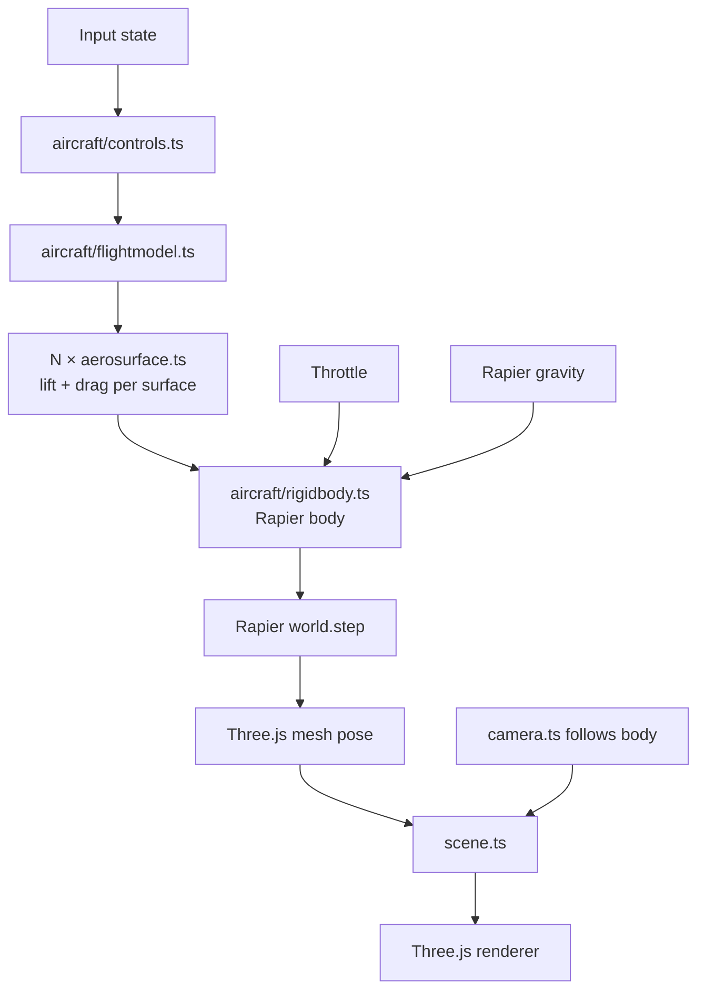

# Architecture

**Phase:** Phase 1 — Flight PoC. Architecture targets Phase 1 explicitly; decisions are chosen to not foreclose Phase 2 (missions) or Phase 3 (polish/ship), but Phase 2-specific systems (mission framework, AI, weapons) are only sketched, not designed.

## Tech Stack

- **Language: TypeScript** (strict mode) — per research. Aircraft physics math benefits from type safety; Three.js + Rapier both ship strong TS types.
- **Framework: none (vanilla Three.js)** — per research. We have minimal DOM UI. A render loop + ECS-lite module layout is simpler than a framework.
- **Rendering: Three.js** (latest stable, r170+) — per research.
- **Physics: Rapier3D** (`@dimforge/rapier3d-compat` for easy bundling; swap to `rapier3d-simd` in Phase 3 if perf needs it) — per research.
- **Build tool: Vite** (TypeScript template) — per research.
- **Dev UI: lil-gui** behind `?debug=true` — per research.
- **Perf: Stats.js** — FPS counter enabled from day one to catch regressions.
- **Database: none** — v1 is stateless. No persistence, no accounts.
- **Infrastructure: static hosting** (Vercel / Netlify / Cloudflare Pages — decide at deploy time; all are equivalent for a static build). No backend in v1.

## System Design

### Module layout

```
src/
  main.ts              # entry: bootstraps engine, starts loop
  engine/
    loop.ts            # fixed-timestep physics + variable-framerate render
    input.ts           # keyboard + mouse state, rebindable map
    assets.ts          # Three.js GLTF / texture loader wrapper
    debug.ts           # lil-gui + Stats.js, gated by ?debug=true
  world/
    scene.ts           # Three.js scene root, lighting, skybox
    terrain.ts         # Phase 1: flat textured plane + landmarks. Phase 3: swap in heightmap.
    camera.ts          # chase + cockpit cameras, swap via key
  aircraft/
    rigidbody.ts       # Rapier rigid body + Three.js mesh binding
    aerosurface.ts     # single lift/drag surface — computes force from local airflow
    flightmodel.ts     # composes aerosurfaces into an aircraft, applies to rigidbody
    controls.ts        # maps input state → control surface deflections
  mission/             # Phase 2 — stub in Phase 1, empty dir
  hud/                 # Phase 2 — stub in Phase 1, empty dir
  index.html
public/
  models/              # GLTF aircraft, textures
  config/
    aircraft.json      # tunable flight model constants (lift, drag, mass, thrust)
```

### Runtime structure



### Game loop

Fixed-timestep physics (60 Hz), variable-timestep render with interpolation:

1. **Input poll** — read keyboard + mouse, update input state.
2. **Controls** — map input → control deflections (elevator, aileron, rudder, throttle).
3. **Flight model** — for each aerosurface: compute local airflow velocity in surface frame, compute angle of attack, look up piecewise-linear CL/CD, produce force + application point.
4. **Apply forces** — sum aerosurface forces + thrust + gravity on the Rapier rigid body.
5. **Physics step** — `world.step()` at fixed dt = 1/60s. Accumulator pattern: run N steps per render frame if behind, skip if ahead.
6. **Sync mesh** — copy Rapier body pose to Three.js mesh transform.
7. **Camera** — chase camera lerps toward target pose; cockpit camera rigidly follows.
8. **Render** — Three.js renderer draws scene.

Separating physics tick from render tick is the standard game-loop pattern ("Fix Your Timestep!" / Glenn Fiedler) and is required for stable aircraft dynamics — Rapier produces wrong results at variable dt.

### Data flow

- **Config** (`public/config/aircraft.json`) → loaded once at boot → flight-model constants.
- **Input** → controls (per-frame) → flight model → rigid body (per physics tick).
- **Rapier world** → body pose (per physics tick) → Three.js mesh (per render frame).
- **No network I/O.** No persistence. Everything in memory.

## Key Decisions

- **D1 — Fixed-timestep physics.** Non-negotiable for flight dynamics. Variable timestep makes aerodynamic integration unstable (stalls oscillate, control response feels laggy on frame drops). Accumulator pattern decouples physics from render framerate.
- **D2 — Aerosurface as first-class primitive.** Every lift-producing part of the aircraft (main wing L, main wing R, horizontal stabilizer, vertical stabilizer, optional control surfaces) is an `AeroSurface` instance with its own position, orientation, area, and CL/CD curves. The flight model is a composition, not a monolith. Rationale: matches Khan & Nahon 2015 model from research; per-surface gives correct-feeling dynamics (banking-to-turn, stall, adverse yaw) automatically without hand-coded rules.
- **D3 — Flight model constants in JSON, not code.** Enables hot-tuning via lil-gui + "Export preset" button that writes back to the config shape. Addresses R2 (flight-feel tuning is iterative) from research. The biggest feel risk is tuning, so we architect for fast iteration.
- **D4 — Flat terrain in Phase 1.** Resolves R3 from research. Phase 1 scope is "plane flies plausibly," not "beautiful world." Flat textured plane + skybox + 2–3 placed landmarks (e.g. a runway, a tower) gives enough spatial reference for flying. Phase 3 polish can swap `terrain.ts` for a heightmap without changing anything else (well-defined interface: provide height-at-xz, provide a Three.js mesh, provide a Rapier collider).
- **D5 — Empty `mission/` and `hud/` dirs in Phase 1.** Explicit Phase 2 stubs. The module layout is intentionally chosen so Phase 2 work is additive — the flight model doesn't need to know about missions, the mission system reads read-only aircraft state.
- **D6 — No ECS.** Single aircraft, flat terrain, no AI in Phase 1. A full ECS (BitECS, miniplex) is overkill. Revisit at Phase 2 if multiple entities (AI enemies, waypoint markers, projectiles) push us past ~5 dynamic things. Swapping in miniplex later is well-scoped — it operates on plain objects.
- **D7 — Three.js + Rapier coordinate alignment.** Both libraries use right-handed Y-up coordinates by default — no transform needed at the sync boundary. One less bug class. Document this in a short `CONVENTIONS.md` when Phase 1 starts so nobody re-derives it.
- **D8 — No framework (React/R3F).** Per research. Revisit if mission-select / HUD grows beyond basic DOM overlays.
- **D9 — Static deploy, backend-less.** Whole game runs client-side. Simplifies infra, aligns with "no-install" vision principle (also: zero server cost).

## Unknowns / deferred to Phase 2 arch pass

- **Mission framework shape** — declarative config? scripted? state-machine? Deferred; Phase 1 proves flight and answers "what does the aircraft expose?" which constrains the mission API.
- **AI enemy architecture** — behavior tree? hand-coded state machine? Deferred. Dependent on mission framework decision.
- **Damage model** — hitpoints? component damage? Deferred.
- **HUD framework** — DOM overlays vs Three.js orthographic layer. Deferred to Phase 2 — depends on what information the HUD needs to render (primarily numeric/iconic → DOM; mixed-world elements like waypoint arrows → Three.js).

These are explicitly Phase 2 concerns. The Phase 1 architecture does not pre-commit to any of them.

## Phase 2 / 3 forward-compat notes

- **Multiple aircraft:** `flightmodel.ts` already takes an aircraft config; multiple instances is just multiple bodies. Rapier handles N dynamic bodies cleanly.
- **Terrain swap:** `terrain.ts` interface (`getHeight(x, z): number`, `getMesh(): Three.Mesh`, `getCollider(): Rapier.Collider`) is chosen so a heightmap implementation is a drop-in.
- **Networking (explicit out-of-scope):** Not forward-compat with v1. Multiplayer would require rewriting physics authority, inputs, and sync. Not a goal.
