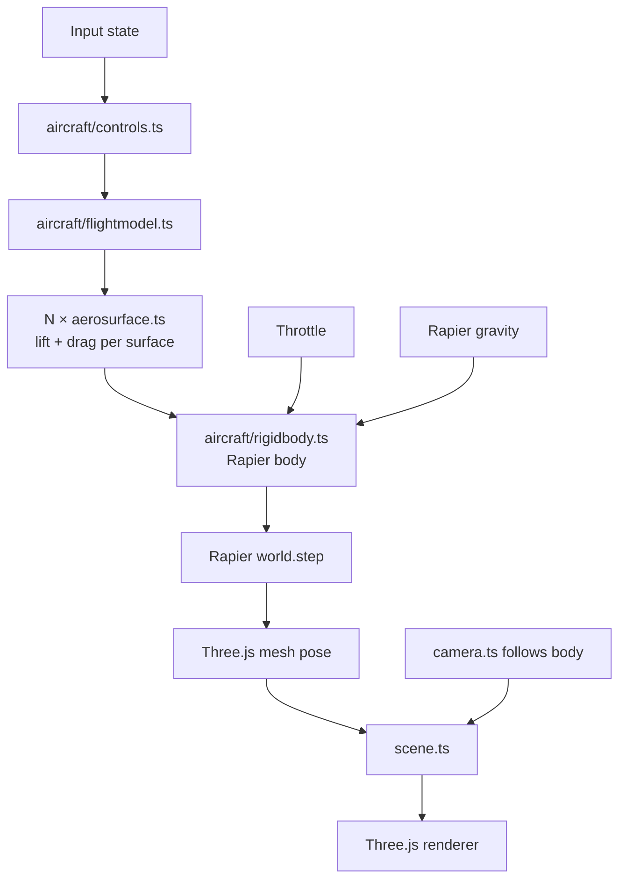

# Architecture

**Phase:** Phase 1 — Flight PoC. Architecture targets Phase 1 explicitly; decisions are chosen to not foreclose Phase 2 (missions) or Phase 3 (polish/ship), but Phase 2-specific systems (mission framework, AI, weapons) are only sketched, not designed.

## Tech Stack

- **Language: TypeScript** (strict mode) — per research. Aircraft physics math benefits from type safety; Three.js + Rapier both ship strong TS types.
- **Framework: none (vanilla Three.js)** — per research. We have minimal DOM UI. A render loop + ECS-lite module layout is simpler than a framework.
- **Rendering: Three.js** (latest stable, r170+) — per research.
- **Physics: Rapier3D** (`@dimforge/rapier3d-compat` for easy bundling; swap to `rapier3d-simd` in Phase 3 if perf needs it) — per research.
- **Build tool: Vite** (TypeScript template) — per research.
- **Dev UI: lil-gui** behind `?debug=true` — per research.
- **Perf: Stats.js** — FPS counter enabled from day one to catch regressions.
- **Database: none** — v1 is stateless. No persistence, no accounts.
- **Infrastructure: static hosting** (Vercel / Netlify / Cloudflare Pages — decide at deploy time; all are equivalent for a static build). No backend in v1.

## System Design

### Module layout

```
src/
  main.ts              # entry: bootstraps engine, starts loop
  engine/
    loop.ts            # fixed-timestep physics + variable-framerate render
    input.ts           # keyboard + mouse state, rebindable map
    assets.ts          # Three.js GLTF / texture loader wrapper
    debug.ts           # lil-gui + Stats.js, gated by ?debug=true
  world/
    scene.ts           # Three.js scene root, lighting, skybox
    terrain.ts         # Phase 1: flat textured plane + landmarks. Phase 3: swap in heightmap.
    camera.ts          # chase + cockpit cameras, swap via key
  aircraft/
    rigidbody.ts       # Rapier rigid body + Three.js mesh binding
    aerosurface.ts     # single lift/drag surface — computes force from local airflow
    flightmodel.ts     # composes aerosurfaces into an aircraft, applies to rigidbody
    controls.ts        # maps input state → control surface deflections
  mission/             # Phase 2 — stub in Phase 1, empty dir
  hud/                 # Phase 2 — stub in Phase 1, empty dir
  index.html
public/
  models/              # GLTF aircraft, textures
  config/
    aircraft.json      # tunable flight model constants (lift, drag, mass, thrust)
```

### Runtime structure



### Game loop

Fixed-timestep physics (60 Hz), variable-timestep render with interpolation:

1. **Input poll** — read keyboard + mouse, update input state.
2. **Controls** — map input → control deflections (elevator, aileron, rudder, throttle).
3. **Flight model** — for each aerosurface: compute local airflow velocity in surface frame, compute angle of attack, look up piecewise-linear CL/CD, produce force + application point.
4. **Apply forces** — sum aerosurface forces + thrust + gravity on the Rapier rigid body.
5. **Physics step** — `world.step()` at fixed dt = 1/60s. Accumulator pattern: run N steps per render frame if behind, skip if ahead.
6. **Sync mesh** — copy Rapier body pose to Three.js mesh transform.
7. **Camera** — chase camera lerps toward target pose; cockpit camera rigidly follows.
8. **Render** — Three.js renderer draws scene.

Separating physics tick from render tick is the standard game-loop pattern ("Fix Your Timestep!" / Glenn Fiedler) and is required for stable aircraft dynamics — Rapier produces wrong results at variable dt.

### Data flow

- **Config** (`public/config/aircraft.json`) → loaded once at boot → flight-model constants.
- **Input** → controls (per-frame) → flight model → rigid body (per physics tick).
- **Rapier world** → body pose (per physics tick) → Three.js mesh (per render frame).
- **No network I/O.** No persistence. Everything in memory.

## Key Decisions

- **D1 — Fixed-timestep physics.** Non-negotiable for flight dynamics. Variable timestep makes aerodynamic integration unstable (stalls oscillate, control response feels laggy on frame drops). Accumulator pattern decouples physics from render framerate.
- **D2 — Aerosurface as first-class primitive.** Every lift-producing part of the aircraft (main wing L, main wing R, horizontal stabilizer, vertical stabilizer, optional control surfaces) is an `AeroSurface` instance with its own position, orientation, area, and CL/CD curves. The flight model is a composition, not a monolith. Rationale: matches Khan & Nahon 2015 model from research; per-surface gives correct-feeling dynamics (banking-to-turn, stall, adverse yaw) automatically without hand-coded rules.
- **D3 — Flight model constants in JSON, not code.** Enables hot-tuning via lil-gui + "Export preset" button that writes back to the config shape. Addresses R2 (flight-feel tuning is iterative) from research. The biggest feel risk is tuning, so we architect for fast iteration.
- **D4 — Flat terrain in Phase 1.** Resolves R3 from research. Phase 1 scope is "plane flies plausibly," not "beautiful world." Flat textured plane + skybox + 2–3 placed landmarks (e.g. a runway, a tower) gives enough spatial reference for flying. Phase 3 polish can swap `terrain.ts` for a heightmap without changing anything else (well-defined interface: provide height-at-xz, provide a Three.js mesh, provide a Rapier collider).
- **D5 — Empty `mission/` and `hud/` dirs in Phase 1.** Explicit Phase 2 stubs. The module layout is intentionally chosen so Phase 2 work is additive — the flight model doesn't need to know about missions, the mission system reads read-only aircraft state.
- **D6 — No ECS.** Single aircraft, flat terrain, no AI in Phase 1. A full ECS (BitECS, miniplex) is overkill. Revisit at Phase 2 if multiple entities (AI enemies, waypoint markers, projectiles) push us past ~5 dynamic things. Swapping in miniplex later is well-scoped — it operates on plain objects.
- **D7 — Three.js + Rapier coordinate alignment.** Both libraries use right-handed Y-up coordinates by default — no transform needed at the sync boundary. One less bug class. Document this in a short `CONVENTIONS.md` when Phase 1 starts so nobody re-derives it.
- **D8 — No framework (React/R3F).** Per research. Revisit if mission-select / HUD grows beyond basic DOM overlays.
- **D9 — Static deploy, backend-less.** Whole game runs client-side. Simplifies infra, aligns with "no-install" vision principle (also: zero server cost).
- **D10 — Per-surface incidence (β1) is the trim mechanism.** Each `AeroSurface` carries an optional `incidenceRad` (default 0) representing the surface's fixed mount angle relative to the fuselage longitudinal axis. At zero body pitch, a wing with `incidenceRad = +2°` sees +2° AoA (positive lift); an h-stab with `incidenceRad = -1°` sees -1° AoA (small downward force behind CG, nose-up moment). This is the textbook airframe-level trim mechanism in real aircraft, and is the schema extension required to make the Phase 1 airframe expressible as a level-trim equilibrium. Rationale + sub-option comparison: see Revision 2026-05-11 below.
- **D11 — Missions are declarative JSON + optional script hook.** Each mission is a JSON file conforming to a `Mission` schema (objectives, win/fail conditions, spawn). Combat (WP16) registers a `scriptHook` for AI enemy behavior; the other three mission types (free flight, waypoint, takeoff/landing) are declarative-pure. Rationale + alternatives: see Revision 2026-05-12 below.
- **D12 — HUD is a DOM overlay.** CSS-absolute `<div>` layered over the canvas, with waypoint arrows positioned via `THREE.Vector3.project()`. Three.js ortho camera is rejected for v1 (no shader-based HUD elements planned). The `HUD` interface is the Phase 3 swap point. Rationale: see Revision 2026-05-12 below.
- **D13 — Per-surface AoA-rate damping (`clAlphaDot`, β5) is the phugoid-mode mechanism.** Each `AeroSurface` carries an optional `clAlphaDot` (default 0) that augments CL by `clAlphaDot · dα/dt`. Damps the phugoid mode (long-period coupled airspeed/AoA oscillation) that SURFACE-2026-05-11-04 logged. Default-zero ships in WP10.5; tuning is Phase 2 per-mission. Rationale + verification: see Revision 2026-05-12 below.

## Unknowns / deferred to Phase 2 arch pass

- **Mission framework shape** — declarative config? scripted? state-machine? Deferred; Phase 1 proves flight and answers "what does the aircraft expose?" which constrains the mission API.
- **AI enemy architecture** — behavior tree? hand-coded state machine? Deferred. Dependent on mission framework decision.
- **Damage model** — hitpoints? component damage? Deferred.
- **HUD framework** — DOM overlays vs Three.js orthographic layer. Deferred to Phase 2 — depends on what information the HUD needs to render (primarily numeric/iconic → DOM; mixed-world elements like waypoint arrows → Three.js).

These are explicitly Phase 2 concerns. The Phase 1 architecture does not pre-commit to any of them.

## Phase 2 / 3 forward-compat notes

- **Multiple aircraft:** `flightmodel.ts` already takes an aircraft config; multiple instances is just multiple bodies. Rapier handles N dynamic bodies cleanly.
- **Terrain swap:** `terrain.ts` interface (`getHeight(x, z): number`, `getMesh(): Three.Mesh`, `getCollider(): Rapier.Collider`) is chosen so a heightmap implementation is a drop-in.
- **Networking (explicit out-of-scope):** Not forward-compat with v1. Multiplayer would require rewriting physics authority, inputs, and sync. Not a goal.

## Revision 2026-05-11 — Per-surface incidence (trim-spawn schema extension)

**Context.** After the WP7 → AoA-sign-fix → static-margin-geometry-fix-ABANDONED chain, an `arch-handoff-trim-spawn.md` document captured a previously-unresolved architectural gap: the Phase 1 `AeroSurface` schema cannot express a trimmable airframe. With identical symmetric flat-plate curves at zero incidence on every surface, the wing and h-stab AoA are locked together by body attitude — any body pitch that produces wing lift produces proportional h-stab lift behind the CG, generating an unbounded nose-down moment with nothing in the model to counter it. No level-trim equilibrium exists in the current parameter space. Empirical evidence (four refuted hypotheses, including a perfect frame-0 trim-state spawn that diverged within 10 frames) is documented in `workflow/archive/static-margin-geometry-fix-ABANDONED.md` and `arch-handoff-trim-spawn.md`.

**The (2)-vs-(3) framing.** Three possibilities were considered:
1. **Physics is wrong** — Khan-Nahon per-surface model is inadequate. Rejected — the model matches a well-studied reference and is internally consistent.
2. **Physics is right, schema is too restrictive** — the model can express physics correctly but the *parameter manifold* (mass, thrust, areas, surface positions, clSlope, stallAlpha) does not contain a flyable-airplane point. **Accepted as the working hypothesis (~85% confidence).** Strongest evidence: a perfectly-initialized frame-0 trim state (throttle=0.5, +6° body pitch, pRate=0, vSpd=0, airspeed=30 m/s) left the trim state within 0.16 seconds. Local stability would have held it; instead there is no fixed point nearby.
3. **Physics + schema are right, tuning is just hard** — held in reserve. See "Fallback path" below.

**Decision (D10): adopt β1 per-surface incidence.** Per the operator directive of 2026-05-10 ("aircraft must spawn airborne in a stable initial state, fly straight indefinitely"), Option β (airborne trim spawn — requires schema extension) is the path. Among four sub-options considered (β1 per-surface incidence, β2 cambered CL curve, β3 trim-elevator at spawn, β4 `cl_q` pitch-rate damping), **β1 is selected** for these reasons:

- Real airframes solve trim exactly this way (wings at a few degrees positive incidence, h-stab at zero or slightly negative). Mechanically obvious — "this surface is bolted on at angle X."
- Smallest schema change: one optional `incidenceRad` field on `AircraftSurfaceConfig` with default 0. The default-zero behavior is identical to current behavior, so the existing 227 tests continue to pass.
- Preserves the symmetric flat-plate curve as a clean primitive — no per-surface camber asymmetry to reason about.
- ~50 LOC, ~half-day implementation.
- Strong physical priors on parameter values (wings +1°..+3°, h-stab -1°..+1°) bracket WP7 retune to a small search.

β2 (cambered CL curves) was rejected as redundant — same outcome via a less mechanically obvious mechanism with per-surface JSON awkwardness. β3 (trim-elevator) was rejected because it does not solve the lift-source problem alone (wings still need to produce lift at level body attitude) and a permanently-deflected trim elevator creates a poor "first-key-press fights the offset" feel. β4 (`cl_q` damping) is **held in reserve as a follow-up**: damping does not create equilibria, only lets perturbations near one decay; if post-D10 verify-self shows residual integrator-drift wobble around the new trim point, β4 becomes a small follow-up extension.

**Schema specifics (binding for the implementation WP):**

- Add `incidenceRad?: number` to `AircraftSurfaceConfig` (default 0 — backward compatible).
- Plumb through `parseAircraftConfig` → `AeroSurface` constructor.
- In `computeAeroForce`, rotate the surface's local `normal` and `chord` by `incidenceRad` about its span axis before computing local airflow. Equivalently, rotate the local airflow vector by `-incidenceRad` about the span axis before AoA computation; pick whichever produces the cleaner diff against the current implementation.
- Span axis is already pre-baked on each surface (used for control-deflection rotation in WP6). Reuse it.
- Tests: default `incidenceRad=0` must produce bit-for-bit identical force vectors to current behavior on the existing 227 cases. Two new tests assert (a) a level-flow surface with non-zero `incidenceRad` returns non-zero lift in the expected direction, (b) the rotation is independent of body attitude (it's a surface property, not a body property).

**Fallback path (case (3), kept warm).** If a hand-tuned β1 airframe in WP7 Phase E fails to converge on a stable level-trim-and-fly state within ~two tuning sessions — i.e., the parameter space is too high-dimensional, too non-convex, or has too-narrow valid regions for human bracketing — pivot to building automated parameter-search tooling. Fitness function sketch: `spawns airborne ∧ flies straight 30s ∧ max|pRate| < 360°/s ∧ altitude ∈ [spawn ± 50m] ∧ airspeed ∈ [25, 35] m/s`. Search method: gradient-free (CMA-ES or random-restart hill-climb) over `aircraft.json` knobs. This is a meta-task with real opportunity cost (it defers the actual flight-sim work and conflicts with the vision principle "ship a casual flight sim, not a parameter-fitter"), so we explicitly DO NOT build it preemptively. The hedge is recorded here so the WP7 successor handoff has a documented escalation path if hand-tuning runs aground.

**Forward implications:**

- A new WP6.5 (β1 implementation) is inserted in `wbs.md` immediately before WP7 Phase E. Resolves the airborne-stable-spawn blocker.
- WP7 Phase E retune (currently paused) resumes against the β1 baseline after WP6.5 ships.
- WP9 Phase 1 verification remains blocked behind WP7.
- `arch-handoff-trim-spawn.md` is closed by this revision (state: resolved).
- `SURFACE-2026-05-10-02` in `workflow/backlog.md` closes-by-implementation when WP6.5 ships and produces verified airborne stable flight.

## Revision 2026-05-12 — Phase 2 arch revision (mission framework + HUD + β5 phugoid damping)

**Context.** Phase 1 closed 2026-05-11 (WP1–WP9 + WP9.5 + WP9.6 all shipped, 246/246 Vitest + 1/1 Playwright green). The original arch (2026-05-11) explicitly deferred three Phase 2 concerns to a Phase 2 revision: (a) mission framework shape, (b) HUD approach, (c) AI enemy architecture (held for WP16 design). It also left `SURFACE-2026-05-11-04` (phugoid mode undamped) as a Phase 2 candidate. This revision settles (a) and (b) and adopts a small schema extension (β5) to address the phugoid architecturally before Phase 2 feel-tuning begins.

**Driving mode disclosure (operator-as-architect deviation).** Per `feedback_operator_as_external.md`, the operator selected full-autopilot for this session, so the architect role for this revision is performed by the agent rather than by the operator (who would normally be the human-in-the-loop for arch decisions). All three decisions below are made in operator-as-architect mode. **Phase 3 re-validation hook:** all three decisions are reviewable at WP21 (cross-browser QA) or earlier if Phase 2 verification surfaces an integration problem. If a decision turns out to be wrong, the cost is bounded — D11 has a documented swap point (`Mission` interface), D12 has a documented swap point (`HUD` interface), D13 is a per-surface optional field defaulting to 0.

---

### D11 — Mission framework: declarative JSON + optional script hook

**Decision.** Each mission is a JSON file in `public/missions/<name>.json` conforming to a `Mission` schema. The schema declares: `id`, `name`, `type` (free-flight | waypoint | takeoff-landing | combat), `objectives[]` (typed entries — waypoint reach, runway touchdown, target destroyed), `winCondition` (declarative — "all objectives complete" by default), `failCondition` (declarative — timer expiration, crash, etc.), `spawn` (position, velocity, throttle), and an optional `scriptHook` string naming a registered TypeScript callback.

**Loader contract.**
```
loadMission(id: string): Promise<Mission>
```
Returns a `Mission` object. The `mission/runner.ts` module owns the lifecycle (`load → start → tick → complete | fail`), reads aircraft state via the existing `window.__aircraft.getState()`-equivalent typed interface (NOT via the debug global), and emits objective state changes for the HUD to consume.

**Script hooks.** Combat (WP16) is the only mission type that anticipates needing imperative logic beyond declarative objectives — specifically AI enemy behavior. Solution: missions may name an optional `scriptHook` whose implementation lives in `mission/hooks/<name>.ts`, registered at boot. The hook receives `(missionState, aircraftState, dt)` per tick and may mutate mission-local state and spawn/despawn entities. WP13 (free flight), WP14 (waypoint), WP15 (takeoff/landing) require **no** script hook — all four are declarative-pure for those three. **Only WP16 (combat) is expected to register a script hook** for the AI enemy.

**Why declarative JSON over scripted-class or state-machine.**
- **Aligns with D3** (constants in JSON, not code). The mission set is small and tuning-heavy — JSON enables rapid iteration without rebuilds, exactly mirroring `aircraft.json`'s role.
- **Aligns with vision principle 4** ("mission variety over depth"). Four shallow missions × declarative-objectives composition is structurally simple; scripted classes would over-engineer for variety we're not building.
- **Keeps `mission/` small.** A scripted-class approach makes every new mission a new TypeScript file and a new test file. JSON missions need only a schema validator (TypeScript runtime guard, ~30 LOC, same pattern as `parseAircraftConfig`).
- **State-machine alternative** was rejected as a generalization not earned by Phase 2 scope. State machines pay off when missions have multi-phase progression (takeoff → cruise → land), but WP15 is the only such mission, and its phases compose cleanly as ordered objectives in a declarative list. If Phase 3 reveals a mission type that genuinely needs SM semantics (event-driven branching, parallel states), the script-hook escape is the swap point.
- **Script-hook escape preserves the rejected paths' upside.** WP16's AI enemy gets imperative control — the path full-script would have provided — without forcing the other three mission types to pay that complexity tax.

**Trade-off accepted.** Declarative-JSON missions are constrained to the schema. If WP14 (waypoint) or WP15 (takeoff/landing) discovers a need for objective semantics not in the schema, the response is to extend the schema (additive, backward-compatible), not to escape into the script hook. The script hook is reserved for AI-style emergent behavior, not for working around schema gaps.

**Schema sketch (binding for WP11 implementation):**
```ts
type Mission = {
  id: string;
  name: string;
  type: 'free-flight' | 'waypoint' | 'takeoff-landing' | 'combat';
  spawn: { position: Vec3; linvel: Vec3; throttle: number };
  objectives: Objective[];
  winCondition?: 'all-objectives';        // default 'all-objectives'
  failCondition?: FailCondition;          // default 'crash'
  timeoutSec?: number;                    // optional fail-on-timeout
  scriptHook?: string;                    // optional, registered name
};

type Objective =
  | { kind: 'reach-waypoint'; position: Vec3; radius: number; order: number }
  | { kind: 'touchdown'; runway: { center: Vec3; halfExtents: Vec3 }; maxVSpeed: number }
  | { kind: 'destroy-target'; targetId: string };

type FailCondition = 'crash' | 'timeout' | 'out-of-bounds';
```

The exact schema is finalized at WP11. The runtime guard (analogous to `parseAircraftConfig`) and the test suite live in `src/mission/`.

**Phase-3 swap point.** The `Mission` interface (loader + runner + objective state) is the public boundary. If a future mission type needs full-script semantics, replace `loadMission` with a scripted-class factory — `mission/runner.ts` stays the same. Cost of a wrong call at D11 ≈ rewriting `mission/loader.ts` and the missions themselves (~half-day per mission). No physics/render impact.

### D12 — HUD: DOM overlay (CSS-positioned absolute layer on top of the canvas)

**Decision.** v1 HUD is a CSS-absolute `<div>` overlay layered on top of the `<canvas>`. Static elements (altitude readout, airspeed readout, current-objective text, status banner) are plain DOM nodes updated each frame. The one world-anchored element — waypoint directional arrow for WP14 — is a DOM node positioned each frame via `THREE.Vector3.project()`-to-screen-coords (well-trodden pattern, ~20 LOC). HUD lives in `src/hud/`; the existing empty `hud/` dir (D5) becomes populated.

**Why DOM over Three.js orthographic camera.**
- **Aligns with D8** (no framework). HUD content is overwhelmingly numeric/text. DOM text is crisper than 2D-text-rendered-in-WebGL (no anti-alias surprises across Chrome/Safari/Firefox), free DPI handling, and accessible to copy-paste / a11y tooling for free.
- **Cheaper to iterate.** CSS for layout, plain DOM for content. No `OrthographicCamera` second-render-pass cost. The Phase 1 budget is already tight per R5 — adding a second render pass for HUD is a perf risk we don't need to take.
- **Aligns with D9** (static deploy, simple infra). DOM HUD is "open devtools, inspect, edit CSS" — the lil-gui ethos applied to the player-facing UI.
- **Three.js ortho camera was rejected** because its main upside (mixing with in-world particles, shaders, post-processing effects) is a Phase 3 polish concern. v1 HUD shows altitude/airspeed/objective — there is no shader-based HUD element planned for v1.

**HUD interface (binding for WP12 implementation):**
```ts
interface HUD {
  setAircraftState(state: AircraftState): void;     // altitude, airspeed, throttle
  setObjective(text: string | null): void;          // current objective text
  setWaypointArrow(worldPos: Vec3 | null): void;    // world-space target, or null to hide
  setStatus(status: 'flying' | 'won' | 'failed', text?: string): void;
  show(): void;
  hide(): void;
}
```
Implementation in WP12: `src/hud/dom-hud.ts`. The interface is the swap point — a `three-hud.ts` (ortho camera) implementation could be added at Phase 3 if v1 playtesting reveals a HUD design that needs world-shader effects.

**Trade-off accepted.** DOM HUD couples to the page DOM; if the canvas needs to be embedded in a third-party iframe with strict isolation, the HUD overlay would need rework. **This is not a v1 concern** — vision says "open a URL," not "embeddable widget." If embedding becomes a goal, swap to `three-hud.ts`.

**Phase-3 swap point.** The `HUD` interface boundary is the swap point. Cost of a wrong call ≈ reimplementing the four `set*` methods in a Three.js ortho impl (~half-day) plus rewiring waypoint-arrow projection (already lives behind the interface). No mission-framework impact.

### D13 — β5 AoA-rate damping (`clAlphaDot`) — closes SURFACE-2026-05-11-04 architecturally

**Decision.** Extend the per-surface schema with an optional `clAlphaDot?: number` field (default 0 — backward-compatible). At per-surface force computation, lift is augmented by a term proportional to `dα/dt`, the time-rate-of-change of local angle-of-attack. This adds AoA-rate damping that suppresses the phugoid mode (long-period oscillation involving coupled airspeed and AoA changes — the failure SURFACE-2026-05-11-04 documented under non-zero throttle forcing).

**Mechanism (binding for WP10.5 implementation — see WBS).**
At each call to `computeAeroForce`, the surface tracks its previous-tick local AoA. Current `dα/dt ≈ (α_now − α_prev) / dt_physics`. The lift coefficient is augmented:
```
CL_effective(α) = CL_lookup(α) + clAlphaDot · (dα/dt)
```
For `clAlphaDot = 0`, behavior is bit-for-bit identical to current behavior (the existing 246 tests must continue to pass — same default-zero parity contract as β1 and β4).

**Sign convention:** positive `clAlphaDot` produces a lift force opposing rapid AoA increase — i.e., damps the AoA oscillation. Physical analog: a wing whose camber transiently lags as α changes (real airfoils have small but nonzero `cl_α̇` in unsteady aero theory; this is a simplified Theodorsen-like effect).

**Why β5 is in the arch revision, not deferred to a Phase 2 feature WP.**
- **It is a schema extension**, not a tuning value. Schema extensions belong in arch by D2 ("aerosurface as first-class primitive"). Adding `clAlphaDot` mid-Phase-2 to a non-blocking feature WP risks scope creep on that WP.
- **WP10 is the natural moment.** Phase 2 verification (any of WP13–WP17) will hit the phugoid if mission types include level-cruise expectations (waypoint, combat). Better to land β5 in the arch revision and tune in Phase 2 feature WPs than to discover it mid-WP14.
- **Symmetric with the β1/β4 pattern in the original revision.** β1 and β4 were both schema-with-default-zero extensions; β5 follows the same shape. The pattern is established and tested.

**Why not β2 (cambered CL curves) or β6 (full unsteady aero)?**
- β2 was rejected in Rev 2026-05-11; that rejection stands.
- Full unsteady aero (Theodorsen function, indicial response) is study-level fidelity, explicitly out of scope per vision ("plausible over perfect"). β5 is the minimum-mechanism extension that addresses the phugoid divergence — first-order damping on AoA rate.

**Risk + verification approach.**
- **Risk:** β5 may interact with β4 (pitch-rate damping) in ways that look like over-damping or "soggy" feel. Per-surface `clAlphaDot` is tuned independently and starts at 0 until tuned.
- **Verification (binding):** any future tuning of β5 must verify against a **≥30-second** Playwright probe with non-zero throttle (`0.05, 0.15, 0.4`) — single-period observation hides phugoid behavior. Matches the backlog's existing `SURFACE-2026-05-11-04` verification requirement. Memory `feedback_verify_self_envelope.md` applies here.
- **Default `clAlphaDot=0`** ships in WP10.5; actual non-zero tuning is a Phase 2 deliverable when (and only when) a mission requires sustained level cruise (waypoint, combat).

**Schema specifics (binding for WP10.5 implementation):**
- Add `clAlphaDot?: number` to `AircraftSurfaceConfig` and `AeroSurfaceConfig`. Default 0, finite-number validation.
- Plumb through `parseAircraftConfig` → `AeroSurface` constructor.
- Track previous-tick AoA on the `AeroSurface` instance (one new scalar field). Use the physics `dt` (fixed timestep) for finite difference — NOT the variable render `dt`.
- In `computeAeroForce`, compute `dα/dt` and augment CL by `clAlphaDot · dα/dt`. Skip on first tick (prev-AoA undefined) — return baseline CL only. Document this in CONVENTIONS.md.
- Tests: (a) default `clAlphaDot=0` produces bit-for-bit identical force vectors to current behavior on existing 246 cases. (b) Non-zero `clAlphaDot` with constant α produces zero augmentation (dα/dt=0). (c) Non-zero `clAlphaDot` with α_now > α_prev produces additional lift in the +α direction with positive sign (damping convention). (d) First-tick behavior: no augmentation, baseline only.

**Closes-by-implementation:** SURFACE-2026-05-11-04 once `clAlphaDot` is wired AND a Phase 2 mission requires the level-cruise feel and tunes non-zero values. The schema landing in WP10.5 closes the **arch gap**; tuning closes the surface entry.

---

### Forward implications (WBS updates required)

- **Insert WP10.5: β5 (`clAlphaDot`) schema extension** in `wbs.md` Phase 2, between WP10 and WP11. Size: XS (schema-only, default-zero parity). Same shape as WP6.5 + WP6.6.
- **WP11 (mission framework)**: locked to the D11 declarative-JSON + script-hook design.
- **WP12 (HUD)**: locked to the D12 DOM-overlay design with `HUD` interface.
- **WP14 (waypoint)**: implements `setWaypointArrow` via `THREE.Vector3.project()` per D12.
- **WP15 (takeoff/landing)**: declarative `touchdown` objective per D11 schema; no script hook needed.
- **WP16 (combat)**: the one mission with a `scriptHook` for AI enemy. Hook lives in `src/mission/hooks/combat-ai.ts`. AI architecture (behavior tree vs FSM) is **still deferred** to WP16 design — the script hook gives WP16 the freedom to choose without re-opening arch.
- **WP17 (Phase 2 verification)**: must include a ≥30s level-cruise probe to validate β5 (separate from per-mission verification).

### Unknowns / deferred to Phase 3 arch pass

- **AI enemy architecture** (behavior tree, FSM, scripted): still deferred. The `scriptHook` in D11 makes this a per-WP16 decision rather than an arch decision. If WP16 surfaces a generalization need, P12 SURFACE-IN.
- **Damage model**: still deferred. Hitpoints scalar on a destructible-entity type is the v1 minimum; deeper component damage is Phase 3 polish if at all.
- **Bundle size (SURFACE-2026-04-19-01)**: still Phase 3 (WP18/WP21). No arch change.
- **Multiplayer**: out of scope per vision. No arch.
