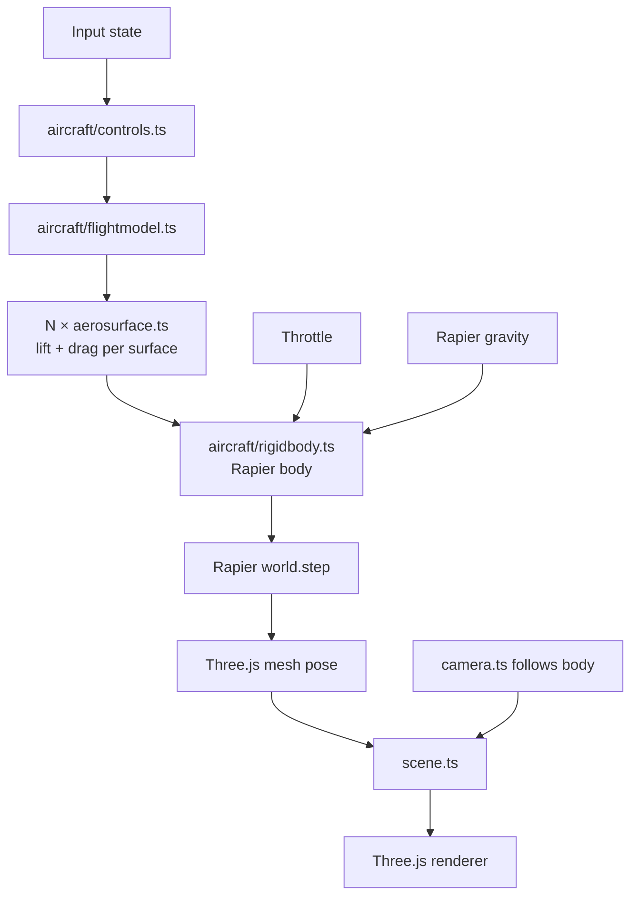

# Architecture

**Phase:** Phase 1 — Flight PoC. Architecture targets Phase 1 explicitly; decisions are chosen to not foreclose Phase 2 (missions) or Phase 3 (polish/ship), but Phase 2-specific systems (mission framework, AI, weapons) are only sketched, not designed.

## Tech Stack

- **Language: TypeScript** (strict mode) — per research. Aircraft physics math benefits from type safety; Three.js + Rapier both ship strong TS types.
- **Framework: none (vanilla Three.js)** — per research. We have minimal DOM UI. A render loop + ECS-lite module layout is simpler than a framework.
- **Rendering: Three.js** (latest stable, r170+) — per research.
- **Physics: Rapier3D** (`@dimforge/rapier3d-compat` for easy bundling; swap to `rapier3d-simd` in Phase 3 if perf needs it) — per research.
- **Build tool: Vite** (TypeScript template) — per research.
- **Dev UI: lil-gui** behind `?debug=true` — per research.
- **Perf: Stats.js** — FPS counter enabled from day one to catch regressions.
- **Database: none** — v1 is stateless. No persistence, no accounts.
- **Infrastructure: static hosting** (Vercel / Netlify / Cloudflare Pages — decide at deploy time; all are equivalent for a static build). No backend in v1.

## System Design

### Module layout

```
src/
  main.ts              # entry: bootstraps engine, starts loop
  engine/
    loop.ts            # fixed-timestep physics + variable-framerate render
    input.ts           # keyboard + mouse state, rebindable map
    assets.ts          # Three.js GLTF / texture loader wrapper
    debug.ts           # lil-gui + Stats.js, gated by ?debug=true
  world/
    scene.ts           # Three.js scene root, lighting, skybox
    terrain.ts         # Phase 1: flat textured plane + landmarks. Phase 3: swap in heightmap.
    camera.ts          # chase + cockpit cameras, swap via key
  aircraft/
    rigidbody.ts       # Rapier rigid body + Three.js mesh binding
    aerosurface.ts     # single lift/drag surface — computes force from local airflow
    flightmodel.ts     # composes aerosurfaces into an aircraft, applies to rigidbody
    controls.ts        # maps input state → control surface deflections
  mission/             # Phase 2 — stub in Phase 1, empty dir
  hud/                 # Phase 2 — stub in Phase 1, empty dir
  index.html
public/
  models/              # GLTF aircraft, textures
  config/
    aircraft.json      # tunable flight model constants (lift, drag, mass, thrust)
```

### Runtime structure



### Game loop

Fixed-timestep physics (60 Hz), variable-timestep render with interpolation:

1. **Input poll** — read keyboard + mouse, update input state.
2. **Controls** — map input → control deflections (elevator, aileron, rudder, throttle).
3. **Flight model** — for each aerosurface: compute local airflow velocity in surface frame, compute angle of attack, look up piecewise-linear CL/CD, produce force + application point.
4. **Apply forces** — sum aerosurface forces + thrust + gravity on the Rapier rigid body.
5. **Physics step** — `world.step()` at fixed dt = 1/60s. Accumulator pattern: run N steps per render frame if behind, skip if ahead.
6. **Sync mesh** — copy Rapier body pose to Three.js mesh transform.
7. **Camera** — chase camera lerps toward target pose; cockpit camera rigidly follows.
8. **Render** — Three.js renderer draws scene.

Separating physics tick from render tick is the standard game-loop pattern ("Fix Your Timestep!" / Glenn Fiedler) and is required for stable aircraft dynamics — Rapier produces wrong results at variable dt.

### Data flow

- **Config** (`public/config/aircraft.json`) → loaded once at boot → flight-model constants.
- **Input** → controls (per-frame) → flight model → rigid body (per physics tick).
- **Rapier world** → body pose (per physics tick) → Three.js mesh (per render frame).
- **No network I/O.** No persistence. Everything in memory.

## Key Decisions

- **D1 — Fixed-timestep physics.** Non-negotiable for flight dynamics. Variable timestep makes aerodynamic integration unstable (stalls oscillate, control response feels laggy on frame drops). Accumulator pattern decouples physics from render framerate.
- **D2 — Aerosurface as first-class primitive.** Every lift-producing part of the aircraft (main wing L, main wing R, horizontal stabilizer, vertical stabilizer, optional control surfaces) is an `AeroSurface` instance with its own position, orientation, area, and CL/CD curves. The flight model is a composition, not a monolith. Rationale: matches Khan & Nahon 2015 model from research; per-surface gives correct-feeling dynamics (banking-to-turn, stall, adverse yaw) automatically without hand-coded rules.
- **D3 — Flight model constants in JSON, not code.** Enables hot-tuning via lil-gui + "Export preset" button that writes back to the config shape. Addresses R2 (flight-feel tuning is iterative) from research. The biggest feel risk is tuning, so we architect for fast iteration.
- **D4 — Flat terrain in Phase 1.** Resolves R3 from research. Phase 1 scope is "plane flies plausibly," not "beautiful world." Flat textured plane + skybox + 2–3 placed landmarks (e.g. a runway, a tower) gives enough spatial reference for flying. Phase 3 polish can swap `terrain.ts` for a heightmap without changing anything else (well-defined interface: provide height-at-xz, provide a Three.js mesh, provide a Rapier collider).
- **D5 — Empty `mission/` and `hud/` dirs in Phase 1.** Explicit Phase 2 stubs. The module layout is intentionally chosen so Phase 2 work is additive — the flight model doesn't need to know about missions, the mission system reads read-only aircraft state.
- **D6 — No ECS.** Single aircraft, flat terrain, no AI in Phase 1. A full ECS (BitECS, miniplex) is overkill. Revisit at Phase 2 if multiple entities (AI enemies, waypoint markers, projectiles) push us past ~5 dynamic things. Swapping in miniplex later is well-scoped — it operates on plain objects.
- **D7 — Three.js + Rapier coordinate alignment.** Both libraries use right-handed Y-up coordinates by default — no transform needed at the sync boundary. One less bug class. Document this in a short `CONVENTIONS.md` when Phase 1 starts so nobody re-derives it.
- **D8 — No framework (React/R3F).** Per research. Revisit if mission-select / HUD grows beyond basic DOM overlays.
- **D9 — Static deploy, backend-less.** Whole game runs client-side. Simplifies infra, aligns with "no-install" vision principle (also: zero server cost).
- **D10 — Per-surface incidence (β1) is the trim mechanism.** Each `AeroSurface` carries an optional `incidenceRad` (default 0) representing the surface's fixed mount angle relative to the fuselage longitudinal axis. At zero body pitch, a wing with `incidenceRad = +2°` sees +2° AoA (positive lift); an h-stab with `incidenceRad = -1°` sees -1° AoA (small downward force behind CG, nose-up moment). This is the textbook airframe-level trim mechanism in real aircraft, and is the schema extension required to make the Phase 1 airframe expressible as a level-trim equilibrium. Rationale + sub-option comparison: see Revision 2026-05-11 below.

## Unknowns / deferred to Phase 2 arch pass

- **Mission framework shape** — declarative config? scripted? state-machine? Deferred; Phase 1 proves flight and answers "what does the aircraft expose?" which constrains the mission API.
- **AI enemy architecture** — behavior tree? hand-coded state machine? Deferred. Dependent on mission framework decision.
- **Damage model** — hitpoints? component damage? Deferred.
- **HUD framework** — DOM overlays vs Three.js orthographic layer. Deferred to Phase 2 — depends on what information the HUD needs to render (primarily numeric/iconic → DOM; mixed-world elements like waypoint arrows → Three.js).

These are explicitly Phase 2 concerns. The Phase 1 architecture does not pre-commit to any of them.

## Phase 2 / 3 forward-compat notes

- **Multiple aircraft:** `flightmodel.ts` already takes an aircraft config; multiple instances is just multiple bodies. Rapier handles N dynamic bodies cleanly.
- **Terrain swap:** `terrain.ts` interface (`getHeight(x, z): number`, `getMesh(): Three.Mesh`, `getCollider(): Rapier.Collider`) is chosen so a heightmap implementation is a drop-in.
- **Networking (explicit out-of-scope):** Not forward-compat with v1. Multiplayer would require rewriting physics authority, inputs, and sync. Not a goal.

## Revision 2026-05-11 — Per-surface incidence (trim-spawn schema extension)

**Context.** After the WP7 → AoA-sign-fix → static-margin-geometry-fix-ABANDONED chain, an `arch-handoff-trim-spawn.md` document captured a previously-unresolved architectural gap: the Phase 1 `AeroSurface` schema cannot express a trimmable airframe. With identical symmetric flat-plate curves at zero incidence on every surface, the wing and h-stab AoA are locked together by body attitude — any body pitch that produces wing lift produces proportional h-stab lift behind the CG, generating an unbounded nose-down moment with nothing in the model to counter it. No level-trim equilibrium exists in the current parameter space. Empirical evidence (four refuted hypotheses, including a perfect frame-0 trim-state spawn that diverged within 10 frames) is documented in `workflow/archive/static-margin-geometry-fix-ABANDONED.md` and `arch-handoff-trim-spawn.md`.

**The (2)-vs-(3) framing.** Three possibilities were considered:
1. **Physics is wrong** — Khan-Nahon per-surface model is inadequate. Rejected — the model matches a well-studied reference and is internally consistent.
2. **Physics is right, schema is too restrictive** — the model can express physics correctly but the *parameter manifold* (mass, thrust, areas, surface positions, clSlope, stallAlpha) does not contain a flyable-airplane point. **Accepted as the working hypothesis (~85% confidence).** Strongest evidence: a perfectly-initialized frame-0 trim state (throttle=0.5, +6° body pitch, pRate=0, vSpd=0, airspeed=30 m/s) left the trim state within 0.16 seconds. Local stability would have held it; instead there is no fixed point nearby.
3. **Physics + schema are right, tuning is just hard** — held in reserve. See "Fallback path" below.

**Decision (D10): adopt β1 per-surface incidence.** Per the operator directive of 2026-05-10 ("aircraft must spawn airborne in a stable initial state, fly straight indefinitely"), Option β (airborne trim spawn — requires schema extension) is the path. Among four sub-options considered (β1 per-surface incidence, β2 cambered CL curve, β3 trim-elevator at spawn, β4 `cl_q` pitch-rate damping), **β1 is selected** for these reasons:

- Real airframes solve trim exactly this way (wings at a few degrees positive incidence, h-stab at zero or slightly negative). Mechanically obvious — "this surface is bolted on at angle X."
- Smallest schema change: one optional `incidenceRad` field on `AircraftSurfaceConfig` with default 0. The default-zero behavior is identical to current behavior, so the existing 227 tests continue to pass.
- Preserves the symmetric flat-plate curve as a clean primitive — no per-surface camber asymmetry to reason about.
- ~50 LOC, ~half-day implementation.
- Strong physical priors on parameter values (wings +1°..+3°, h-stab -1°..+1°) bracket WP7 retune to a small search.

β2 (cambered CL curves) was rejected as redundant — same outcome via a less mechanically obvious mechanism with per-surface JSON awkwardness. β3 (trim-elevator) was rejected because it does not solve the lift-source problem alone (wings still need to produce lift at level body attitude) and a permanently-deflected trim elevator creates a poor "first-key-press fights the offset" feel. β4 (`cl_q` damping) is **held in reserve as a follow-up**: damping does not create equilibria, only lets perturbations near one decay; if post-D10 verify-self shows residual integrator-drift wobble around the new trim point, β4 becomes a small follow-up extension.

**Schema specifics (binding for the implementation WP):**

- Add `incidenceRad?: number` to `AircraftSurfaceConfig` (default 0 — backward compatible).
- Plumb through `parseAircraftConfig` → `AeroSurface` constructor.
- In `computeAeroForce`, rotate the surface's local `normal` and `chord` by `incidenceRad` about its span axis before computing local airflow. Equivalently, rotate the local airflow vector by `-incidenceRad` about the span axis before AoA computation; pick whichever produces the cleaner diff against the current implementation.
- Span axis is already pre-baked on each surface (used for control-deflection rotation in WP6). Reuse it.
- Tests: default `incidenceRad=0` must produce bit-for-bit identical force vectors to current behavior on the existing 227 cases. Two new tests assert (a) a level-flow surface with non-zero `incidenceRad` returns non-zero lift in the expected direction, (b) the rotation is independent of body attitude (it's a surface property, not a body property).

**Fallback path (case (3), kept warm).** If a hand-tuned β1 airframe in WP7 Phase E fails to converge on a stable level-trim-and-fly state within ~two tuning sessions — i.e., the parameter space is too high-dimensional, too non-convex, or has too-narrow valid regions for human bracketing — pivot to building automated parameter-search tooling. Fitness function sketch: `spawns airborne ∧ flies straight 30s ∧ max|pRate| < 360°/s ∧ altitude ∈ [spawn ± 50m] ∧ airspeed ∈ [25, 35] m/s`. Search method: gradient-free (CMA-ES or random-restart hill-climb) over `aircraft.json` knobs. This is a meta-task with real opportunity cost (it defers the actual flight-sim work and conflicts with the vision principle "ship a casual flight sim, not a parameter-fitter"), so we explicitly DO NOT build it preemptively. The hedge is recorded here so the WP7 successor handoff has a documented escalation path if hand-tuning runs aground.

**Forward implications:**

- A new WP6.5 (β1 implementation) is inserted in `wbs.md` immediately before WP7 Phase E. Resolves the airborne-stable-spawn blocker.
- WP7 Phase E retune (currently paused) resumes against the β1 baseline after WP6.5 ships.
- WP9 Phase 1 verification remains blocked behind WP7.
- `arch-handoff-trim-spawn.md` is closed by this revision (state: resolved).
- `SURFACE-2026-05-10-02` in `workflow/backlog.md` closes-by-implementation when WP6.5 ships and produces verified airborne stable flight.
