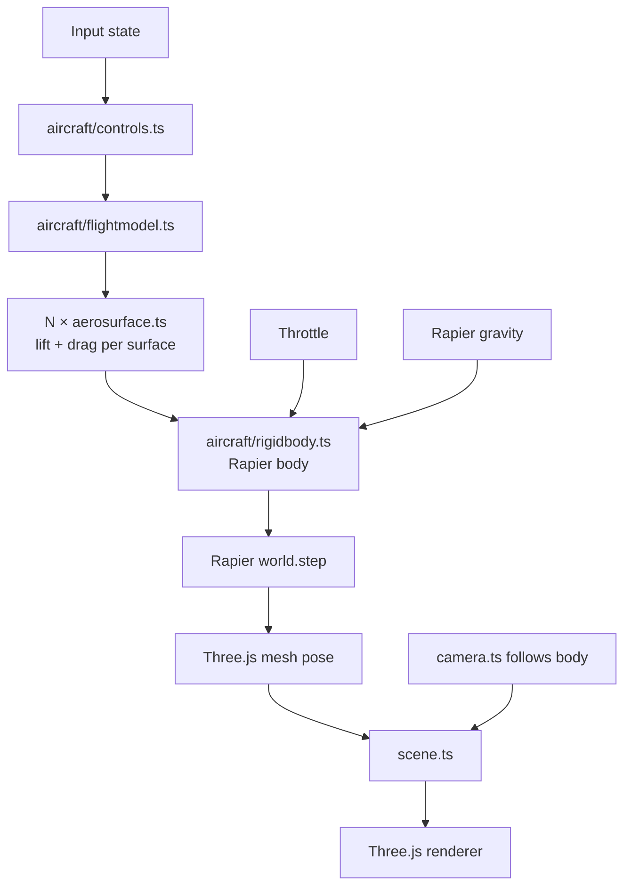

# Architecture

**Phase:** Phase 1 — Flight PoC. Architecture targets Phase 1 explicitly; decisions are chosen to not foreclose Phase 2 (missions) or Phase 3 (polish/ship), but Phase 2-specific systems (mission framework, AI, weapons) are only sketched, not designed.

## Tech Stack

- **Language: TypeScript** (strict mode) — per research. Aircraft physics math benefits from type safety; Three.js + Rapier both ship strong TS types.
- **Framework: none (vanilla Three.js)** — per research. We have minimal DOM UI. A render loop + ECS-lite module layout is simpler than a framework.
- **Rendering: Three.js** (latest stable, r170+) — per research.
- **Physics: Rapier3D** (`@dimforge/rapier3d-compat` for easy bundling; swap to `rapier3d-simd` in Phase 3 if perf needs it) — per research.
- **Build tool: Vite** (TypeScript template) — per research.
- **Dev UI: lil-gui** behind `?debug=true` — per research.
- **Perf: Stats.js** — FPS counter enabled from day one to catch regressions.
- **Database: none** — v1 is stateless. No persistence, no accounts.
- **Infrastructure: static hosting** (Vercel / Netlify / Cloudflare Pages — decide at deploy time; all are equivalent for a static build). No backend in v1.

## System Design

### Module layout

```
src/
  main.ts              # entry: bootstraps engine, starts loop
  engine/
    loop.ts            # fixed-timestep physics + variable-framerate render
    input.ts           # keyboard + mouse state, rebindable map
    assets.ts          # Three.js GLTF / texture loader wrapper
    debug.ts           # lil-gui + Stats.js, gated by ?debug=true
  world/
    scene.ts           # Three.js scene root, lighting, skybox
    terrain.ts         # Phase 1: flat textured plane + landmarks. Phase 3: swap in heightmap.
    camera.ts          # chase + cockpit cameras, swap via key
  aircraft/
    rigidbody.ts       # Rapier rigid body + Three.js mesh binding
    aerosurface.ts     # single lift/drag surface — computes force from local airflow
    flightmodel.ts     # composes aerosurfaces into an aircraft, applies to rigidbody
    controls.ts        # maps input state → control surface deflections
  mission/             # Phase 2 — stub in Phase 1, empty dir
  hud/                 # Phase 2 — stub in Phase 1, empty dir
  index.html
public/
  models/              # GLTF aircraft, textures
  config/
    aircraft.json      # tunable flight model constants (lift, drag, mass, thrust)
```

### Runtime structure



### Game loop

Fixed-timestep physics (60 Hz), variable-timestep render with interpolation:

1. **Input poll** — read keyboard + mouse, update input state.
2. **Controls** — map input → control deflections (elevator, aileron, rudder, throttle).
3. **Flight model** — for each aerosurface: compute local airflow velocity in surface frame, compute angle of attack, look up piecewise-linear CL/CD, produce force + application point.
4. **Apply forces** — sum aerosurface forces + thrust + gravity on the Rapier rigid body.
5. **Physics step** — `world.step()` at fixed dt = 1/60s. Accumulator pattern: run N steps per render frame if behind, skip if ahead.
6. **Sync mesh** — copy Rapier body pose to Three.js mesh transform.
7. **Camera** — chase camera lerps toward target pose; cockpit camera rigidly follows.
8. **Render** — Three.js renderer draws scene.

Separating physics tick from render tick is the standard game-loop pattern ("Fix Your Timestep!" / Glenn Fiedler) and is required for stable aircraft dynamics — Rapier produces wrong results at variable dt.

### Data flow

- **Config** (`public/config/aircraft.json`) → loaded once at boot → flight-model constants.
- **Input** → controls (per-frame) → flight model → rigid body (per physics tick).
- **Rapier world** → body pose (per physics tick) → Three.js mesh (per render frame).
- **No network I/O.** No persistence. Everything in memory.

## Key Decisions

- **D1 — Fixed-timestep physics.** Non-negotiable for flight dynamics. Variable timestep makes aerodynamic integration unstable (stalls oscillate, control response feels laggy on frame drops). Accumulator pattern decouples physics from render framerate.
- **D2 — Aerosurface as first-class primitive.** Every lift-producing part of the aircraft (main wing L, main wing R, horizontal stabilizer, vertical stabilizer, optional control surfaces) is an `AeroSurface` instance with its own position, orientation, area, and CL/CD curves. The flight model is a composition, not a monolith. Rationale: matches Khan & Nahon 2015 model from research; per-surface gives correct-feeling dynamics (banking-to-turn, stall, adverse yaw) automatically without hand-coded rules.
- **D3 — Flight model constants in JSON, not code.** Enables hot-tuning via lil-gui + "Export preset" button that writes back to the config shape. Addresses R2 (flight-feel tuning is iterative) from research. The biggest feel risk is tuning, so we architect for fast iteration.
- **D4 — Flat terrain in Phase 1.** Resolves R3 from research. Phase 1 scope is "plane flies plausibly," not "beautiful world." Flat textured plane + skybox + 2–3 placed landmarks (e.g. a runway, a tower) gives enough spatial reference for flying. Phase 3 polish can swap `terrain.ts` for a heightmap without changing anything else (well-defined interface: provide height-at-xz, provide a Three.js mesh, provide a Rapier collider).
- **D5 — Empty `mission/` and `hud/` dirs in Phase 1.** Explicit Phase 2 stubs. The module layout is intentionally chosen so Phase 2 work is additive — the flight model doesn't need to know about missions, the mission system reads read-only aircraft state.
- **D6 — No ECS.** Single aircraft, flat terrain, no AI in Phase 1. A full ECS (BitECS, miniplex) is overkill. Revisit at Phase 2 if multiple entities (AI enemies, waypoint markers, projectiles) push us past ~5 dynamic things. Swapping in miniplex later is well-scoped — it operates on plain objects.
- **D7 — Three.js + Rapier coordinate alignment.** Both libraries use right-handed Y-up coordinates by default — no transform needed at the sync boundary. One less bug class. Document this in a short `CONVENTIONS.md` when Phase 1 starts so nobody re-derives it.
- **D8 — No framework (React/R3F).** Per research. Revisit if mission-select / HUD grows beyond basic DOM overlays.
- **D9 — Static deploy, backend-less.** Whole game runs client-side. Simplifies infra, aligns with "no-install" vision principle (also: zero server cost).
- **D10 — Per-surface incidence (β1) is the trim mechanism.** Each `AeroSurface` carries an optional `incidenceRad` (default 0) representing the surface's fixed mount angle relative to the fuselage longitudinal axis. At zero body pitch, a wing with `incidenceRad = +2°` sees +2° AoA (positive lift); an h-stab with `incidenceRad = -1°` sees -1° AoA (small downward force behind CG, nose-up moment). This is the textbook airframe-level trim mechanism in real aircraft, and is the schema extension required to make the Phase 1 airframe expressible as a level-trim equilibrium. Rationale + sub-option comparison: see Revision 2026-05-11 below.
- **D11 — Missions are declarative JSON + optional script hook.** Each mission is a JSON file conforming to a `Mission` schema (objectives, win/fail conditions, spawn). Combat (WP16) registers a `scriptHook` for AI enemy behavior; the other three mission types (free flight, waypoint, takeoff/landing) are declarative-pure. Rationale + alternatives: see Revision 2026-05-12 below.
- **D12 — HUD is a DOM overlay.** CSS-absolute `<div>` layered over the canvas, with waypoint arrows positioned via `THREE.Vector3.project()`. Three.js ortho camera is rejected for v1 (no shader-based HUD elements planned). The `HUD` interface is the Phase 3 swap point. Rationale: see Revision 2026-05-12 below.
- **D13 — Per-surface AoA-rate damping (`clAlphaDot`, β5) is the phugoid-mode mechanism.** Each `AeroSurface` carries an optional `clAlphaDot` (default 0) that augments CL by `clAlphaDot · dα/dt`. Damps the phugoid mode (long-period coupled airspeed/AoA oscillation) that SURFACE-2026-05-11-04 logged. Default-zero ships in WP10.5; tuning is Phase 2 per-mission. Rationale + verification: see Revision 2026-05-12 below.
- **D14 — Headless physics harness + automated parameter search is the tuning methodology.** Physics mechanism tuning (β5 first; future βN extensions next) runs against a Node-side headless harness that steps the shipped Rapier physics + flight model at many multiples of wall-clock, scored against an envelope-probing fitness function, driven by a gradient-free optimizer (Nelder-Mead start; CMA-ES fallback). Replaces the manual `build → verify-self → guess` loop for any WP that adjusts `aircraft.json` physics constants. A harness↔browser parity test guards against drift. Rationale + cascade: see Revision 2026-05-12 (afternoon) below.

## Unknowns / deferred to Phase 2 arch pass

- **Mission framework shape** — declarative config? scripted? state-machine? Deferred; Phase 1 proves flight and answers "what does the aircraft expose?" which constrains the mission API.
- **AI enemy architecture** — behavior tree? hand-coded state machine? Deferred. Dependent on mission framework decision.
- **Damage model** — hitpoints? component damage? Deferred.
- **HUD framework** — DOM overlays vs Three.js orthographic layer. Deferred to Phase 2 — depends on what information the HUD needs to render (primarily numeric/iconic → DOM; mixed-world elements like waypoint arrows → Three.js).

These are explicitly Phase 2 concerns. The Phase 1 architecture does not pre-commit to any of them.

## Phase 2 / 3 forward-compat notes

- **Multiple aircraft:** `flightmodel.ts` already takes an aircraft config; multiple instances is just multiple bodies. Rapier handles N dynamic bodies cleanly.
- **Terrain swap:** `terrain.ts` interface (`getHeight(x, z): number`, `getMesh(): Three.Mesh`, `getCollider(): Rapier.Collider`) is chosen so a heightmap implementation is a drop-in.
- **Networking (explicit out-of-scope):** Not forward-compat with v1. Multiplayer would require rewriting physics authority, inputs, and sync. Not a goal.

## Revision 2026-05-11 — Per-surface incidence (trim-spawn schema extension)

**Context.** After the WP7 → AoA-sign-fix → static-margin-geometry-fix-ABANDONED chain, an `arch-handoff-trim-spawn.md` document captured a previously-unresolved architectural gap: the Phase 1 `AeroSurface` schema cannot express a trimmable airframe. With identical symmetric flat-plate curves at zero incidence on every surface, the wing and h-stab AoA are locked together by body attitude — any body pitch that produces wing lift produces proportional h-stab lift behind the CG, generating an unbounded nose-down moment with nothing in the model to counter it. No level-trim equilibrium exists in the current parameter space. Empirical evidence (four refuted hypotheses, including a perfect frame-0 trim-state spawn that diverged within 10 frames) is documented in `workflow/archive/static-margin-geometry-fix-ABANDONED.md` and `arch-handoff-trim-spawn.md`.

**The (2)-vs-(3) framing.** Three possibilities were considered:
1. **Physics is wrong** — Khan-Nahon per-surface model is inadequate. Rejected — the model matches a well-studied reference and is internally consistent.
2. **Physics is right, schema is too restrictive** — the model can express physics correctly but the *parameter manifold* (mass, thrust, areas, surface positions, clSlope, stallAlpha) does not contain a flyable-airplane point. **Accepted as the working hypothesis (~85% confidence).** Strongest evidence: a perfectly-initialized frame-0 trim state (throttle=0.5, +6° body pitch, pRate=0, vSpd=0, airspeed=30 m/s) left the trim state within 0.16 seconds. Local stability would have held it; instead there is no fixed point nearby.
3. **Physics + schema are right, tuning is just hard** — held in reserve. See "Fallback path" below.

**Decision (D10): adopt β1 per-surface incidence.** Per the operator directive of 2026-05-10 ("aircraft must spawn airborne in a stable initial state, fly straight indefinitely"), Option β (airborne trim spawn — requires schema extension) is the path. Among four sub-options considered (β1 per-surface incidence, β2 cambered CL curve, β3 trim-elevator at spawn, β4 `cl_q` pitch-rate damping), **β1 is selected** for these reasons:

- Real airframes solve trim exactly this way (wings at a few degrees positive incidence, h-stab at zero or slightly negative). Mechanically obvious — "this surface is bolted on at angle X."
- Smallest schema change: one optional `incidenceRad` field on `AircraftSurfaceConfig` with default 0. The default-zero behavior is identical to current behavior, so the existing 227 tests continue to pass.
- Preserves the symmetric flat-plate curve as a clean primitive — no per-surface camber asymmetry to reason about.
- ~50 LOC, ~half-day implementation.
- Strong physical priors on parameter values (wings +1°..+3°, h-stab -1°..+1°) bracket WP7 retune to a small search.

β2 (cambered CL curves) was rejected as redundant — same outcome via a less mechanically obvious mechanism with per-surface JSON awkwardness. β3 (trim-elevator) was rejected because it does not solve the lift-source problem alone (wings still need to produce lift at level body attitude) and a permanently-deflected trim elevator creates a poor "first-key-press fights the offset" feel. β4 (`cl_q` damping) is **held in reserve as a follow-up**: damping does not create equilibria, only lets perturbations near one decay; if post-D10 verify-self shows residual integrator-drift wobble around the new trim point, β4 becomes a small follow-up extension.

**Schema specifics (binding for the implementation WP):**

- Add `incidenceRad?: number` to `AircraftSurfaceConfig` (default 0 — backward compatible).
- Plumb through `parseAircraftConfig` → `AeroSurface` constructor.
- In `computeAeroForce`, rotate the surface's local `normal` and `chord` by `incidenceRad` about its span axis before computing local airflow. Equivalently, rotate the local airflow vector by `-incidenceRad` about the span axis before AoA computation; pick whichever produces the cleaner diff against the current implementation.
- Span axis is already pre-baked on each surface (used for control-deflection rotation in WP6). Reuse it.
- Tests: default `incidenceRad=0` must produce bit-for-bit identical force vectors to current behavior on the existing 227 cases. Two new tests assert (a) a level-flow surface with non-zero `incidenceRad` returns non-zero lift in the expected direction, (b) the rotation is independent of body attitude (it's a surface property, not a body property).

**Fallback path (case (3), kept warm).** If a hand-tuned β1 airframe in WP7 Phase E fails to converge on a stable level-trim-and-fly state within ~two tuning sessions — i.e., the parameter space is too high-dimensional, too non-convex, or has too-narrow valid regions for human bracketing — pivot to building automated parameter-search tooling. Fitness function sketch: `spawns airborne ∧ flies straight 30s ∧ max|pRate| < 360°/s ∧ altitude ∈ [spawn ± 50m] ∧ airspeed ∈ [25, 35] m/s`. Search method: gradient-free (CMA-ES or random-restart hill-climb) over `aircraft.json` knobs. This is a meta-task with real opportunity cost (it defers the actual flight-sim work and conflicts with the vision principle "ship a casual flight sim, not a parameter-fitter"), so we explicitly DO NOT build it preemptively. The hedge is recorded here so the WP7 successor handoff has a documented escalation path if hand-tuning runs aground.

**Forward implications:**

- A new WP6.5 (β1 implementation) is inserted in `wbs.md` immediately before WP7 Phase E. Resolves the airborne-stable-spawn blocker.
- WP7 Phase E retune (currently paused) resumes against the β1 baseline after WP6.5 ships.
- WP9 Phase 1 verification remains blocked behind WP7.
- `arch-handoff-trim-spawn.md` is closed by this revision (state: resolved).
- `SURFACE-2026-05-10-02` in `workflow/backlog.md` closes-by-implementation when WP6.5 ships and produces verified airborne stable flight.

## Revision 2026-05-12 — Phase 2 arch revision (mission framework + HUD + β5 phugoid damping)

**Context.** Phase 1 closed 2026-05-11 (WP1–WP9 + WP9.5 + WP9.6 all shipped, 246/246 Vitest + 1/1 Playwright green). The original arch (2026-05-11) explicitly deferred three Phase 2 concerns to a Phase 2 revision: (a) mission framework shape, (b) HUD approach, (c) AI enemy architecture (held for WP16 design). It also left `SURFACE-2026-05-11-04` (phugoid mode undamped) as a Phase 2 candidate. This revision settles (a) and (b) and adopts a small schema extension (β5) to address the phugoid architecturally before Phase 2 feel-tuning begins.

**Driving mode disclosure (operator-as-architect deviation).** Per `feedback_operator_as_external.md`, the operator selected full-autopilot for this session, so the architect role for this revision is performed by the agent rather than by the operator (who would normally be the human-in-the-loop for arch decisions). All three decisions below are made in operator-as-architect mode. **Phase 3 re-validation hook:** all three decisions are reviewable at WP21 (cross-browser QA) or earlier if Phase 2 verification surfaces an integration problem. If a decision turns out to be wrong, the cost is bounded — D11 has a documented swap point (`Mission` interface), D12 has a documented swap point (`HUD` interface), D13 is a per-surface optional field defaulting to 0.

---

### D11 — Mission framework: declarative JSON + optional script hook

**Decision.** Each mission is a JSON file in `public/missions/<name>.json` conforming to a `Mission` schema. The schema declares: `id`, `name`, `type` (free-flight | waypoint | takeoff-landing | combat), `objectives[]` (typed entries — waypoint reach, runway touchdown, target destroyed), `winCondition` (declarative — "all objectives complete" by default), `failCondition` (declarative — timer expiration, crash, etc.), `spawn` (position, velocity, throttle), and an optional `scriptHook` string naming a registered TypeScript callback.

**Loader contract.**
```
loadMission(id: string): Promise<Mission>
```
Returns a `Mission` object. The `mission/runner.ts` module owns the lifecycle (`load → start → tick → complete | fail`), reads aircraft state via the existing `window.__aircraft.getState()`-equivalent typed interface (NOT via the debug global), and emits objective state changes for the HUD to consume.

**Script hooks.** Combat (WP16) is the only mission type that anticipates needing imperative logic beyond declarative objectives — specifically AI enemy behavior. Solution: missions may name an optional `scriptHook` whose implementation lives in `mission/hooks/<name>.ts`, registered at boot. The hook receives `(missionState, aircraftState, dt)` per tick and may mutate mission-local state and spawn/despawn entities. WP13 (free flight), WP14 (waypoint), WP15 (takeoff/landing) require **no** script hook — all four are declarative-pure for those three. **Only WP16 (combat) is expected to register a script hook** for the AI enemy.

**Why declarative JSON over scripted-class or state-machine.**
- **Aligns with D3** (constants in JSON, not code). The mission set is small and tuning-heavy — JSON enables rapid iteration without rebuilds, exactly mirroring `aircraft.json`'s role.
- **Aligns with vision principle 4** ("mission variety over depth"). Four shallow missions × declarative-objectives composition is structurally simple; scripted classes would over-engineer for variety we're not building.
- **Keeps `mission/` small.** A scripted-class approach makes every new mission a new TypeScript file and a new test file. JSON missions need only a schema validator (TypeScript runtime guard, ~30 LOC, same pattern as `parseAircraftConfig`).
- **State-machine alternative** was rejected as a generalization not earned by Phase 2 scope. State machines pay off when missions have multi-phase progression (takeoff → cruise → land), but WP15 is the only such mission, and its phases compose cleanly as ordered objectives in a declarative list. If Phase 3 reveals a mission type that genuinely needs SM semantics (event-driven branching, parallel states), the script-hook escape is the swap point.
- **Script-hook escape preserves the rejected paths' upside.** WP16's AI enemy gets imperative control — the path full-script would have provided — without forcing the other three mission types to pay that complexity tax.

**Trade-off accepted.** Declarative-JSON missions are constrained to the schema. If WP14 (waypoint) or WP15 (takeoff/landing) discovers a need for objective semantics not in the schema, the response is to extend the schema (additive, backward-compatible), not to escape into the script hook. The script hook is reserved for AI-style emergent behavior, not for working around schema gaps.

**Schema sketch (binding for WP11 implementation):**
```ts
type Mission = {
  id: string;
  name: string;
  type: 'free-flight' | 'waypoint' | 'takeoff-landing' | 'combat';
  spawn: { position: Vec3; linvel: Vec3; throttle: number };
  objectives: Objective[];
  winCondition?: 'all-objectives';        // default 'all-objectives'
  failCondition?: FailCondition;          // default 'crash'
  timeoutSec?: number;                    // optional fail-on-timeout
  scriptHook?: string;                    // optional, registered name
};

type Objective =
  | { kind: 'reach-waypoint'; position: Vec3; radius: number; order: number }
  | { kind: 'touchdown'; runway: { center: Vec3; halfExtents: Vec3 }; maxVSpeed: number }
  | { kind: 'destroy-target'; targetId: string };

type FailCondition = 'crash' | 'timeout' | 'out-of-bounds';
```

The exact schema is finalized at WP11. The runtime guard (analogous to `parseAircraftConfig`) and the test suite live in `src/mission/`.

**Phase-3 swap point.** The `Mission` interface (loader + runner + objective state) is the public boundary. If a future mission type needs full-script semantics, replace `loadMission` with a scripted-class factory — `mission/runner.ts` stays the same. Cost of a wrong call at D11 ≈ rewriting `mission/loader.ts` and the missions themselves (~half-day per mission). No physics/render impact.

### D12 — HUD: DOM overlay (CSS-positioned absolute layer on top of the canvas)

**Decision.** v1 HUD is a CSS-absolute `<div>` overlay layered on top of the `<canvas>`. Static elements (altitude readout, airspeed readout, current-objective text, status banner) are plain DOM nodes updated each frame. The one world-anchored element — waypoint directional arrow for WP14 — is a DOM node positioned each frame via `THREE.Vector3.project()`-to-screen-coords (well-trodden pattern, ~20 LOC). HUD lives in `src/hud/`; the existing empty `hud/` dir (D5) becomes populated.

**Why DOM over Three.js orthographic camera.**
- **Aligns with D8** (no framework). HUD content is overwhelmingly numeric/text. DOM text is crisper than 2D-text-rendered-in-WebGL (no anti-alias surprises across Chrome/Safari/Firefox), free DPI handling, and accessible to copy-paste / a11y tooling for free.
- **Cheaper to iterate.** CSS for layout, plain DOM for content. No `OrthographicCamera` second-render-pass cost. The Phase 1 budget is already tight per R5 — adding a second render pass for HUD is a perf risk we don't need to take.
- **Aligns with D9** (static deploy, simple infra). DOM HUD is "open devtools, inspect, edit CSS" — the lil-gui ethos applied to the player-facing UI.
- **Three.js ortho camera was rejected** because its main upside (mixing with in-world particles, shaders, post-processing effects) is a Phase 3 polish concern. v1 HUD shows altitude/airspeed/objective — there is no shader-based HUD element planned for v1.

**HUD interface (binding for WP12 implementation):**
```ts
interface HUD {
  setAircraftState(state: AircraftState): void;     // altitude, airspeed, throttle
  setObjective(text: string | null): void;          // current objective text
  setWaypointArrow(worldPos: Vec3 | null): void;    // world-space target, or null to hide
  setStatus(status: 'flying' | 'won' | 'failed', text?: string): void;
  show(): void;
  hide(): void;
}
```
Implementation in WP12: `src/hud/dom-hud.ts`. The interface is the swap point — a `three-hud.ts` (ortho camera) implementation could be added at Phase 3 if v1 playtesting reveals a HUD design that needs world-shader effects.

**Trade-off accepted.** DOM HUD couples to the page DOM; if the canvas needs to be embedded in a third-party iframe with strict isolation, the HUD overlay would need rework. **This is not a v1 concern** — vision says "open a URL," not "embeddable widget." If embedding becomes a goal, swap to `three-hud.ts`.

**Phase-3 swap point.** The `HUD` interface boundary is the swap point. Cost of a wrong call ≈ reimplementing the four `set*` methods in a Three.js ortho impl (~half-day) plus rewiring waypoint-arrow projection (already lives behind the interface). No mission-framework impact.

### D13 — β5 AoA-rate damping (`clAlphaDot`) — closes SURFACE-2026-05-11-04 architecturally

**Decision.** Extend the per-surface schema with an optional `clAlphaDot?: number` field (default 0 — backward-compatible). At per-surface force computation, lift is augmented by a term proportional to `dα/dt`, the time-rate-of-change of local angle-of-attack. This adds AoA-rate damping that suppresses the phugoid mode (long-period oscillation involving coupled airspeed and AoA changes — the failure SURFACE-2026-05-11-04 documented under non-zero throttle forcing).

**Mechanism (binding for WP10.5 implementation — see WBS).**
At each call to `computeAeroForce`, the surface tracks its previous-tick local AoA. Current `dα/dt ≈ (α_now − α_prev) / dt_physics`. The lift coefficient is augmented:
```
CL_effective(α) = CL_lookup(α) + clAlphaDot · (dα/dt)
```
For `clAlphaDot = 0`, behavior is bit-for-bit identical to current behavior (the existing 246 tests must continue to pass — same default-zero parity contract as β1 and β4).

**Sign convention:** positive `clAlphaDot` produces a lift force opposing rapid AoA increase — i.e., damps the AoA oscillation. Physical analog: a wing whose camber transiently lags as α changes (real airfoils have small but nonzero `cl_α̇` in unsteady aero theory; this is a simplified Theodorsen-like effect).

**Why β5 is in the arch revision, not deferred to a Phase 2 feature WP.**
- **It is a schema extension**, not a tuning value. Schema extensions belong in arch by D2 ("aerosurface as first-class primitive"). Adding `clAlphaDot` mid-Phase-2 to a non-blocking feature WP risks scope creep on that WP.
- **WP10 is the natural moment.** Phase 2 verification (any of WP13–WP17) will hit the phugoid if mission types include level-cruise expectations (waypoint, combat). Better to land β5 in the arch revision and tune in Phase 2 feature WPs than to discover it mid-WP14.
- **Symmetric with the β1/β4 pattern in the original revision.** β1 and β4 were both schema-with-default-zero extensions; β5 follows the same shape. The pattern is established and tested.

**Why not β2 (cambered CL curves) or β6 (full unsteady aero)?**
- β2 was rejected in Rev 2026-05-11; that rejection stands.
- Full unsteady aero (Theodorsen function, indicial response) is study-level fidelity, explicitly out of scope per vision ("plausible over perfect"). β5 is the minimum-mechanism extension that addresses the phugoid divergence — first-order damping on AoA rate.

**Risk + verification approach.**
- **Risk:** β5 may interact with β4 (pitch-rate damping) in ways that look like over-damping or "soggy" feel. Per-surface `clAlphaDot` is tuned independently and starts at 0 until tuned.
- **Verification (binding):** any future tuning of β5 must verify against a **≥30-second** Playwright probe with non-zero throttle (`0.05, 0.15, 0.4`) — single-period observation hides phugoid behavior. Matches the backlog's existing `SURFACE-2026-05-11-04` verification requirement. Memory `feedback_verify_self_envelope.md` applies here.
- **Default `clAlphaDot=0`** ships in WP10.5; actual non-zero tuning is a Phase 2 deliverable when (and only when) a mission requires sustained level cruise (waypoint, combat).

**Schema specifics (binding for WP10.5 implementation):**
- Add `clAlphaDot?: number` to `AircraftSurfaceConfig` and `AeroSurfaceConfig`. Default 0, finite-number validation.
- Plumb through `parseAircraftConfig` → `AeroSurface` constructor.
- Track previous-tick AoA on the `AeroSurface` instance (one new scalar field). Use the physics `dt` (fixed timestep) for finite difference — NOT the variable render `dt`.
- In `computeAeroForce`, compute `dα/dt` and augment CL by `clAlphaDot · dα/dt`. Skip on first tick (prev-AoA undefined) — return baseline CL only. Document this in CONVENTIONS.md.
- Tests: (a) default `clAlphaDot=0` produces bit-for-bit identical force vectors to current behavior on existing 246 cases. (b) Non-zero `clAlphaDot` with constant α produces zero augmentation (dα/dt=0). (c) Non-zero `clAlphaDot` with α_now > α_prev produces additional lift in the +α direction with positive sign (damping convention). (d) First-tick behavior: no augmentation, baseline only.

**Closes-by-implementation:** SURFACE-2026-05-11-04 once `clAlphaDot` is wired AND a Phase 2 mission requires the level-cruise feel and tunes non-zero values. The schema landing in WP10.5 closes the **arch gap**; tuning closes the surface entry.

---

### Forward implications (WBS updates required)

- **Insert WP10.5: β5 (`clAlphaDot`) schema extension** in `wbs.md` Phase 2, between WP10 and WP11. Size: XS (schema-only, default-zero parity). Same shape as WP6.5 + WP6.6.
- **WP11 (mission framework)**: locked to the D11 declarative-JSON + script-hook design.
- **WP12 (HUD)**: locked to the D12 DOM-overlay design with `HUD` interface.
- **WP14 (waypoint)**: implements `setWaypointArrow` via `THREE.Vector3.project()` per D12.
- **WP15 (takeoff/landing)**: declarative `touchdown` objective per D11 schema; no script hook needed.
- **WP16 (combat)**: the one mission with a `scriptHook` for AI enemy. Hook lives in `src/mission/hooks/combat-ai.ts`. AI architecture (behavior tree vs FSM) is **still deferred** to WP16 design — the script hook gives WP16 the freedom to choose without re-opening arch.
- **WP17 (Phase 2 verification)**: must include a ≥30s level-cruise probe to validate β5 (separate from per-mission verification).

### Unknowns / deferred to Phase 3 arch pass

- **AI enemy architecture** (behavior tree, FSM, scripted): still deferred. The `scriptHook` in D11 makes this a per-WP16 decision rather than an arch decision. If WP16 surfaces a generalization need, P12 SURFACE-IN.
- **Damage model**: still deferred. Hitpoints scalar on a destructible-entity type is the v1 minimum; deeper component damage is Phase 3 polish if at all.
- **Bundle size (SURFACE-2026-04-19-01)**: still Phase 3 (WP18/WP21). No arch change.
- **Multiplayer**: out of scope per vision. No arch.

## Revision 2026-05-12 (afternoon) — D14: Physics tuning harness + automated parameter search

**Context.** WP14.5 attempted to tune the β5 (`clAlphaDot`) mechanism that landed in WP10.5 (D13). Three Playwright-driven tuning attempts (+5/+10, +1/+2, -1/-2 on wings/h-stab) all diverged catastrophically — at every sign, every magnitude, every operating regime tested. The WP14.5 retrospect surfaced two findings: (1) the β5 mechanism itself is dimensionally wrong (raw `dα/dt`, no V-normalization — see SURFACE-2026-05-12-03), and (2) the *methodology* of tuning Phase-2 physics by hand-driven `feature-build → verify-self → adjust` loops cannot scale to the search density that real aero coefficients need. Three attempts under `feedback_retune_attempt_budget.md` is the right discipline for refuting a mechanism, but the budget was hit before any meaningful parameter-space coverage was achieved. Per-attempt cost: ~5 minutes of Playwright probe + agent reasoning across three throttle bands. Search density: 3 points in a 2-knob × 3-regime space — sparse to the point of being uninformative.

This revision is the operator-acknowledged escalation from "the β5 mechanism is wrong" to "we lack a systematic way to search physics parameter space at all." It pauses Phase 2 mission progress (post-WP14 line) and routes the next several WPs through harness + optimizer infrastructure rather than further mission content.

**Driving mode disclosure.** Operator-as-architect deviation continues under full-autopilot drive mode per `feedback_operator_as_external.md`. The decision sketch below was reviewed and accepted by the operator before this revision was written; the operator explicitly framed the requirement as "search 100+ combinations, without Playwright, with regression/convergence." All architectural specifics below are the agent's working-out under that framing. **Phase 3 re-validation hook:** D14's design is reviewable at WP21 (cross-browser QA) or sooner if the cascade WPs (14.6/14.7/14.8) surface a problem.

---

### D14 — Physics tuning harness + automated parameter search

**Decision.** Tuning of physics mechanism coefficients in `aircraft.json` (β4 `clQ`, β5 `clAlphaDot`, future βN extensions, plus shared knobs like mass, area, thrust) is performed by a Node-side headless harness that steps the shipped flight model and physics engine without browser, render, or HUD overhead, at as-fast-as-CPU-allows wall-clock. The harness is driven by a gradient-free optimizer that fits a regression to the score surface and converges on parameter values that satisfy an envelope-probing fitness function. Replaces the manual lil-gui + Playwright-probe loop for any WP that adjusts physics constants.

**Why this is arch-level, not feature-level.**
- **Changes module topology.** `src/aircraft/flightmodel.ts` and `src/aircraft/rigidbody.ts` currently bind directly to Rapier-WASM-loaded-in-browser. The harness needs the same physics code executable in Node. That requires extracting a framework-agnostic core, and that's a `src/` reorg — not a tooling add.
- **Changes the tuning workflow.** Phase 2 WPs (WP15, WP16, WP14.5-retry) previously had "tune values in lil-gui" as an implicit verify-self path. With D14, the tuning step becomes a separate harness-run that emits a `aircraft.json`-shaped artifact, which the WP then commits. This is a process change worth codifying in CLAUDE.md alongside the two physics-mechanism discipline rules from the WP14.5 retrospect.
- **Introduces a new test tier.** Vitest (unit), Playwright (e2e), and now **harness sweeps** (slow, parameter-search). CLAUDE.md "Testing" section grows by one tier. Harness sweeps are too slow for CI on the default path; CI runs the harness↔browser parity test only (fast).
- **Has a long-lived dependency on Rapier semantics.** If Rapier is swapped (e.g., to `rapier3d-simd` per D-tech-stack), the harness moves with it. That's an arch-level coupling, not a tooling concern.

---

#### D14.1 — Execution strategy: Rapier in Node, not pure-TS re-implementation

**Three candidate execution strategies were considered:**

1. **Node-side Rapier** (chosen). Use `@dimforge/rapier3d-compat` directly from Node — the same WASM binary that ships to the browser. Step the world manually as fast as the CPU allows in a `while` loop. No render budget, no requestAnimationFrame, no fetch-for-config — just `world.step()` in a tight loop. Expected throughput: 50–200× wall-clock on the operator's mid-range laptop (60 Hz physics × 50× = 3000 simulated seconds/sec, so a 30s probe runs in ~0.6s of CPU).
2. **Pure-TS physics core extraction.** Replace Rapier with a minimal Euler/RK4 integrator we own in TS. Faster (no WASM boundary) and lighter, but **introduces a behavioral fork** between harness and browser. WP14.5's lesson is that pure-math correctness is decoupled from physical correctness; introducing a second physics engine is a second place for those two to diverge. Rejected.
3. **Stub-Rapier shim.** Mock just the methods `flightmodel.ts` calls; keep the rest of Rapier behind a thin protocol. Lighter than (1) but the protocol surface (gravity, collision detection, rigid body integration) is exactly the part where Rapier's correctness matters. Rejected for the same reason as (2).

(1) wins because **harness physics = shipped physics** by construction. No drift class. The cost is paying the WASM boundary overhead per step, which is bounded — `world.step()` in Rapier is microseconds, and we get ~50–200× wall-clock anyway.

**Determinism contract.** Rapier is deterministic at fixed-dt given identical input sequences and identical initial conditions. The harness MUST:
- Seed any RNG inputs explicitly (currently the flight model has none; if Phase 2 adds wind/turbulence, that becomes a seed input).
- Use fixed-dt = 1/60s (matches browser; per D1).
- Take initial conditions (position, linvel, ang vel, throttle, control deflections) as explicit harness input, not from `aircraft.json` spawn defaults (which are mission-coupled and could change).
- Step the world a fixed number of ticks per run; do NOT use any "wall-clock until convergence" loop — the loop is deterministic in tick-count.

A regression-fitting optimizer needs deterministic objective values; non-determinism turns gradient signal into noise.

---

#### D14.2 — Module reorg: extract physics-core layer

To make `flightmodel.ts` callable from Node without dragging Three.js or browser globals, the following reorg is required:

**Current state.**
- `src/aircraft/rigidbody.ts` imports both Rapier AND Three.js. The Three.js dependency is for `syncMesh()` (writes Rapier pose into a Three.js mesh).
- `src/aircraft/flightmodel.ts` imports Rapier types and `BodyState`. No direct Three.js.
- `src/aircraft/aerosurface.ts` is already framework-agnostic — pure math + Rapier scratch types.

**Target state.**
```
src/
  aircraft/
    physics-core/                 # NEW — framework-agnostic, Node-compatible
      aerosurface.ts              # MOVED — already pure
      flightmodel.ts              # MOVED — drop the Three.js leakage if any
      rigidbody-core.ts           # NEW — Rapier-only RigidBody, no Three.js
      state.ts                    # MOVED — AircraftState plain-data (already exists)
      config.ts                   # MOVED — parseAircraftConfig (synchronous parse; loader stays)
      step.ts                     # NEW — composable single-tick step function
    rigidbody.ts                  # KEPT — Three.js mesh binding + delegates to rigidbody-core
    controls.ts                   # KEPT — Three.js-free already; stays here for locality
```

The split criterion is: **can this code run in Node with only `@dimforge/rapier3d-compat` and `aircraft.json` as inputs?** If yes → `physics-core/`. If no (Three.js mesh, DOM input events, lil-gui) → outside.

Modules under `physics-core/` are the only ones the harness imports. The browser entry (`src/main.ts`) imports from both `physics-core/` and the browser-side wrappers. **No behavioral change** — pure file moves + interface tightening. Vitest tests follow their moved modules.

**Why this is safe.** The split criterion is mechanical (does it import `three`?). The 385/385 Vitest suite covers the moved code. The harness↔browser parity test (D14.3) guards against silent drift after the move.

---

#### D14.3 — Parity test: harness must not drift from browser

The single biggest risk in D14 is **harness/browser drift** — the harness's trajectories silently diverging from what the browser actually produces, so the optimizer converges on values that are wrong in the shipped game. Mitigation is structural:

**Parity test contract:**
- A fixed set of initial-condition fixtures (currently: WP14.5's three throttle bands @ 0.05/0.15/0.4 starting from `(0,50,0)` with linvel `(0,0,-30)`). Easily extended.
- The harness runs each fixture for N ticks (start at N=1800 → 30s) and emits a trajectory CSV: `tick, posX, posY, posZ, vX, vY, vZ, pitch, yaw, roll, airspeed`.
- A Playwright spec under `tests/e2e/parity.spec.ts` runs the same fixtures in-browser at fixed-dt (skip render interpolation) and emits the same CSV via `window.__aircraft.getTrajectory()`.
- A Vitest spec diffs the two CSVs column-by-column with a tight tolerance (`|Δ| < 1e-6` per scalar, except angles which use shortest-arc distance). Any divergence fails CI.

The tolerance is tight on purpose. We are using the same Rapier WASM with the same fixed-dt and the same code path — bit-identity is the expected default; any drift indicates the split was not clean.

**Determinism caveat.** If parity-test failures show up cross-platform (Mac vs Linux CI), that's evidence that WASM is non-deterministic across the boundary and we need to either pin a single platform for harness runs or relax tolerance with care. Treat this as a SURFACE if hit.

---

#### D14.4 — Score function: envelope-probing fitness

The optimizer needs a scalar score per parameter point. The score function is the load-bearing piece — see WP14.5's catastrophic failure mode (Attempt 1 *appeared* to work at one throttle and broke at others). Per `feedback_verify_self_envelope.md`, the score MUST probe the operating envelope, not a single nominal initial condition.

**Score function shape (binding for the harness implementation WP):**

```
score(params) = Σ_regime  weight_regime · regime_score(simulate(params, regime))

where regime ∈ {low_throttle, mid_throttle, high_throttle}  (initial set; extensible)
and regime_score is a piecewise function on the trajectory:

   if any NaN/Infinity at any tick:   -1e9 - tick_of_first_NaN  (heavy penalty, prefer-failing-later)
   else:
     altitude_penalty   = max(0, |max(alt) - spawn_alt| - ALT_ENVELOPE) ** 2
     airspeed_penalty   = max(0, max(|airspeed - target_airspeed|) - AS_ENVELOPE) ** 2
     pitch_rate_penalty = max(0, max(|pitch_rate_deg_per_sec|) - PITCH_RATE_LIMIT) ** 2
     phugoid_penalty    = grow_rate_of_alt_envelope_over_window  (positive if growing — phugoid)
     -1 * (alt_penalty + as_penalty + pitch_rate_penalty + phugoid_penalty)
```

**Higher is better.** NaN produces a large negative score that still encodes "how soon did it explode" so the optimizer can move *toward* later-NaN regions even when all sampled points NaN. Crucial for the WP14.5 attack regime where every Attempt-1 point exploded — the optimizer needs *some* gradient, not all-equal sentinel values.

**Envelope constants** (initial values; tunable):
- `ALT_ENVELOPE = 50m` — phugoid allowable amplitude
- `AS_ENVELOPE = 30 m/s` — airspeed allowable amplitude
- `PITCH_RATE_LIMIT = 360°/s` — short-period control health (matches WP6.5 budget)
- `target_airspeed = regime-dependent` (e.g., 25/30/40 m/s for low/mid/high throttle)
- `weight_regime` — equal weights initially; bias toward gameplay-relevant regimes later

The score function lives in `tools/tune/score.ts`. Vitest covers it. The envelope constants live with the score function, not in `aircraft.json` — they're optimizer hyperparameters, not aircraft physics.

---

#### D14.5 — Optimizer: Nelder-Mead with quadratic regression on best simplex; CMA-ES as fallback

**Choice: Nelder-Mead (downhill simplex) as the primary optimizer.**
- Gradient-free — works against the noisy, discontinuous (NaN-cliff) score function above.
- Low-dimensional friendly — physics tuning is typically 2–4 knobs at a time (e.g., `wings.clAlphaDot`, `hstab.clAlphaDot`).
- Cheap to implement — ~150 LOC pure TS, no dependencies. (Well-known reference: Press et al., *Numerical Recipes*.)
- Composes well with the regression layer: once the simplex contracts near a candidate optimum, fit a local quadratic (`score ≈ a + bᵀΔp + Δpᵀ C Δp`) to the simplex vertices and emit it as a status report — "near this point, the response surface looks like X, gradient direction Y, conditioning Z." This is what the operator means by "compute the regression": local Taylor fit on the simplex, used both for convergence diagnosis and for human-readable output.
- **Restarts.** Random-restart Nelder-Mead from K seeded starting points (K=4 initially) bounds the local-minimum risk. Each restart is a fresh harness run, so harness speed is the budget gate.

**Fallback: CMA-ES** if Nelder-Mead repeatedly fails to converge in 2 restart batches. CMA-ES handles multi-modal / ill-conditioned surfaces better but is heavier. Adopt only if needed; we don't pre-build it.

**Stopping criteria:**
- Score plateau: best vertex score changes < `SCORE_TOL = 1e-3` over `N_PLATEAU = 30` iterations.
- Simplex diameter: `max ||p_i - p_centroid|| < PARAM_TOL = 1e-4` (in normalized parameter space).
- Iteration cap: `MAX_ITER = 500` per restart.

**Bayesian optimization explicitly rejected** for this scale. Sample efficiency wins on expensive evaluations (minutes/hour per eval). With harness at 50–200× wall-clock, a 30s probe runs in <1s, and Nelder-Mead's tens-to-hundreds of evals fit in seconds-to-minutes. BayesOpt's GP-fitting + acquisition-function overhead dominates the eval cost at our scale. Reconsider only if score evaluation cost rises (e.g., harness probes go to multi-minute durations for higher-fidelity stability checks).

---

#### D14.6 — Tuning workflow change (codified in CLAUDE.md)

**Before D14.** A physics-tuning WP looked like:
1. `feature-plan` proposes tuning values.
2. `feature-build` edits `aircraft.json`.
3. `feature-verify-self` runs Playwright probe.
4. If fail → back-loop to step 2 with revised guess (budget per `feedback_retune_attempt_budget.md`: 2-3 attempts then option-c).

**After D14.** A physics-tuning WP looks like:
1. `feature-plan` defines the optimizer search space (which knobs, bounds) and validates the score function envelope is appropriate for this mission's regime.
2. `feature-build` runs `npm run tune -- --knobs wings.clAlphaDot,hstab.clAlphaDot --bounds 0..20,0..20 --restarts 4`; harness produces a `tools/tune/results-<timestamp>.json` artifact with the best parameters, score, regression fit, and convergence trace.
3. Commit only if score crosses an explicit acceptance threshold (defined in the plan); otherwise option-c escalates to mechanism revision (same SURFACE shape as WP14.5).
4. `feature-build` writes the chosen parameters into `aircraft.json`.
5. `feature-verify-self` runs Playwright probe to confirm harness↔browser parity holds for the tuned point (catches drift in the mechanism we're tuning, not in physics).

**The 2–3-attempt budget from `feedback_retune_attempt_budget.md` still applies** — but now an "attempt" is one optimizer run (~minutes), not one human-driven probe (~5 minutes + reasoning). The budget is on *optimizer restarts with different starting points or scoring envelopes*, not on individual evaluations. Memory `feedback_retune_attempt_budget.md` will be updated when D14 ships.

This adds a new bullet to CLAUDE.md "Development Conventions" → **Physics-mechanism discipline** section:

> **3. Physics-mechanism tuning runs through the harness, not hand-guessing.** Any WP that adjusts `aircraft.json` physics constants (mass, thrust, areas, β-coefficients, inertia) MUST run the harness optimizer (`npm run tune`) over an explicit parameter space and commit the optimizer's output artifact alongside the JSON change. Hand-guessing physics values is reserved for (a) initial schema-land WPs where defaults must be 0 anyway, and (b) the operator-as-architect explicitly choosing a value for non-physical reasons (e.g., gameplay feel override). **Origin:** WP14.5 exhausted the 3-attempt budget on 3 sparse points in a continuous parameter space; the mechanism may or may not have been tunable — the search density was too low to know.

The two existing rules (no-sign-convention-unit-tests-before-live-observation; schema-land close requires non-default verify-self) remain in force.

---

#### D14.7 — What this is NOT

- **Not a generic ML/AI pipeline.** No neural networks, no learned models, no RL. The score function is hand-written and human-readable; the optimizer is a classical simplex method. The "regression" is local quadratic fit for human-readable convergence diagnosis, not model training.
- **Not a continuous tuning daemon.** The harness runs on-demand from `npm run tune`, produces an artifact, and exits. It does not run in CI by default; parity test runs in CI, full tuning sweeps do not.
- **Not a substitute for verify-self in browser.** Browser verify-self still runs on every WP via Playwright. The harness adds a pre-step for tuning WPs only. Non-physics features (HUD, mission flow, controls) ignore the harness entirely.
- **Not an architectural commitment to long-term parameter search infrastructure.** If Phase 2 closes with WP14.5/15/16 shipped and Phase 3 finds the harness unused for 3+ months, it's allowed to bit-rot or be deleted. The arch decision is "land the harness so we can finish Phase 2"; it is not "we are now a parameter-search shop."

---

#### D14.8 — Forward implications (WBS cascade — binding for `/product-wbs`)

The following new work items land in `wbs.md` Phase 2 in order, before WP14.5-retry. WP15/WP16/WP17 remain blocked behind WP14.5-retry as previously stated. **Existing WP14.5 in WBS is REPLACED in scope** — its current contents (tuning attempts already run and disposed) are archived; the new WP14.5 description (below) is "tune using the harness, ship if any values work, else escalate to mechanism revision."

**WP14.6 — Extract physics-core (D14.2) + parity test (D14.3).** Size: M. Description: file-move reorg per D14.2 with no behavioral change; add `tests/e2e/parity.spec.ts` and a Vitest CSV-diff spec. Acceptance: 385/385 existing tests pass post-move; parity test green in CI; tsc strict clean.

**WP14.7 — Node harness (D14.1).** Size: M. Description: `tools/tune/harness.ts` boots Rapier in Node, loads `aircraft.json`, takes initial conditions + parameter overrides + tick-count from CLI args, emits trajectory CSV. `npm run harness -- --fixture <name> --ticks 1800` runs a single deterministic probe. No optimizer yet — this is the inner loop. Vitest covers CLI parsing + the trajectory emitter; the parity test (WP14.6) is the correctness gate. Includes `tsconfig.tools.json` if Vite's `tsconfig.json` doesn't reach `tools/`.

**WP14.8 — Optimizer + score function (D14.4 + D14.5).** Size: M. Description: `tools/tune/score.ts` implements the envelope-probing score; `tools/tune/optimizer.ts` implements Nelder-Mead with K=4 restarts and quadratic-regression status reporting; `tools/tune/tune.ts` is the CLI entry (`npm run tune -- --knobs ... --bounds ... --regimes ...`). Vitest covers score function on synthetic trajectories (deterministic mocked harness) + Nelder-Mead on synthetic objective functions (Rosenbrock, sphere, etc.) to validate the implementation against known optima.

**WP14.5 (rescoped) — `clAlphaDot` tuning pass via harness.** Size: S–M (depends on outcome). Description: run `npm run tune -- --knobs wings.clAlphaDot,hstab.clAlphaDot --bounds -10..20,-10..20 --restarts 4 --regimes low,mid,high`; commit the result if score crosses acceptance threshold. **If no parameter point produces a passing score across all three regimes**, the mechanism is confirmed unsuitable; surface as a mechanism-revision WP (Options A/B/C from SURFACE-2026-05-12-03), now with regression-gradient evidence to argue for one option over the others. The harness becomes the experiment platform for evaluating Options A/B/C side-by-side.

**WP15 / WP16 / WP17 — unchanged in shape**, but their respective tuning sub-tasks (if any) flow through `npm run tune` now. WP17 Phase 2 verification absorbs the parity test as a permanent CI artifact.

**Critical path update.** New chain:

```
… → WP10.5 → WP11 → WP12 → WP13 ✓ → WP14 ✓ → WP14.6 → WP14.7 → WP14.8 → WP14.5(retry) → WP15/WP16 → WP17 → WP18 → …
```

Net cost: +3 WPs (~2 days of agent work) before Phase 2 mission content resumes. Net benefit: every future Phase 2 + Phase 3 physics tuning runs at minutes-per-attempt instead of hours-per-attempt, and converges on optima we can defend with regression evidence instead of "I tried 3 points."

---

#### D14.9 — Project structure additions

```
tools/                          # NEW — Node-side tools, framework-agnostic
  tune/
    harness.ts                  # WP14.7 — Rapier-in-Node single-probe driver
    score.ts                    # WP14.8 — envelope-probing fitness
    optimizer.ts                # WP14.8 — Nelder-Mead + restarts + regression
    tune.ts                     # WP14.8 — CLI entry point
    results/                    # gitignored — optimizer artifacts (timestamped JSON)
src/aircraft/physics-core/      # NEW — WP14.6 — framework-agnostic physics
tests/e2e/parity.spec.ts        # NEW — WP14.6 — browser-side trajectory emitter
tests/parity-diff.test.ts       # NEW — WP14.6 — Vitest CSV-diff
tsconfig.tools.json             # NEW — WP14.7 — Node-target tsconfig for tools/
```

`package.json` adds two scripts at WP14.7/WP14.8:
```
"harness": "tsx tools/tune/harness.ts",
"tune": "tsx tools/tune/tune.ts"
```

Adopt `tsx` (zero-config TS-on-Node runner) as a devDep — cheaper than maintaining a separate `tsc` build for tools. Locked at WP14.7.

`.gitignore` extends with `tools/tune/results/`.

---

### Open questions / deferred to harness implementation WPs

- **Cross-platform determinism of Rapier WASM.** Assumed bit-identical across Mac/Linux/Windows; will be confirmed by the parity test at WP14.6. If it fails, SURFACE and either pin platform or relax tolerance.
- **Score function envelope constants.** Initial values are educated guesses; the WP14.5-retry run will be the first real calibration. Constants live in `tools/tune/score.ts` and are themselves tunable (but not via the harness — that'd be infinite regress).
- **Whether to wire `npm run tune` into pre-commit hooks for files matching `aircraft.json`.** Tempting but probably wrong — tuning is intentional, not reflexive. Deferred to "see how the WPs feel."
- **Whether the harness needs a Three.js-less mesh stub for collider visualization in trajectory output.** Probably no — the trajectory CSV is sufficient for scoring. Defer until WP14.7 surfaces a need.

---

## Revision 2026-05-16 — D15 + D16: numerical-integration fixes for β4 and β5

**Context.** WP14.5-retry (shipped 2026-05-16, commit `5fa06d1`) ran the D14 harness-optimizer over the joint 4D (clQ, clAlphaDot) parameter space for wing-left + h-stab. 4 Nelder-Mead random restarts + 4 hand-picked supplementary probes — 8 distinct points covering the box `[0..20]×[-10..20]×[0..20]×[-10..20]` — all converged to the NaN-floor score `-2,999,999,985 = 3 × -1e9 + ~15`. The optimizer's quadratic-regression Hessian came back **null** (degenerate — zero score variance across the simplex), indicating no gradient direction exists in the searched space.

**Critically, the current `aircraft.json` baseline (clQ=3,8; clAlphaDot=0,0) is itself NaN in high-throttle at tick 417** — reproducing SURFACE-2026-05-16-01's diagnostic exactly via the new harness. The hand-picked tiny-clAlphaDot=0.1 probe (with WP6.5-stable clQ) NaN's within 85-199 ticks across all 3 regimes — confirming SURFACE-2026-05-12-03's "raw dα/dt dimensionally wrong" hypothesis under controlled conditions.

**Diagnostic conclusion (filed as SURFACE-2026-05-16-04 — the actionable arch-revision driver):** the issue is not in the *physics model* (the continuous-time mechanism is correct) and not in the *parameters* (no point in the searched 4D box stabilizes). The issue is in the **discrete-time integration** of two specific rotational-damping terms at dt=1/60s. Both have well-established fixes in real flight-sim literature; both apply at the **discretization layer**, not the model layer.

**Driving mode disclosure.** Continues `feedback_operator_as_external.md` deviation: operator-as-architect, full-autopilot. The decision sketch below was framed by the operator's reading of the WP14.5-retry diagnostic ("the problem is the physics simulation, not the parameters") and is the agent's working-out under that framing. **Phase 3 re-validation hook:** both D15 and D16 are reviewable at WP21 (cross-browser QA) or sooner if downstream WPs surface a problem.

**Why D15 + D16 are separate decisions, not a single "β-numerics revision".** They address two distinct mechanisms (β4 / pitch-rate damping; β5 / AoA-rate damping). Each could in principle be fixed independently. The cascade WPs (see "Forward implications" below) treat them in parallel because both block WP14.5-retry-2 — but each has its own schema-landing + tuning sequence, its own verify-self gate, and its own SURFACE origin record. Bundling them would entangle the change-impact attribution if either fix needed iteration.

---

### D15 — β4 implicit-Euler integration for pitch-rate damping

**Decision.** Replace the explicit-Euler-in-disguise update of the (`ω × r`) contribution to local airflow at `src/aircraft/physics-core/aerosurface.ts:445-450` with an implicit-Euler form. The current line `_scratchAngVelCross.multiplyScalar(1 + surface.clQ * vScale)` computes the damping coefficient against *this tick's* angular velocity and applies the resulting force to *next tick's* velocity update via Rapier — a classic explicit-Euler shape that goes unstable when the discrete-time damping pole moves outside the unit circle. At dt=1/60s with `clQ=8` (h-stab) and `vScale ∝ v/V_REF` above V_REF=30, this happens around |v|=50-60 m/s and produces the sign-flip cascade documented in SURFACE-2026-05-16-01 (tick 412: angvel −2.4 → −25 → +38 → −262 rad/s; NaN by tick 417).

**Mechanism (binding for WP14.X1 implementation — see "Forward implications").**
The amplification `(1 + clQ · vScale)` is currently applied to the rotational contribution to airflow *before* the airflow → AoA → CL → force chain. In an implicit-Euler form, the damping moment on `ω` must be consistent with `ω_{n+1}` (the result), not `ω_n` (the input). Two implementations are arch-equivalent; the WP picks the cheaper one at schema-landing time:

- **Form A (preferred): semi-implicit ω update inside the aerosurface pipeline.** Compute the force-from-airflow at the un-amplified `ω · r`; compute the would-be damping moment from `clQ`; solve a per-axis scalar equation `ω_{n+1} = ω_n + dt · (M_un_damped − k · ω_{n+1}) / I`, where `k = damping_coefficient(clQ, v)` and `I` is the relevant moment-of-inertia component. The closed-form `ω_{n+1} = (ω_n + dt · M_un_damped / I) / (1 + dt · k / I)` keeps the discrete-time pole inside the unit circle for any positive `k`. Apply this correction to `ω` *before* Rapier's own step. Adds one scalar division per surface per tick.
- **Form B (alternative): clamp the damping moment magnitude.** Cap `|M_damping| ≤ I · |ω_n| / dt` so the damper can never reverse ω in a single tick. Simpler but loses asymptotic correctness — at large `clQ` it caps to "no damping reversal" rather than "smooth exponential decay." Rejected unless Form A measurably costs too much.

**Why Form A is the standard fix.** Real flight-sim and rigid-body-dynamics codes that include stiff aerodynamic damping use implicit or semi-implicit Euler precisely because explicit Euler's stability boundary `dt · k / I < 2` is easily exceeded by realistic damping coefficients at common physics tick rates. The 1/(1 + dt·k/I) factor is one division and trivially fast; the math is in any introductory numerical-methods text under "implicit methods for stiff ODEs."

**Why this is in the arch revision, not deferred to a feature WP.**
- **Changes the integration scheme**, not a tuning value. WP6.5 + WP6.6 added the β4 schema field and its V-scaling formula; D15 changes how that field's effect is *integrated*. Schema-level vs integration-level fix — different layers, both arch.
- **Touches the hot path.** `computeAeroForce` is called per-surface per-tick (4 surfaces × 60 Hz = 240 calls/sec). Any allocation in the implicit-Euler closure must respect the existing allocation-free contract (scratch buffers, no `new`). Worth specifying at arch level.
- **Symmetric with D14's "structural-not-parametric" framing.** D14 said tuning needs systematic search; D15 says when search refutes all parameters, the integrator is the problem. Both are arch-level methodology decisions, not WP-level tweaks.

**Risk + verification approach.**
- **Risk 1: parity drift with WP6.5 calibration.** WP6.5's β4 was calibrated empirically in-browser for low-V (descending-glide) behavior. The implicit-Euler form must reduce to WP6.5's `(1 + clQ)` amplification *exactly* in the low-V regime (`v ≤ V_REF`) to avoid invalidating the WP6.5 tuning. Verification: the harness-vs-browser parity test in `tests/parity-diff.test.ts` MUST stay green at `clQ=3` (wings) and `clQ=8` (h-stab) with the post-D15 implementation. If parity fails, the implicit form is not equivalent enough at low-V — surface and reconsider.
- **Risk 2: interaction with Rapier's own integrator.** Rapier integrates `ω_{n+1} = ω_n + dt · M / I` internally. D15 pre-corrects `ω` before passing to Rapier OR adjusts the applied moment to be Rapier-compatible. The two are mathematically equivalent at small dt but the WP must commit to one and document it.
- **Verification (binding):** the `throttle-high` parity fixture (already exists at `tools/tune/harness.ts` per WP14.7) MUST stay finite through all 1800 ticks at the current baseline `clQ=3,8` after the fix. **This is the non-default verify-self gate per CLAUDE.md physics-mechanism discipline Rule #2** — the fix must demonstrably do its claimed job at a non-default coefficient before the schema-land WP closes. Just default-zero parity is insufficient.
- **Verification (binding, secondary):** after D15 lands AND default coefficients are preserved at `clQ=3,8`, the WP14.5-retry-2 optimizer search MUST find a non-NaN region in the (clQ, clAlphaDot) joint space across all 3 throttle regimes. If it does not, D15 alone is insufficient and D16 alone is the remaining variable to test.

**Default behavior preservation.**
- All current `aircraft.json` values (wings clQ=3, h-stab clQ=8) must produce **identical low-V trajectories** to the pre-D15 code (same parity fixtures, same `|Δ| < 1e-6` tolerance) — this is Rule #2 + Rule #1 of `feedback_asymmetric_fix_no_op.md`. The fix is a no-op in the WP6.5-calibrated regime; it activates above V_REF where the explicit-Euler stability boundary is currently crossed.

**Closes-by-implementation:** SURFACE-2026-05-16-01 (β4-specific origin record) once the implicit-Euler form is in production AND the throttle-high parity fixture stays finite through 1800 ticks at baseline. SURFACE-2026-05-16-04 partially closes when D15 + D16 both land + WP14.5-retry-2 finds a stable parameter point.

---

### D16 — β5 non-dimensional form for AoA-rate damping

**Decision.** Replace the raw-rate update at `src/aircraft/physics-core/aerosurface.ts:475-483` (`cl += surface.clAlphaDot * dAlphaDt` where `dAlphaDt = (alpha - surface.prevAoA) / dt`) with the standard non-dimensional aerodynamic form:

```
cl += surface.clAlphaDot · (dAlphaDt) · referenceChord / (2 · max(V, V_REF))
```

where `referenceChord` is the surface's chord length (derived from the existing `chord` vector — `surface.chord.length()` gives it; cached in the AeroSurface constructor for hot-path efficiency) and `V = |bodyState.linvel|`. The `max(V, V_REF)` floor is the same shape as WP6.6's β4 V-scaling: it avoids the 1/V singularity at low airspeed (taxi/spawn) and preserves a sensible damping scale in the descending-glide attractor regime.

**Why the non-dimensional form.** Standard unsteady-aerodynamics theory (Etkin & Reid, *Dynamics of Flight*, §5.10–5.12; Theodorsen 1935 with simplifications) writes the lift-coefficient correction for AoA rate as `cl_α̇ · (α̇ · c̄ / (2V))`. The factor `c̄ / (2V)` is the standard reduced-frequency normalization — it makes `cl_α̇` a **dimensionless coefficient** of `O(1)` (typical values 1–10) instead of a dimensional coefficient that depends on tick rate and airspeed scales. The current raw-rate code makes `clAlphaDot` an implicit function of dt and V; that's why every tuning attempt diverged regardless of magnitude.

Specifically: at dt=1/60s and AoA changes of 1° per tick (typical during a startup transient), `dα/dt` ≈ 1 rad/s. With raw-rate β5 at clAlphaDot=0.1 (the smallest tested value), CL is augmented by 0.1 — comparable to the entire steady-state CL at moderate α. Positive-feedback loop, immediate divergence. With the non-dimensional form at `c̄ = 1m` and `V = 30 m/s`, the same raw rate gives a CL augmentation of `0.1 · 1 / 60 = 0.0017` — three orders of magnitude smaller, in the right physical range. Tunable values of `clAlphaDot` in the standard form land in the 1–10 range (per textbook), so the optimizer's bounds for D16-cascade tuning should be approximately `[0..15]` or `[-5..15]` per surface.

**Mechanism (binding for WP14.X2 implementation — see "Forward implications").**
- The `referenceChord` value is derived once at AeroSurface construction time (in `parseAircraftConfig` → `AeroSurface` constructor), cached as a numeric field, NOT computed per-tick. The `chord` vector is already required to be unit-length-equivalent for the AoA computation, so a per-surface `chordLength?: number` field can be optional in `AeroSurfaceConfig` (default: `chord.length()` if omitted — typically 1 for the current aircraft.json shape).
- The `max(V, V_REF)` floor uses the same `BETA4_V_REF = 30` constant as β4 (no need for a separate `BETA5_V_REF`; the physical interpretation is "reference airspeed at which the calibration is anchored," shared across β4 and β5 by design).
- The augmentation gate (`clAlphaDot !== 0 && dt !== undefined && dt > 0 && prevAoA !== undefined`) remains as-is — same first-tick-no-augmentation contract.

**Why D16 alone is not enough (and why D15 + D16 must land together).** If D16 lands without D15, β5 becomes tunable but β4 still NaN's in high-throttle (per SURFACE-2026-05-16-01's pre-existing diagnostic). The optimizer would converge on the β4 NaN-floor and never reach informative gradient in (clQ, clAlphaDot) joint space. If D15 lands without D16, β4 becomes stable but β5 is still dimensionally broken — every nonzero clAlphaDot value still destabilizes at the first AoA-transient tick. **Both must land before the WP14.5-retry-2 joint search can find a stable point.** The cascade WPs are ordered to land both before the tuning attempt.

**Risk + verification approach.**
- **Risk 1: parity drift at default clAlphaDot=0.** The current code's β5 contribution is zero when `clAlphaDot=0` (the augmentation block is gated). The new code's β5 contribution is also zero in the same case (`0 · anything = 0`). Default-zero parity is preserved by construction. The harness-vs-browser parity test `tests/parity-diff.test.ts` MUST stay green through D16 with current `aircraft.json` values.
- **Risk 2: WP10.5's sign-convention unit test.** The β5 sign-convention test at `src/aircraft/physics-core/aerosurface.test.ts:1135` (per the project CLAUDE.md retrospect) asserts "positive clAlphaDot + rising α produces additional lift." This relation holds under the non-dim form too (multiplication by `c̄/(2V) > 0` preserves sign). The test will continue to pass — but per CLAUDE.md physics-mechanism discipline Rule #1, the test is **not authoritative** without live-system observation at a non-zero coefficient. WP14.X2 MUST observe live behavior at a non-zero clAlphaDot in at least two operating regimes (low-V and high-V, or rising-α and falling-α) for a ≥10s window before relying on the sign-convention test as a regression anchor.
- **Verification (binding):** at WP14.X2 close, with clAlphaDot set to a non-zero value (per CLAUDE.md Rule #2 — non-default verify-self), the `tests/e2e/phugoid-probe.spec.ts` MUST be un-skipped and produce all-3-throttle-bands finite through 30s. This is the same gate the original D13 promised; D16 delivers it for real.

**Default behavior preservation.**
- All current `aircraft.json` values (clAlphaDot omitted → defaults to 0 on all 4 surfaces) produce identical trajectories pre- and post-D16. Per `feedback_asymmetric_fix_no_op.md`: the fix is a no-op in the working regime (default-zero) and only activates where a non-zero `clAlphaDot` is set.

**Closes-by-implementation:** SURFACE-2026-05-12-03 (β5-specific origin record) once the non-dimensional form is in production AND a non-zero clAlphaDot is tuned at WP14.5-retry-2 to satisfy the phugoid-probe gate across all 3 throttle bands. SURFACE-2026-05-16-04 partially closes when D15 + D16 both land + WP14.5-retry-2 finds a stable parameter point. SURFACE-2026-05-11-04 (the original phugoid-undamped surface) fully closes at that point too.

---

### D15 + D16 jointly — physics-mechanism discipline reinforcement

Both D15 and D16 are direct applications of the physics-mechanism discipline codified in CLAUDE.md after WP10.5's premature-close lesson:

- **Rule #1 (live-observation before sign tests):** WP14.X1 and WP14.X2 schema-landing each require a Playwright probe at a non-zero coefficient before any new sign-convention unit test is written. The D14 harness optimizer's parity fixtures count toward this requirement (they ARE Playwright-driven via `tests/e2e/parity.spec.ts`).
- **Rule #2 (non-default verify-self for schema-landing close):** both WPs must verify at a non-default coefficient against the relevant SURFACE — for D15, against SURFACE-2026-05-16-01's throttle-high regime; for D16, against SURFACE-2026-05-12-03's tiny-clAlphaDot=0.1 destabilization regime. Default-zero parity tests alone do NOT satisfy close.
- **Rule #3 (harness-driven tuning, not hand-guessing):** WP14.5-retry-2 (the post-D15/D16 tuning WP) MUST run through `npm run tune`, not via hand-guessing in lil-gui. The optimizer search is the systematic budget per `feedback_retune_attempt_budget.md`.

---

### Forward implications (WBS updates required)

Three new WPs cascade from this revision, ordered analogously to the D14 cascade (WP14.6 → WP14.7 → WP14.8):

- **WP14.X1: D15 — β4 implicit-Euler integration.** Size: S (one `computeAeroForce` hot-path change + cached chord length pre-compute + Rapier integration boundary documentation). Must preserve harness-vs-browser parity at `clQ=3,8` baseline. Verify-self: throttle-high parity fixture stays finite through 1800 ticks at baseline.
- **WP14.X2: D16 — β5 non-dimensional form.** Size: S (one `computeAeroForce` hot-path change + cached chord length re-use + bounds-of-typical-values comment). Must preserve default-zero parity. Verify-self: non-zero clAlphaDot probe stays finite through ≥10s in at least 2 operating regimes (low-V + high-V, or low-throttle + high-throttle).
- **WP14.5-retry-2: joint (clQ, clAlphaDot) tuning post-D15+D16.** Size: XS-S (mostly harness-run + threshold-evaluation, same shape as WP14.5-retry). Acceptance threshold: all 3 regimes finite through 1800 ticks AND total score ≥ -300 (same threshold as WP14.5-retry; the threshold doesn't change just because the mechanism does). If cross-threshold: commit `aircraft.json` values + un-skip `tests/e2e/phugoid-probe.spec.ts`. If not: file a new SURFACE — but per the diagnostic evidence in SURFACE-2026-05-16-04, both Option-A fixes together SHOULD produce a stable region; failure would indicate a third mechanism layer we haven't surfaced yet.

WP15 (takeoff/landing) and WP16 (combat) remain paused at the post-WP14 line — they can resume once WP14.5-retry-2 closes either way (success: tuning produces a stable airframe; failure: mission content is re-scoped to the descending-glide envelope, but that's a separate decision).

**Schema additions.** D15 adds a per-AeroSurface cached `chordLength: number` field (computed at construction, not in `aircraft.json` — derived from `chord.length()`). D16 uses the same cached field. **No `aircraft.json` schema changes** — `clQ` and `clAlphaDot` keep their existing meaning; only their integration changes.

**Test additions.**
- D15 Vitest: discrete-time pole stability check at `clQ=8, v=60` (post-fix should produce bounded `ω_{n+1}` over many ticks given a fixed external moment); default-clQ parity (existing 516/516 must continue to pass).
- D16 Vitest: non-dim form unit-test for `c̄ = 1, V = 30, dα/dt = 1` produces CL augmentation of `clAlphaDot / 60` (closed form sanity check); default-zero parity (existing 516/516 must continue to pass).
- D15+D16 Playwright: `tests/e2e/phugoid-probe.spec.ts` un-skipped at WP14.5-retry-2 close.

### Open questions / deferred to D15+D16 cascade implementation WPs

- **Whether to wire D15's implicit-Euler correction as a pre-Rapier ω adjustment or a Rapier moment-input adjustment.** Mathematically equivalent at small dt; the WP picks based on Rapier API ergonomics. Documented at WP14.X1 close.
- **Whether `chordLength` warrants a per-surface override in `aircraft.json`.** Currently the chord vector is `(0, 0, -1)` for all 4 surfaces, so `chord.length() = 1` everywhere. If Phase 3 adds aircraft with varying chord lengths, a per-surface override would be needed — deferred until then.
- **Whether D15 needs a per-axis moment-of-inertia split.** The implicit-Euler correction needs `I` (moment of inertia about the damping axis). The aircraft has `inertia: { x, y, z }` in `aircraft.json`; β4 damping is primarily about pitch (Y-axis) on h-stab and roll (Z-axis) on wings. WP14.X1 documents which axis each surface's β4 dampens (probably needs a `clQAxis` schema field — surface knows its rotation axis from `normal × chord`). If this turns out to require schema work, surface as SURFACE during WP14.X1 build.
- **Whether the D14 score function envelope constants need updating after D15+D16.** Likely no — the envelope (ALT=50m, AS=30 m/s, PR=360°/s) is set by aircraft feel, not by integration scheme. But WP14.5-retry-2 may surface that the new stable region's natural amplitudes are different. Tuning the score function is meta-tuning; defer until WP14.5-retry-2 actually runs.

---

## Revision 2026-05-17 — D17: β4 non-dimensional pitch-rate damping (supersedes D15)

**Context.** WP14.9 (β4 implicit-Euler integration per D15) was attempted 2026-05-17 and refuted at verify-self. Attempt-1 implemented D15 Form A as a moment-amplification-ratio at `src/aircraft/physics-core/aerosurface.ts:449` — factor `(1 + clQ · vScale) / (1 + clQ · max(0, vScale − 1))` — preserving WP6.5 calibration bit-identically at low V and asymptotically bounding amplification above V_REF. Empirical result:

- **Baseline `clQ=3, 8`** (current `aircraft.json`): NaN at tick 416 (vs pre-D15 tick 417 — *within 1 tick, no improvement*).
- **Non-default `clQ=12`** (CLAUDE.md Rule #2 gate): NaN at tick 817.
- **Control `clQ=0`** (β4 disabled): finite through all 1800 ticks.

The clQ=0 control isolates β4 as the sole instability driver (per CLAUDE.md Rule #4, added 2026-05-17). The attempt-1 implementation did not fix it. Full diagnostic evidence in `workflow/backlog.md` → SURFACE-2026-05-17-01, including per-trajectory NaN onset ticks for all three regimes and the diagnostic interpretation. WP14.9 archive retrospect at `workflow/archive/wp14.9-beta4-implicit-euler.md`.

**Diagnostic shift (operator framing).** The original D15 framed β4 instability as an explicit-vs-implicit integration problem. Operator selected **Option 3 (full reframe)** at attempt 1/3 of the `feedback_retune_attempt_budget.md` budget: the V-scaling shape itself is the defect, not the explicit-vs-implicit dimension. Dimensional analysis (done post-failure, not pre-plan — see WP14.9 retrospect §"Assumptions that were wrong") confirms:

- Current code's amplification `(1 + clQ · vScale)` on the rotation-induced airflow contribution `ω × r` produces a damping moment that scales as `(linear in V) × (dynamic pressure ∝ V²) = V³`. **Cubic damping growth.**
- Textbook pitch-rate damping (Etkin & Reid, *Dynamics of Flight*, §5.10–5.12; same source D16 cites for β5) gives the damping moment as proportional to `cl_q · (q · c̄ / 2V)`, where `q` is pitch rate and `c̄` is reference chord. The `c̄ / (2V)` is the standard reduced-frequency normalization — it makes `cl_q` a **dimensionless** coefficient of `O(1)` (typical values 1–10). Net damping scaling: `(1/V) × V² = V`. **Linear damping growth.**
- The current form gives 2 extra orders of V — exactly the magnitude difference that puts the explicit-Euler discrete-time pole outside the unit circle above V_REF, producing the SURFACE-2026-05-16-01 sign-flip cascade. **The instability is not a discretization problem; it is a dimensional problem made visible by the discretization.**

**Driving mode disclosure.** Continues `feedback_operator_as_external.md` deviation: operator-as-architect, full-autopilot. The reframe was framed by the operator's Option 3 selection during WP14.9 verify-self pause; the agent's working-out under that framing produced this decision sketch. **Phase 3 re-validation hook:** D17 is reviewable at WP21 (cross-browser QA) or sooner if downstream WPs surface a problem.

**Why D17 supersedes D15 rather than amending it.** D15 stays in arch.md as the origin record (analogous to how SURFACE-2026-05-16-01 stays open as the β4-specific origin record even after being superseded by SURFACE-2026-05-16-04 and now -17-01). D15's "discretization-layer fix" framing was empirically refuted; D17 reframes at the non-dimensionalization layer. Keeping both visible preserves the audit trail of *why* the cascade ended up unified (both β4 and β5 are now non-dimensionalization fixes) rather than mixed (D15 implicit-Euler + D16 non-dim).

---

### D17 — β4 non-dimensional pitch-rate damping

**Decision.** Replace the WP6.6 V-scaling amplification of `ω × r` in `src/aircraft/physics-core/aerosurface.ts:445-450` with a standard non-dimensional pitch-rate-damping form applied at the CL level (parallel to D16's β5 treatment). The new code path:

```typescript
// Pre-D17 (current — to be replaced):
_scratchAngVelCross.copy(bodyState.angvel).cross(_scratchAppOffset);
if (surface.clQ !== 0) {
  const vBody = bodyState.linvel.length();
  const vScale = vBody > BETA4_V_REF ? vBody / BETA4_V_REF : 1;
  _scratchAngVelCross.multiplyScalar(1 + surface.clQ * vScale);
}

// Post-D17 (new):
_scratchAngVelCross.copy(bodyState.angvel).cross(_scratchAppOffset);
// No airflow amplification — ω × r flows through un-scaled.
// β4 enters at the CL level (step 4b, alongside β5), not at the airflow step.
```

```typescript
// Step 4b — β4 + β5 non-dimensional rate-damping (paired):
if (surface.clQ !== 0) {
  // ω_pitch = component of body angular velocity about this surface's
  // damping axis (= (position × restNormal).normalized() — pre-computed at
  // construction time and cached as surface.dampAxis). The damping axis is
  // the axis about which this surface's lift moment acts when ω is present;
  // for h-stab it's pitch (X), for wings it's roll (Z), for v-stab it's yaw (Y).
  const omegaAlongDampAxis = bodyState.angvel.dot(_scratchDampAxisWorld);
  const vBody = bodyState.linvel.length();
  const vEff = vBody > BETA4_V_REF ? vBody : BETA4_V_REF;
  cl += surface.clQ * omegaAlongDampAxis * surface.chordLength / (2 * vEff);
}
```

where `_scratchDampAxisWorld` is the surface's cached `dampAxis` rotated into the world frame via the body quaternion (one allocation-free quaternion-apply per surface per tick, using a module-scoped scratch buffer). The `max(V, V_REF)` floor matches D16's β5 form for consistency: it avoids the `1/V` singularity at low airspeed and preserves a sensible damping scale in the descending-glide attractor regime.

**Why the non-dimensional form is right.** The standard derivation: pitch-rate damping moment `M_q = q_bar · S · c̄ · Cm_q · (q · c̄ / 2V)` where `q_bar = 0.5 · ρ · V²` is dynamic pressure. Lifting one factor of `c̄` for moment-arm leaves `cl_q · (q · c̄ / 2V)` as the lift-coefficient augmentation per unit pitch-rate. The factor `c̄ / (2V)` is the **reduced frequency** — a standard dimensionless aerodynamic quantity. It makes `cl_q` a dimensionless `O(1)` coefficient in the textbook range of 1–10 (typical for h-stab; wings smaller — see Etkin & Reid Table 5.4 for representative values). This is the same shape D16 already adopted for β5; D17 unifies the cascade.

**Why move from airflow-amplification to CL-augmentation.** The WP6.5/WP6.6 framing put β4 in the airflow chain (`ω × r` amplified before AoA computation) because that's where pitch rate first enters the aero pipeline. But pitch-rate damping is conceptually a *change in lift coefficient* due to angular rate, not a *change in apparent airflow*. The airflow chain already correctly handles `ω × r` (linear airflow contribution); β4 should augment CL on top, just as β5 augments CL for AoA rate. This is structurally consistent with how textbook aero models separate steady aerodynamics (`Cl(α)`) from unsteady derivatives (`Cl_q`, `Cl_α̇`, etc.).

**Sign convention (binding).** Positive `clQ` on a surface aft of the CG (h-stab) must produce a CL augmentation that opposes the pitch rate — i.e., positive pitch rate (nose up, `+ω_pitch`) at the h-stab produces *negative* CL augmentation on the h-stab, which produces downward force, which produces nose-down moment, which damps the pitch. The sign of `dampAxis` (computed as `(position × restNormal).normalized()`) determines whether the `dot(angvel, dampAxis)` term comes out with the right polarity at each surface. **Per CLAUDE.md Rule #1 (live observation before sign tests):** WP14.9-successor must observe live behavior at non-zero clQ in at least two operating regimes before writing any sign-convention unit test that codifies the orientation.

**Risk + verification approach.**

- **Risk 1: low-V parity drift.** WP6.5's β4 was calibrated empirically in-browser for the low-V (descending-glide, `V < V_REF = 30 m/s`) regime at `clQ=3` (wings) and `clQ=8` (h-stab). At `V = V_REF`, the pre-D17 amplification factor is `(1 + clQ · 1) = (1 + clQ)` — a 9× boost on h-stab's `ω × r`. At `V = V_REF` under D17, the CL augmentation is `clQ · ω_pitch · c̄ / (2 · V_REF) = 8 · ω_pitch · 1 / 60 ≈ 0.133 · ω_pitch`. **These are not the same calibration.** The new form does not preserve WP6.5 bit-for-bit — and that's expected, since WP6.5's calibration was empirical against a dimensionally-wrong formula. The new form needs its own calibration; the `clQ` values currently in `aircraft.json` are likely wrong under D17.
  - **Mitigation:** WP14.5-retry-2 (the joint-tuning successor WP) will retune `clQ` under the new form. Per the textbook reference, the optimizer bounds for `clQ` under D17 should be `[0..15]` per surface (dimensionless O(1) range), NOT `[0..20]` from WP14.5-retry's bounds (which were for the dimensional form).
  - **Parity test contract change:** the existing harness-vs-browser parity test `tests/parity-diff.test.ts` will fail at all three throttle fixtures under D17 because trajectories are different from pre-D17 *everywhere*, not just above V_REF. The parity test regenerates: browser CSVs re-emitted via `npm run test:e2e -- tests/e2e/parity.spec.ts` (the same regeneration step WP14.9 went through). The parity contract becomes "browser and Node-side harness produce bit-identical trajectories under D17" — which is what the test fundamentally asserts. The reference trajectory shape changes; bit-identity within the new shape is preserved.

- **Risk 2: clQ=0 still must be a no-op.** D17's CL augmentation is gated on `surface.clQ !== 0`, identical to the existing gate. With clQ=0 the augmentation block does not execute and the airflow chain produces the un-augmented trajectory bit-for-bit. Default-zero parity is preserved. **Existing tests that exercise `clQ=0` MUST continue to pass.**

- **Risk 3: dampAxis sign for v-stab.** v-stab (clQ defaults to 0 in `aircraft.json`) has `position = (0, 0.5, 3)` and `normal = (1, 0, 0)`. `dampAxis = (position × normal).normalized() = (0, 0.5, 3) × (1, 0, 0) = (0 · 0 − 3 · 0, 3 · 1 − 0 · 0, 0 · 0 − 0.5 · 1) = (0, 3, −0.5)`. Normalized: `(0, 0.987, −0.164)` — primarily Y (yaw) with a small Z (roll) component. For positive yaw rate (nose right, `+ω_y`), the dot product is positive, so CL augmentation on v-stab is positive `→` more sideways force `→` correct yaw-damping direction. Sign checks out at construction-time geometry; live observation per Rule #1 will confirm at non-zero clQ on v-stab if/when that's tuned.

- **Verification (binding, primary):** the harness `throttle-high` fixture (1800 ticks, throttle=0.4, spawn `v=30 m/s`) MUST stay finite at:
  - Baseline (post-tune `clQ` values from WP14.5-retry-2), AND
  - Non-default per Rule #2 — e.g. `clQ=12` on all surfaces or the optimizer's recommended high-stress point, AND
  - Control `clQ=0` per Rule #4 — finite trajectory proves β4 is not the *active* destabilizer.

- **Verification (binding, secondary):** after D17 + D16 both land + WP14.5-retry-2 runs the joint search, the optimizer MUST find a parameter point where all 3 throttle regimes (low/mid/high) stay finite through 1800 ticks AND score ≥ -300. If it doesn't, file a new SURFACE — but the diagnostic from -17-01 + -16-04 predicts both non-dim fixes together SHOULD produce a stable region somewhere in `[0..15] × [0..15]` per surface.

**Default behavior preservation.** All current `aircraft.json` `clAlphaDot=0` defaults remain no-ops by gate. `clQ=3, 8` defaults will change the trajectory under D17 (per Risk 1) — and that's by design: the pre-D17 trajectories at `clQ=3, 8` were the *unstable* ones above V_REF (NaN at tick 417). The post-D17 trajectories at the same `clQ=3, 8` values will differ at all V, and may themselves be unstable until WP14.5-retry-2 retunes. The retune is *part of the D17 cascade*, not a separate concern.

**Closes-by-implementation:**
- **SURFACE-2026-05-17-01** (D15 attempt-1 refutation): closes when D17 implementation ships and the `throttle-high` fixture stays finite through 1800 ticks at the WP14.5-retry-2-tuned values across all 3 throttle regimes (per CLAUDE.md Rules #2 + #4 gates).
- **SURFACE-2026-05-16-01** (β4-specific origin record): closes-by-implementation at the same gate as -17-01.
- **SURFACE-2026-05-16-04** β4 side closes at the same gate. β5 side closes at D16 implementation (WP14.10 still on the cascade path).

---

### D17 — physics-mechanism discipline reinforcement (consolidates D15+D16)

D17 inherits all three of the existing CLAUDE.md physics-mechanism discipline rules (#1 live-observation, #2 non-default verify-self, #3 harness-driven tuning) AND the new Rule #4 (control regime), added 2026-05-17 in response to this same WP14.9 escalation:

- **Rule #1:** the WP14.9-successor schema-landing (now actually a code-landing, since D17 changes the *form* of an existing schema field's effect rather than adding a new field) requires a Playwright probe at a non-zero clQ before any new sign-convention unit test is written. The D14 harness optimizer's parity fixtures count toward this requirement.
- **Rule #2:** the WP must verify at a non-default clQ against the SURFACE-2026-05-16-01 throttle-high regime AND against the WP14.5-retry-2 optimizer's recommended high-stress point. Default-parity tests alone do NOT satisfy close — this is the gate that fired in WP14.9, catching attempt-1's defect.
- **Rule #3:** WP14.5-retry-2 (post-D17+D16 joint tuning) MUST run through `npm run tune` over the explicit dimensionless `[0..15]` bounds per surface, NOT hand-guessing. The optimizer search is the systematic budget per `feedback_retune_attempt_budget.md`.
- **Rule #4** (added 2026-05-17, originated by WP14.9 verify-self): the WP14.9-successor's verify-self must include a control regime (`clQ=0`) alongside baseline + non-default. The control proves β4 is the driver of any observed effect (positive or negative). Without it, a verify-self failure can be misread as a different mechanism's bug, routing into the wrong escalation lane. WP14.9 surfaced this rule by demonstrating the failure-mode it prevents.

---

### Forward implications (WBS updates required)

The D15+D16 cascade in `wbs.md` is partially obsoleted. Concretely:

- **WP14.9 (D15 — β4 implicit-Euler integration):** marked ESCALATED in `wbs.md` per the WP14.9 finalize commit (`9ebaf47`). Stays in the WBS as an audit-trail entry; the description references SURFACE-2026-05-17-01 as the actionable driver.
- **WP14.9b — β4 non-dimensional pitch-rate damping (D17) [NEW, replaces WP14.9].** Size: **S** (one `computeAeroForce` step-4b change parallel to D16's β5 augmentation + per-surface `dampAxis` cache at construction + per-surface scratch-buffer for the world-frame dampAxis vector + retune of `clQ` values in `aircraft.json` as part of close). The retune is part of close because D17 invalidates WP6.5's empirical calibration — shipping D17 with the existing `clQ=3, 8` values would ship a likely-unstable airframe. **Dependencies:** WP14.6 (physics-core layer), WP14.7 (harness for verify-self), WP14.8 (optimizer for the calibration retune), WP14.9's `chordLength` cache (retained — D17 consumes it identically to D16).
- **WP14.10 (D16 — β5 non-dimensional form):** unchanged. Still S-sized, still depends on the `chordLength` cache. Lands in parallel with WP14.9b or after, whichever the operator picks. The two are mechanically independent at this layer (D17 and D16 augment different rate-derivatives of CL) but operationally tend to land together for the WP14.5-retry-2 joint tune.
- **WP14.11 (joint tuning retry):** unchanged shape, updated parameter bounds. The `npm run tune` command becomes:
  ```
  npm run tune -- --knobs surfaces.0.clQ,surfaces.0.clAlphaDot,surfaces.2.clQ,surfaces.2.clAlphaDot --bounds 0..15,0..15,0..15,0..15 --regimes low,mid,high --restarts 4 --seed 42
  ```
  The bounds are dimensionless `[0..15]` per surface (textbook range), not the dimensional `[0..20]` × `[-10..20]` from WP14.5-retry. The sign-bounds are also tighter (positive-only for `clAlphaDot` under D16, per the standard reduced-frequency sign convention).

**Schema additions.**
- `AeroSurface.dampAxis: Vector3` — new per-surface cached field (`(position × restNormal).normalized()`), computed at construction, refreshed by `setGeometry`. Allocation-free hot path: the world-frame version is computed each tick into a module-scoped scratch buffer via quaternion-apply.
- **No `aircraft.json` schema changes.** `clQ` keeps its existing meaning ("pitch-rate damping coefficient"); only its integration changes. Values in `aircraft.json` will likely change via the retune, but the *schema* doesn't.

**Test additions.**
- WP14.9b Vitest: non-dim form unit-test for `clQ = 1, ω_pitch = 1 rad/s, c̄ = 1, V = 30 m/s` produces CL augmentation of `1 · 1 · 1 / 60 ≈ 0.0167` (closed form sanity check); dampAxis derivation tests for each of the 4 surface geometries; clQ=0 control parity (existing tests must continue to pass at the existing clQ=0 surfaces — v-stab).
- WP14.9b Playwright: harness fixture probe at non-zero clQ on h-stab in two regimes (low + high throttle, ≥10s window each) per CLAUDE.md Rule #1.
- D17 + D16 Playwright: `tests/e2e/phugoid-probe.spec.ts` un-skipped at WP14.11 close.

### Open questions / deferred to D17 cascade implementation WPs

- **Whether the per-surface `dampAxis` should be derivable from `(position × restNormal)` or needs an explicit schema override.** For all 4 current aircraft.json surfaces, the geometric derivation produces the physically correct damping axis (h-stab → pitch, wings → roll, v-stab → yaw — verified analytically in the WP14.9 P1.2 task log at `workflow/archive/wp14.9-beta4-implicit-euler.md` → `## Resolution`). If Phase 3 adds aircraft with unusual surface positions (canard, delta wing, V-tail), the geometric derivation may not match the intended damping axis. Defer until then; surface as SURFACE during WP14.9b build if the 4-surface aircraft.json doesn't validate cleanly under the geometric derivation.
- **Whether `clQ` values from the WP14.5-retry-2 tune should be committed to `aircraft.json` in the same commit as the D17 implementation or in a follow-up.** Single-commit is cleaner (matches the WP14.9b "S size" framing); two-commit allows the impl to land + parity-regenerate + run-tune sequentially with intermediate verification. **Recommended:** single-commit if the tune converges to a stable point within the WP14.5-retry-2 budget; two-commit fallback if iteration is needed. Document at WP14.9b close.
- **Whether D17 needs `BETA4_V_REF` (currently 30 m/s) to change.** Under D17 `BETA4_V_REF` serves the same role as D16's identical-named constant: a floor preventing the `1/V` singularity at very low airspeed. The same physical value (30 m/s = spawn airspeed = WP14.5 phugoid-probe entry velocity) makes sense; no change. But noted in case Phase 3 retuning surfaces a different optimal anchor.

## Revision 2026-05-23 — D18: drag polar revision (induced drag + fuselage parasitic drag) — closes SURFACE-2026-05-23-01 architecturally

**Context.** WP14.11 (post-D17+D16 joint tuning) ran the harness optimizer over the dimensionally-correct bounds `[0..15]^4` for joint (clQ, clAlphaDot) and then a narrowed-bounds re-run at `[0..3]×[0..10]×[0..3]×[0..10]` per SURFACE-2026-05-17-03. **A finite-trajectory region exists** under D17+D16 — multiple symmetric-mirror (clQ, clAlphaDot) points produce 1800 finite ticks across all 3 throttle regimes — confirming both mechanism halves work numerically. **But no point produces flyable trajectories.** Deployed-config score at the narrow-bounds best: **−96.1M** vs the acceptance threshold −300 — a 320,000× gap. Airspeed peaks 230–373 m/s, far beyond the phugoid-probe spec's 200 m/s envelope. Hand-probes within the finite region all show the same energy-excursion pattern: the airframe accumulates KE in phugoid dives faster than aerodynamic drag dissipates it. Full diagnostic in `workflow/backlog.md` → SURFACE-2026-05-23-01; archived WIP at `workflow/archive/wp14.11-joint-tune.md`.

**Diagnostic — energy balance arithmetic (CLAUDE.md Rule #5 plan-time derivation).** With current aircraft.json (mass=1000 kg, S_wing+stab=13.5 m², T_max=6000 N, g·m=9800 N) and the symmetric-flat-plate CD curve (CD_min=0.02 at α=0, rising linearly to CD=0.05 at stall α=15°, then to CD=1.2 at α=π/2):

- Drag at V=200 m/s, α=0: `0.5 · 1.225 · 200² · 13.5 · 0.02 ≈ 6,615 N` — barely above thrust_max (6,000 N).
- **Equilibrium-dive terminal velocity (gravity vs drag, α=0, no thrust):** `V_term = √(2·m·g / (ρ·S·CD)) = √(2·9800 / (1.225·13.5·0.02)) ≈ 245 m/s`. At any α between 0 and stall, CD rises only to 0.05 → V_term still ≈ 155 m/s.
- The current model has **no induced drag** (the CD curve is α-only, no CL² coupling) and **no fuselage drag** (Rapier collider exists for ground contact but contributes zero aerodynamic drag — `linearDamping` is not set, no body-level drag force is applied; only per-surface lifting-area drag is computed).
- Combined: at cruise α the airframe has dissipation only from ~13.5 m² of "clean wing." Real aircraft also have induced drag (`CD_i = k·CL²` from wingtip vortex shedding — typically comparable to parasitic CD at moderate AoA) and fuselage parasitic drag (typically 30–50% of total parasitic drag — the fuselage isn't a lifting surface but its frontal cross-section drags through the air all the same). Both are missing.

The 373 m/s airspeed peak observed at throttle=0.05 is **kinematically possible only because dissipation is undersized**. β4 (pitch-rate damping) and β5 (AoA-rate damping) damp the *rotation* part of the phugoid, but the phugoid is fundamentally a *translational* energy cycle (PE↔KE swap as altitude excursions become airspeed excursions). Translational damping comes from drag, not from rate-damping terms. Rate-damping shapes the trajectory; drag bounds the energy.

**Driving mode disclosure.** Operator-as-architect deviation continues under full-autopilot drive mode per `feedback_operator_as_external.md`. The architect decision below is performed by the agent at session-resume into `/product-arch` from SURFACE-2026-05-23-01. **Phase 3 re-validation hook:** D18 is reviewable at WP21 (cross-browser QA) or sooner if downstream WPs surface a problem; both schema additions are default-zero/default-absent and bit-for-bit backward-compatible, so any rollback is mechanically clean.

**Why D18 is the right next mechanism layer — SURFACE-2026-05-23-01 candidate evaluation.**

The SURFACE listed 5 ranked candidates. Evaluating each against the energy-balance arithmetic above:

1. **Drag-CD model (SURFACE rank 1).** ✓ Named the right *layer* but the wrong specifics. The SURFACE's claim "CD_0 likely effectively zero" is **factually incorrect** — CD_min=0.02 is textbook (Etkin & Reid §1.3; matches NACA flat-plate data). The real gap is the missing CL²-coupled induced drag term and the missing fuselage drag. **D18 addresses this gap.**
2. **Inertia tensor (SURFACE rank 2).** Symptomatic, not causal. Iyy=3000 vs Cessna-class ≈1346 is ~2.2× heavy. Halving Iyy speeds the phugoid period by `√2 ≈ 1.41×` (since `T ∝ √I`) but does not change peak energy excursion — the phugoid amplitude is set by initial conditions + dissipation, not period. Won't close the 320,000× score gap. Rejected as the third mechanism layer; potentially worth a small hand-tune later under CLAUDE.md Rule #3's operator-as-architect gameplay-feel exemption.
3. **Theodorsen / unsteady aero (SURFACE rank 3).** High complexity, low ROI for this airframe scale. At V=200 m/s and c̄=1 m, the Wagner indicial lag is ~0.01 s (≈0.6 ticks at 60 Hz) — marginal at any reasonable α̇. Explicitly out of scope per vision principle 2 ("plausible over perfect"). Rejected.
4. **WP6.5 ω×r retirement (SURFACE rank 4).** Misframes the mechanism. The linear `ω × r` term in `computeAeroForce` step-2 is the *kinematic* airflow contribution from body rotation — physically necessary so off-CG surfaces see correct airflow at non-zero ω (an h-stab at z=+3 with the body pitching nose-up sees an additional downward airflow component proportional to `ω_pitch · 3`). Retiring it would break basic flight at any non-zero ω, not improve it. D17 already correctly moved the *amplification* (β4 V-scaling) out of the airflow chain into the CL chain; the underlying `ω × r` belongs where it is. Rejected.
5. **Score function envelope re-calibration (SURFACE rank 5).** The envelopes (ALT=50m, AS=30m, PITCH_RATE=360°/s) were sized in WP14.8 for a hypothetical-flyable airframe; the 373 m/s airspeed peak is far outside that envelope by design. Recalibrating envelopes to admit 373 m/s as "flyable" would mask the underlying unflyability, not fix it. The envelopes are doing exactly the right job. Rejected.

**Singular not stacked.** Per `feedback_surface_or_means_or.md`: D18 picks one candidate, not the union of (1)+(2)+(3). If D18 ships and the joint tune still fails to find a flyable point, *then* inertia-tensor revision becomes the candidate for D19. Stacking would amplify failure modes and obscure which mechanism mattered.

---

### D18 — drag polar revision: induced drag + fuselage parasitic drag

**Decision.** Add two new optional configuration fields that augment the drag computation in `computeAeroForce` and at the body level. Both default to inactive (the existing 525/525 Vitest test suite must continue to pass bit-for-bit). The two fields together complete the textbook drag-polar decomposition `CD_total = CD_0,surface + CD_0,fuselage + k·CL²`.

**Schema additions (binding for the implementation WP):**

1. **Per-surface optional `inducedDragK?: number`** (default 0). Added to `AircraftSurfaceConfig` and `AeroSurfaceConfig`. At the CD lookup step in `computeAeroForce` (step 4, just after `cd = lookupLiftDragCurve(...)`), augment:
   ```typescript
   if (surface.inducedDragK !== 0) {
     cd += surface.inducedDragK * cl * cl;
   }
   ```
   The augmentation uses the *post-β4/β5* `cl` value (i.e., after step 4b and 4c). Rationale: induced drag is the wingtip-vortex drag from the vortex circulation that lift production sets up — it scales with `CL²`, not with the steady-state CL alone. Using the unsteady-augmented CL keeps the relationship consistent with what the surface is *actually* producing in lift this tick. Sign: `inducedDragK > 0` always (drag opposes motion; the cl² term is non-negative by construction).

2. **Top-level optional `fuselageDrag?: { cd0: number; area: number }`** (default absent → no fuselage drag force). Added to `AircraftConfig`. When present, a single body-level drag force is applied at the body origin (NOT at any aero surface) along `−linvel_world / |linvel|`, with magnitude `0.5 · ρ · |linvel|² · area · cd0`. Implementation lives in `flightmodel.ts` (where per-surface forces are accumulated into the body force/torque accumulator), NOT in `aerosurface.ts` (which is per-surface). The drag is applied at the body origin so it contributes zero torque — fuselage drag is a pure translational damping term, not a rotational one (which is what `linearDamping` semantics would also give us, but we use an explicit body-level drag so the magnitude scales with `V²` per textbook aerodynamics, not the linear-in-V damping that Rapier's `linearDamping` provides).

**Why two knobs and not one bundled drag-polar.** Induced drag and fuselage parasitic drag have different physical scalings (CL² coupling vs constant CD_0) and different geometric anchors (per-surface vs whole-airframe). Bundling them into a single phenomenological knob (e.g. "extra drag multiplier") would (a) make the tunable parameter physically meaningless, (b) hide the relative contribution of each effect from the optimizer's regression, and (c) violate D2's "aerosurface as first-class primitive" by mixing surface-level and body-level drag into one field. The textbook decomposition is the right schema shape.

**Why the augmentation point is post-β4/β5 for induced drag.** β4 (clQ) and β5 (clAlphaDot) are CL augmentations. Induced drag scales with the *total* circulation-bound lift, not just the steady-state `Cl(α)` portion. Using the post-augmentation CL keeps the model internally consistent: `CD_i = k · CL_total²` matches the textbook derivation from Prandtl's lifting-line theory. The alternative (computing `CD_i` from `Cl(α)` only) would understate induced drag during high-rate maneuvers, which is the opposite of what real aircraft do (a wing pulling g sees increased induced drag, not steady induced drag).

**Why fuselage drag is at the body origin, not as a 5th "fuselage surface."** A 5th aerosurface entry would require fabricating a `position`, `normal`, `chord`, `area`, and CL/CD curves for the fuselage — none of which are physically meaningful for a non-lifting body. Pure body-level drag avoids the fabrication, fits in `flightmodel.ts` in ~10 lines, and applies the right physics (V²-scaled, at the body origin, opposite to linvel). The cost is that the `aerosurface.ts` abstraction no longer captures *all* drag — but D2's framing ("every *lift-producing* part is an AeroSurface") never claimed it did; drag from non-lifting parts is body-level by definition.

**Sign convention (binding).** `inducedDragK > 0` always adds drag (energy dissipation); `inducedDragK < 0` is a misconfiguration and must be rejected at `parseAircraftConfig` time. `fuselageDrag.cd0 ≥ 0` and `fuselageDrag.area ≥ 0` are both required to be non-negative; either being zero effectively disables the fuselage drag term. The body-level drag force vector is `F_fuselage = −0.5 · ρ · |v|² · area · cd0 · v̂` where `v̂ = linvel / |linvel|`; the `−v̂` direction is unconditional (drag always opposes motion through the air). Per CLAUDE.md Rule #1 (live observation before sign tests), the D18 implementation WP must observe live behavior at non-zero coefficient in at least two operating regimes BEFORE writing any sign-convention unit test.

**Default-zero / default-absent parity.** With `inducedDragK = 0` on all surfaces AND `fuselageDrag` absent from `aircraft.json`, the trajectory is bit-for-bit identical to pre-D18. Both fields are gated:
- The `inducedDragK !== 0` check is the standard β-style gate (parallel to β1/β4/β5).
- The `fuselageDrag` field is optional at the JSON-schema level; when absent, `flightmodel.ts` skips the body-level drag accumulator branch entirely.

The existing 525/525 Vitest test suite — including the parity tests, the WP14.9b dampAxis tests, and the WP14.10 D16 closed-form non-dim tests — must continue to pass bit-for-bit.

**Risk + verification approach.**

- **Risk 1: induced drag k value is uncalibrated.** Textbook range for the induced-drag coefficient `k = 1 / (π · AR · e)` where AR is aspect ratio and `e` is Oswald efficiency factor (0.7–0.9). For our wing (area=6 m², span 4 m → AR=2.67, with e=0.8): `k ≈ 1/(π · 2.67 · 0.8) ≈ 0.149`. For h-stab (area=1.5, span 1.5 → AR=1.5, e=0.8): `k ≈ 0.265`. These are the right starting magnitudes for the optimizer bounds `[0..0.5]`. The harness optimizer will find the right per-surface values.
- **Risk 2: fuselage drag parameters are uncalibrated.** Textbook fuselage `CD_0,f · A` for a Cessna-class airframe ≈ 0.3 · 1.5 m² = 0.45 m² equivalent drag-area. Optimizer bounds `cd0 ∈ [0..1.0], area ∈ [0..3.0]` per surface span the textbook range comfortably.
- **Risk 3: induced drag + β5 interaction.** β5's clAlphaDot augments CL on rising α; if induced drag uses the post-β5 CL, sharply rising α produces a transient bump in induced drag that opposes the maneuver. This is physically correct (real aircraft pulling g feel exactly this drag rise) but may interact with the joint tune by penalizing high-clAlphaDot points more than expected. The optimizer will sort this out; not a blocker.
- **Risk 4: induced drag scaling factor doesn't match the planform.** Textbook `k = 1/(π·AR·e)` assumes elliptical-ish planform and clean wingtips. Our flat-plate symmetric-curve doesn't model planform explicitly, so the optimizer's chosen `inducedDragK` may differ from textbook by 1.5–2×. Acceptable — the optimizer's job is to find the value that produces flyable feel, not to match a textbook number.

- **Verification (binding, primary, per CLAUDE.md Rule #2):** the harness `throttle-low` fixture (1800 ticks, throttle=0.05, spawn `v=25 m/s`) MUST show:
  - Baseline (`inducedDragK=0` everywhere + `fuselageDrag` absent): peak airspeed 373 m/s (current state — recorded in SURFACE-2026-05-23-01's per-regime table).
  - Non-default (`inducedDragK=0.15` on wings, `inducedDragK=0.25` on h-stab, `fuselageDrag={cd0: 0.3, area: 1.5}`): peak airspeed < 200 m/s (the phugoid-probe spec envelope) AND all 3 regimes finite at 1800 ticks.
  - Control (`inducedDragK=0` + `fuselageDrag` absent — same as baseline, per CLAUDE.md Rule #4): identical to baseline → proves the mechanism is the driver of any observed difference, not some other interaction.

- **Verification (binding, secondary):** after D18 ships, the joint-tune WP (WP14.12 — replaces WP14.11 since WP14.11 closed ESCALATED) MUST find a parameter point where:
  - All 3 throttle regimes finite through 1800 ticks (criterion 1, same as WP14.11).
  - Deployed-symmetric-airframe score ≥ −300 (criterion 2, same as WP14.11, computed via `tools/tune/score-deployed.mjs` per `feedback_tune_cli_search_vs_deploy.md`).
  - Browser sanity at `localhost:5173/?mission=phugoid-probe-mid&debug=true`: no NaN/Infinity in 30s, altitude stays within ±5000m, airspeed < 200 m/s, |pitch| ≤ 180°.
  - If criterion 1 holds but criterion 2 fails at the new search bounds, that's a SURFACE-IN candidate — but the energy-balance arithmetic above predicts criterion 2 SHOULD pass with both terms tuned. Confidence: ~75%. Lower than D17's ~85% because the airframe-constants interaction with drag dissipation has more degrees of freedom than the β4/β5 single-mechanism cases.

**Default behavior preservation (test contract).** All existing tests at `inducedDragK=0` and absent `fuselageDrag` produce bit-identical force/moment vectors. The `aircraft.json` ships post-WP14.12 with non-zero values; the parity-test fixture (`tests/parity-diff.test.ts`) regenerates browser CSVs accordingly per the D17 precedent. The parity contract — "browser and Node-side harness produce bit-identical trajectories" — is preserved; the reference trajectory shape changes once.

**Closes-by-implementation:**
- **SURFACE-2026-05-23-01** closes when D18 implementation ships AND the joint-tune WP (WP14.12) finds a parameter point satisfying criteria 1+2+3 above. The current state of `aircraft.json` (D17+D16 mechanisms with clQ=3,3,8,0; clAlphaDot=0,0,0,0) is the *baseline* against which D18 is measured — if D18 fails to open a flyable region, escalate to D19 (inertia-tensor revision) per the singular-not-stacked discipline.
- **SURFACE-2026-05-17-03** (D17 narrow stable region) closes at the same gate as -23-01 — narrowing was the right call pre-WP14.11; the open question was whether the narrowed region contained a flyable point, and D18 is what makes that yes-or-no answerable.
- **SURFACE-2026-05-12-03 + SURFACE-2026-05-11-04 + SURFACE-2026-05-12-01** all blocked-by -23-01; all close-by-implementation at WP14.12 close.

---

### D18 — physics-mechanism discipline reinforcement (continues D14/D15/D16/D17 lineage)

D18 inherits all four existing CLAUDE.md physics-mechanism discipline rules:

- **Rule #1 (live observation before sign tests).** The D18 implementation WP must observe live harness behavior at non-zero `inducedDragK` and `fuselageDrag` in at least two operating regimes (throttle-low + throttle-high) before any sign-convention unit test is written. Pure-math "CD increases with cl²" tests do not satisfy Rule #1 — the gate is observed-trajectory-difference between baseline and non-default.
- **Rule #2 (non-default verify-self).** The D18 implementation WP cannot close on the strength of default-zero parity alone. Close gate is observable trajectory difference at the non-default coefficient in the throttle-low regime (the regime where the 373 m/s baseline peak demonstrates the gap most clearly). Per the 2026-05-17 clarification, "non-default" means "any value that activates the mechanism observably and stays finite" — not specifically the textbook value.
- **Rule #3 (harness-driven tuning).** The follow-up joint-tune WP (WP14.12) MUST run `npm run tune` over an explicit parameter space (`inducedDragK ∈ [0..0.5] per surface, fuselageDrag.cd0 ∈ [0..1.0], fuselageDrag.area ∈ [0..3.0]`, plus the existing (clQ, clAlphaDot) knobs to re-fit them under the new dissipation regime). Hand-guessing reserved for the D18 implementation WP's verify-self only, where the value is chosen to *demonstrate* the mechanism works, not to *deploy* it.
- **Rule #4 (control regime).** Any verify-self in this WP family MUST run baseline + non-default + control in the same fixture set. Control = `inducedDragK=0` + `fuselageDrag` absent (= current production). The triple-gate isolates D18's mechanism from any orthogonal interaction with D17/D16.

Additionally, this revision reinforces a lesson learned during WP14.11 that did not require a new CLAUDE.md rule:

- **`feedback_tune_cli_search_vs_deploy.md` applies to WP14.12.** The optimizer's reported score reflects the asymmetric search-space airframe, NOT the deployed symmetric-mirror airframe. The joint-tune WP must compute the deployed-config score via `tools/tune/score-deployed.mjs` as a verify-self step before declaring criterion 2 satisfied. Tooling fix candidate (out of scope for D18 but flagged): add `--mirror surfaces.0=surfaces.1` to the tune CLI.

---

### Forward implications (WBS updates required)

The WP14.11 close path is ESCALATED; WP14.12 inherits the joint-tune scope under the new D18 + (clQ, clAlphaDot) parameter space. Concretely:

- **WP14.11.5 — D18 implementation (NEW, replaces no prior WP).** Size: **S–M**. One `computeAeroForce` step-4 addition (CD augmentation, ~5 lines parallel to β4/β5 augmentations), one `flightmodel.ts` body-drag accumulator (~10 lines, including direction normalization + magnitude calc), one `AeroSurfaceConfig` + `AircraftConfig` schema extension (~15 lines with validation), one `parseAircraftConfig` plumbing pass (~20 lines), default-zero/default-absent parity tests, Rule #1 live observation, Rule #2 non-default verify-self, Rule #4 control regime. **Dependencies:** none beyond what D17/D16 already require (the physics-core layer at `src/aircraft/physics-core/` and the harness at `tools/tune/`). **Sized for one focused session.**
- **WP14.12 — joint tune (NEW, replaces ESCALATED WP14.11).** Size: **S**. Same shape as WP14.11 but with the expanded parameter space:
  ```
  npm run tune -- --knobs surfaces.0.clQ,surfaces.0.clAlphaDot,surfaces.0.inducedDragK,surfaces.2.clQ,surfaces.2.clAlphaDot,surfaces.2.inducedDragK,fuselageDrag.cd0,fuselageDrag.area --bounds 0..3,0..10,0..0.5,0..3,0..10,0..0.5,0..1.0,0..3.0 --regimes low,mid,high --restarts 4 --seed 42
  ```
  The clQ/clAlphaDot bounds inherit WP14.11's narrowed `[0..3]×[0..10]` per surface (SURFACE-2026-05-17-03's recommendation, confirmed empirically by WP14.11). The new drag knobs use textbook-grounded bounds (see Risk 1/2 above). Acceptance criteria 1+2+3 as recorded in the D18 closes-by-implementation section. Browser sanity walk-through is part of the WP14.12 verify-self gate explicitly (the WP14.11 retrospect flagged the "no browser walkthrough at session end" gap — WP14.12 closes it).
- **WP15, WP16, WP17 (Phase 2 mission content):** still gated on WP14.12 success. Pause line continues.
- **No changes to D11/D12/D13 (mission framework / HUD / β5 schema).** D18 is additive and orthogonal.

**Schema additions (forward-compat):**
- `AeroSurfaceConfig.inducedDragK?: number` — new optional per-surface field.
- `AircraftConfig.fuselageDrag?: { cd0: number; area: number }` — new optional top-level field.
- Both default-absent → bit-for-bit pre-D18 behavior.

**Test additions:**
- D18 Vitest: closed-form unit test for `inducedDragK=0.15, cl=1.0` augments `cd` by exactly `0.15 · 1.0² = 0.15`; default-zero parity (existing tests preserved); fuselage drag direction test (force opposes linvel); fuselage drag magnitude test (V² scaling).
- D18 Playwright: harness fixture probe at non-zero `inducedDragK` + non-zero `fuselageDrag` in throttle-low and throttle-high (≥10s window each) per CLAUDE.md Rule #1.
- WP14.12 Playwright: `tests/e2e/phugoid-probe.spec.ts` un-skipped at close — the same un-skip that WP14.11 was supposed to do, deferred one WP further down the cascade.

### Open questions / deferred to D18 cascade implementation WPs

- **Whether `inducedDragK` should be derivable from per-surface `area + span` (i.e., `k = 1/(π·AR·e_default)`) at parse time rather than taken as an explicit knob.** Textbook says yes for clean wings — `k` is a *derived* quantity, not a primary one. But our flat-plate symmetric-curve doesn't model planform explicitly, and exposing `k` as a knob lets the optimizer find the value that produces good feel without forcing us to also model AR + Oswald efficiency. **Decision:** keep `inducedDragK` as a primary knob for now (consistent with D10/D13 pattern of "expose the simplification, let the optimizer find values"); if Phase 3 adds richer airframe modeling, the derivation can become a default with the knob as an override.
- **Whether `fuselageDrag` should include a CL-coupled term (fuselage induced drag from cross-flow at non-zero β/AoA).** Real fuselages produce nontrivial side force at sideslip. **Decision:** out of scope for D18 — flat-plate symmetric airframe at zero sideslip is the Phase 1 baseline; sideslip-coupled fuselage effects belong in a future revision if Phase 3 mission types stress them (e.g., crosswind landings in WP15).
- **Whether WP14.12 should also re-fit `clQ` and `clAlphaDot` from scratch (8-dim search) or hold them at WP14.11's narrow-bounds best and tune only the 2-3 new drag knobs (3-dim search).** The 8-dim search is more thorough; the 3-dim search is faster and matches the singular-not-stacked discipline more cleanly. **Recommended:** 8-dim — drag dissipation changes the energy balance, which changes the optimal damping coefficients. Holding β4/β5 fixed under a new dissipation regime would converge to a stale optimum. The optimizer's `--restarts 4 --seed 42` budget handles the dimensionality.

## Revision 2026-05-24 — D19: widen D18 drag-polar bounds + re-tune (replaces SURFACE-2026-05-24-01's "inertia revision" primary candidate)

**Context.** WP14.12 (commit `4b7b77d` ship, `906d7fc` finalize) ran the canonical 8-dim joint tune over `(clQ, clAlphaDot, inducedDragK) × wings+h-stab + (fuselageDrag.cd0, fuselageDrag.area)` per arch.md D18's binding command. Optimizer globalBest (restart 1, seed 2622596788): `surfaces.0: clQ=1.286, clAlphaDot=0.801, inducedDragK=0.436 / surfaces.2: clQ=2.134, clAlphaDot=3.665, inducedDragK=0.125 / fuselageDrag: cd0=0.617, area=2.410`. Asymmetric search score −1.057e9; **deployed-symmetric score −92,574,536 vs threshold −300** (~309,000× past flyable). Criterion 1 (all 3 regimes finite at 1800 ticks) PASS — a real improvement over WP14.11's 1-of-N pattern and WP14.5-retry's zero-finite-points box. Criterion 2 (deployed total score ≥ −300) FAIL. WP14.12 closed ESCALATED with SURFACE-2026-05-24-01 filed, naming **inertia-tensor revision (halve Iyy from 3000→1500)** as the primary D19 candidate.

**Plan-time physics derivation discovered the SURFACE's primary candidate is mis-anchored (CLAUDE.md Rule #5 firing).** Per Rule #5, the architect-side performed right-hand-rule / dimensional / numerical-trace derivation BEFORE adopting SURFACE-2026-05-24-01's recommendation. Two findings emerged that the SURFACE author (the WP14.12 implementer-side at session-end) did not surface:

1. **Axis-naming error in the SURFACE.** Pitch axis in this project's right-handed Y-up convention is **body X** (confirmed by `stability.test.ts:94` "positive pitch-rate perturbation... angvel.x=+1 rad/s, nose pitching" and `flightmodel.test.ts:214` "+elevator produces a pitch-up torque (angvel x component is positive)"). The pitch-axis inertia is therefore `inertia.x = Ixx`, not `inertia.y = Iyy`. SURFACE-2026-05-24-01's "halve Iyy 3000→1500" recommendation conflates NASA-aero-convention Iyy (Z-down, where pitch is around Y) with our Y-up convention's Iyy (yaw axis). **Current Ixx = 1500 is already Cessna-class** — Cessna 172 pitch-axis inertia in NASA convention is Iyy ≈ 1346 kg·m²; mapped into our Y-up convention that's Ixx ≈ 1346. Our Ixx=1500 is **1.11× Cessna**, not 2.2× as the SURFACE claimed about its mis-named Iyy. Recording this as **SURFACE-2026-05-24-02** below — the SURFACE-23-01 architect-cycle prose carried the same axis-name error forward; the error originated in arch.md Revision 2026-05-23 line 800 ("Iyy=3000 vs Cessna-class ≈1346 is ~2.2× heavy") and propagated.

2. **Causal mechanism is weak even if the inertia number were right.** The 313 m/s peak airspeed at throttle-low is an *energy* excursion (gravity-PE → KE), not a *period* problem. Pitch-axis inertia governs short-period frequency (`T_sp ∝ √(Ixx / (q·S·c·dCm/dα))`); halving Ixx speeds the short-period response by √2 ≈ 1.41× but does not change the peak energy in the cycle. Phugoid amplitude is set by initial conditions + dissipation, not by pitch inertia. The remaining 309,000× score gap is dominated by *too little dissipation*, not *too slow pitch response*. The SURFACE entry observed correctly that "sustained-dive past AS envelope before pitch arrest" is the failure mode — but the right inference from that observation is "drag is undersized for this dive depth," not "pitch response is too slow."

**Re-ranking the candidates against the WP14.12 evidence base.**

| Candidate | Strength of evidence | Schema/code change | Architect rank (this revision) |
|---|---|---|---|
| **D19a: Widen D18 bounds + re-tune** | **Direct optimizer-at-bounds signal**: `inducedDragK_wing=0.436/0.5` (87% of bound), `fuselageDrag.area=2.410/3.0` (80%). Per `feedback_optimizer_bounds_are_floor.md`: trust the optimizer; widen on next cycle. | None (bounds change in CLI command only). | **#1 (chosen for D19)** |
| D19b: Inertia revision (halve Ixx) | SURFACE-2026-05-24-01 primary candidate, but mis-anchored. Causal mechanism weak; current Ixx already Cessna-class. | JSON-only change (no schema). | #3 — reserved for future cycle only if D19a refutes |
| D19c: Theodorsen unsteady aero | arch.md D18 line 801 rejected as low ROI (Wagner lag ~0.6 ticks at V=200, c̄=1). Unchanged by WP14.12 evidence. | New schema field + indicial-response state machine. | #4 — rejected for the foreseeable cascade |
| D19d: Score-envelope re-calibration | arch.md D18 line 803 rejected as "masking unflyability." WP14.12 evidence shows alt envelope is mostly fine (peak alt-dev 68-98m vs envelope 50m — within 2×) but AS envelope is the binding penalty. Real aircraft do exceed 200 m/s in dives. Worth revisiting *if* D19a closes the AS gap to a real-flight-feel ratio. | Tooling-only change (`tools/tune/score.ts`). | #2 — reserved as backup if D19a closes the gap to a small multiple |

**Singular not stacked (per `feedback_surface_or_means_or.md`).** D19 picks D19a alone. Not the union (D19a + D19b + D19d) — stacking would obscure which knob mattered AND amplify the failure mode if any one of them destabilizes. If D19a refutes (criterion 2 still fails by >100× after widening bounds), the next architect cycle re-ranks D19b/D19c/D19d/new-candidates against richer evidence.

**Why this is the highest-leverage single option.**

1. **The optimizer told us directly.** WP14.12's globalBest sits at 87% and 80% of the textbook-sourced upper bounds for two of four D18 knobs. The just-persisted `feedback_optimizer_bounds_are_floor.md` codifies precisely this scenario: textbook priors are a floor, not a target.
2. **Zero schema change, zero code change.** WP14.13 is a `tools/tune` CLI invocation with widened bounds + an `aircraft.json` edit on Branch A. The smallest possible architect-cycle WP.
3. **Reversibility.** D18 is bit-for-bit backward-compatible at `inducedDragK=0` + `fuselageDrag` absent. D19 ships only an `aircraft.json` constant change; rollback is a `git revert` of one file. Per `feedback_operator_as_external.md`, this is a clean Phase 3 re-validation hook.
4. **Diagnostic clarity if it refutes.** If D19a widens bounds 3× and still fails criterion 2 by 100×+, that's strong evidence that *more drag alone cannot close the gap* — at which point inertia (D19b), envelope (D19d), or a fifth-mechanism-layer candidate (e.g. **bank-angle-coupled drag**, **stall-region CD steepening**, **finite-difference dα/dt smoothing**) become the next candidates with much sharper evidence.

**Driving mode disclosure.** Operator-as-architect deviation continues under full-autopilot drive mode per `feedback_operator_as_external.md`. This revision is performed by the agent at session-resume into `/product-arch` from SURFACE-2026-05-24-01, with the operator-as-architect side independently deriving the verdict per Rule #5 and recording the disagreement with the SURFACE-IN author's primary candidate. **Phase 3 re-validation hook:** D19 is reviewable at WP21 (cross-browser QA) or sooner if downstream WPs surface a problem; the change is a single `aircraft.json` constant adjustment and is mechanically clean to roll back.

---

### D19 — Widen D18 drag-polar bounds and re-tune

**Decision.** Re-run the canonical D18 joint-tune harness command with the per-surface `inducedDragK` upper bound widened from 0.5 to **1.5** (3× the original) and the `fuselageDrag.area` upper bound widened from 3.0 to **10.0** (3.3× the original). All other bounds remain at WP14.12 values. Mirror the WP14.12 closes-by-implementation contract: criterion 1 (all 3 regimes finite at 1800 ticks at the global best) + criterion 2 (deployed-symmetric airframe total score ≥ −300 via `tools/tune/score-deployed.mjs`) + browser walkthrough.

**Binding parameters for the implementation WP:**

```
npm run tune -- \
  --knobs surfaces.0.clQ,surfaces.0.clAlphaDot,surfaces.0.inducedDragK,surfaces.2.clQ,surfaces.2.clAlphaDot,surfaces.2.inducedDragK,fuselageDrag.cd0,fuselageDrag.area \
  --bounds 0..3,0..10,0..1.5,0..3,0..10,0..1.5,0..1.0,0..10.0 \
  --regimes low,mid,high \
  --restarts 4 \
  --seed 42 \
  --out tools/tune/results/wp14.13-widened-tune.json
```

Diffs from WP14.12 command:
- `surfaces.0.inducedDragK` bound: `0..0.5` → `0..1.5` (3× upper).
- `surfaces.2.inducedDragK` bound: `0..0.5` → `0..1.5` (3× upper; h-stab kept 0.125/0.5 = 25% of bound in WP14.12, so widening here is exploratory not signal-driven, but per `feedback_optimizer_bounds_are_floor.md` rule (3) the conservative chosen value is informational, not a constraint).
- `fuselageDrag.area` bound: `0..3.0` → `0..10.0` (3.3× upper).
- `surfaces.{0,2}.clQ`, `surfaces.{0,2}.clAlphaDot`, `fuselageDrag.cd0`: bounds unchanged (WP14.12 globalBest sat inside these bounds — `cd0=0.617` is mid-range at `[0..1.0]`, clQ values mid-range, clAlphaDot values mid-range).
- Seed unchanged (42) — deterministic reproducibility across cascade WPs.
- `--restarts 4` unchanged — per WP14.12 retrospect, 8-dim simplex landscape is too sparse-success-region for higher restart counts to be informative.

**Why these specific widening factors (not 2× or 10×).** Per `feedback_optimizer_bounds_are_floor.md` rule (1): "size the upper bound to 2-3× the textbook value." WP14.12 already sized at textbook + headroom; the optimizer wanted slightly more than 2× textbook for `inducedDragK_wing` and ~5× textbook for `fuselageDrag.area`. Choosing 3× across both honors the rule's central guidance: widen meaningfully (not just barely past the previous bound, which would re-hit-bound) but not extravagantly (10× risks pushing the optimizer into regions where induced drag dominates parasitic and the airframe becomes uniformly draggy at all α, hurting low-AoA cruise feel). The `inducedDragK` upper of 1.5 is also a physical sanity ceiling: above k≈2, induced drag dominates total drag at cl=0.5, which is the regime real aircraft spend most of their time in — feel becomes wrong.

**Why `inducedDragK_hstab` upper widens even though h-stab chose 0.125 in WP14.12.** Per `feedback_optimizer_bounds_are_floor.md` rule (3), a chosen value at 25% of bound is informational (the h-stab doesn't need as much induced drag as the wings — physically plausible given AR_hstab > AR_wing in our airframe). However: widening the bound costs the optimizer almost nothing (the simplex doesn't revisit regions it found unproductive), and keeping the bounds *symmetric* across the cascade (wings and h-stab share the same `[0..K]` range) makes future bounds-comparison plots interpretable. The widening is exploratory, not signal-driven, but doesn't add cost.

**Why `cd0` upper stays at 1.0.** WP14.12 chose `cd0=0.617`, comfortably under the bound. No signal to widen. Per the rule's discipline: widen only where the optimizer signaled it wanted more.

**Closes-by-implementation:**
- **SURFACE-2026-05-24-01** closes when D19 implementation ships AND WP14.13's joint-tune finds a parameter point satisfying criteria 1+2+browser. If D19 widens bounds 3× and still fails criterion 2 by >100×, this SURFACE escalates to a new candidate at D20.
- **SURFACE-2026-05-23-01** stays at `resolved-by-cascade-but-partial` until D19 ships. On D19 close (Branch A), this SURFACE moves to fully resolved (the D18 path is *now* sufficient with widened tuning).
- **SURFACE-2026-05-17-03 + SURFACE-2026-05-17-01 + SURFACE-2026-05-16-04 + SURFACE-2026-05-16-01 + SURFACE-2026-05-12-03 + SURFACE-2026-05-12-01 + SURFACE-2026-05-11-04** all transitively blocked-by-24-01; all close-by-implementation at WP14.13 Branch A.
- **SURFACE-2026-05-24-02 (NEW, filed by this revision)** — axis-naming error in arch.md Revision 2026-05-23 line 800 + propagation into SURFACE-23-01 + SURFACE-24-01 prose. Closes by a low-priority doc fix in a future revision that corrects "Iyy=3000 vs Cessna ≈ 1346" to "Iyy=3000 is yaw inertia in our Y-up convention; pitch is Ixx=1500 which is already Cessna-class." Non-blocking for D19 cascade.

---

### D19 — physics-mechanism discipline reinforcement (continues D14/D15/D16/D17/D18 lineage; meta-rule on Rule #5)

D19 is a tuning-only revision (no new physics mechanism, no schema change), so CLAUDE.md Rules #1, #2, #4, #6 do not apply in the form they apply to schema-extension WPs. **Rule #3 (harness-driven tuning, no hand-guessing)** is the load-bearing rule for D19 — the optimizer IS the WP, and the deployed-score check via `tools/tune/score-deployed.mjs` is the binding gate. **Rule #5 (plan-time physics derivation precedes spec-text reading)** fired effectively in this revision and produced a substantively different verdict from the SURFACE author's primary candidate. The pattern-of-the-pattern:

- **The "pattern fires 3× in 24 hours" observation in CLAUDE.md Rule #5's origin block now extends.** Prior firings caught arch-spec errata at the *implementation* stage (β-AoA sign convention, D15 implementation-layer ambiguity, D17 cross-product order). This revision is the first time Rule #5 has fired at the *architect-cycle* stage, catching a SURFACE-IN entry's primary-candidate recommendation that didn't survive independent derivation. The SURFACE author was the WP14.12 implementer-side at session-end; the architect-cycle side is the same agent at session-resume. The structural value of Rule #5 is that it forces a derivation hand-off check between "the operator who just finished a feature" and "the operator who is about to start the next architect cycle." In a multi-person team this would be a literal hand-off; in solo-dev full-autopilot this is the same agent across a session boundary, with all the same susceptibility to inheriting the previous-session's framing without re-deriving.
- **Lesson candidate for memory:** the SURFACE-IN author's "Recommended next architect cycle" section is a *suggestion*, not a *binding*. The architect cycle must independently derive its choice from the evidence base, not the SURFACE author's prose. This is implicit in `feedback_surface_or_means_or.md` ("try the highest-leverage single option first") + Rule #5 (plan-time derivation) — but the conjunction is not yet captured as a single memory anchor. **Decision:** defer memory persistence until at least one more architect-cycle Rule #5 firing — one data point may be coincidental, two would be a real pattern. (Per `feedback_memory_active_recall.md`, don't write memories on a single observation.)

---

### Forward implications (WBS updates required)

- **WP14.13 — D19 widened-bounds joint tune (NEW; replaces ESCALATED WP14.12).** Size: **S**. Single WP — no two-close-gates split per CLAUDE.md Rule #6, because D19 is a JSON-only constant change with no schema extension. (Rule #6 splits apply when a schema field is added — the "default-inactive ships" claim is what the split protects. Here there is no schema, no default-inactive, no claim to verify in isolation.) WP14.13 scope:
  1. Run the canonical widened-bounds command (above).
  2. Inspect the globalBest; confirm via `tools/tune/score-deployed.mjs` (Phase 2-style symmetric-mirror harness CSV regeneration) whether criterion 1 + criterion 2 + browser walkthrough all hold.
  3. **Branch A** (criterion 1+2+browser PASS): commit `aircraft.json` with the mirrored globalBest values + un-skip `tests/e2e/phugoid-probe.spec.ts` + finalize with SURFACE-23-01/24-01 + the chain of 7 transitively-blocked SURFACEs all closed. WP14.13 closes DONE.
  4. **Branch B** (criterion 1 OR 2 fails at widened bounds): file SURFACE-2026-MM-DD for D20 ranking. Per the candidates table above, D19d (score-envelope re-calibration) is the next-ranked candidate; D19b (inertia revision, correctly re-anchored to Ixx if pursued) is rank #3; a fifth-mechanism-layer candidate may also emerge from the WP14.13 evidence base (e.g. stall-region CD steepening if the optimizer chooses very high `inducedDragK` AND the trajectory still shows sustained dives — pointing at the cl(α) curve itself rather than the cd polar).
- **WP14.12 (ESCALATED)**: stays archived at `workflow/archive/wp14.12-joint-tune.md`. No re-open.
- **WP15, WP16, WP17 (Phase 2 mission content):** still gated on WP14.13 success. Pause line moves from "post-WP14.12 branch A" to "post-WP14.13 branch A."
- **No changes to D11/D12/D13/D14/D15/D16/D17/D18.** D19 is a tuning-bounds revision, not a mechanism revision. The D18 schema fields (`inducedDragK?`, `fuselageDrag?`) and their parser/CD-augmentation/body-drag-accumulator code are unchanged.

**Test additions:**
- WP14.13 Vitest: none required (no code change). Full Vitest 545/545 must remain green at Branch A close (Branch B doesn't change `aircraft.json`, so this is automatic).
- WP14.13 Playwright: `tests/e2e/phugoid-probe.spec.ts` un-skipped at Branch A close. Same un-skip that WP14.11 + WP14.12 were each supposed to do and successively deferred — WP14.13 closes it on Branch A.
- WP14.13 browser walkthrough: explicit binding gate per the WP14.11/WP14.12 retrospect lessons. `localhost:5173/?mission=phugoid-probe-mid&debug=true`, 30s observation, peak AS / altitude range / pitch all within envelope.

### Open questions / deferred to D19 cascade implementation WPs

- **Whether `inducedDragK` widening to 1.5 will push the optimizer toward overdrag-at-cruise (CD dominated by induced term at cl≈0.5, hurting forward-flight feel).** Mitigation: the deployed-score test runs at *level cruise* in the `throttle-mid` regime, which directly penalizes overdrag — if the optimizer chose `inducedDragK_wing=1.4` and that caused mid-regime feel to deteriorate, the score function would catch it. **Decision:** trust the score function; widen the bound; let the optimizer find the value.
- **Whether the search-vs-deploy ratio observation from WP14.12 (11.4× narrowing from WP14.11's 10,000×) predicts D19 will get an even tighter ratio.** Likely yes — symmetric drag terms make the asymmetric search-space airframe more flyable, narrowing the ratio. If the ratio narrows further at WP14.13 (e.g. to <5×), that's a positive diagnostic signal (per `feedback_tune_cli_search_vs_deploy.md` Secondary use — the ratio is informative about mechanism-layer correctness). If the ratio widens at WP14.13 despite more drag, that's an unusual signal worth recording.
- **Whether SURFACE-2026-05-24-02 (the axis-naming doc fix) should be addressed before or after WP14.13.** **Decision:** after, and as a low-priority cleanup. The error doesn't gate WP14.13; the WP just needs to not propagate the error further (this revision doesn't — it explicitly notes the error). Cleanup at any subsequent revision.
- **Confidence calibration for D19 Branch A.** Per the WP14.12 retrospect's confidence-calibration lesson, factor by criterion: P(criterion 1 PASS) ≈ 92% (more drag doesn't introduce new NaN paths; D18 mechanism is well-behaved at finite values); P(criterion 2 PASS | criterion 1 PASS) ≈ 55% (the optimizer wanted ~2-3× more drag; we're giving it 3× headroom; but the 309,000× gap is large and "more drag in the same shape" may close only 100-1000× of it, not 5 orders of magnitude). **Joint P(Branch A) ≈ 50%.** P(Branch B → next architect cycle) ≈ 50%, with the next-cycle ranking favoring D19d (score envelope) at ~25% and D19b (inertia, correctly re-anchored) at ~15%, with ~10% for a genuinely new fifth-mechanism candidate. **Realistic wall-time-to-flyable:** 3-6h if D19 Branch A (~1h tune + ~30min score check + ~30min `aircraft.json` edit + browser walkthrough + finalize), 6-12h if Branch B requires a D19d cycle (~architect cycle + ~tune-only WP on the new envelope).

## Revision 2026-05-24 (PM) — D20: re-tune drag polar under `--link` constraint with further-widened bounds — closes SURFACE-2026-05-24-03 architecturally

**Context.** WP14.13 (commit `e5933f4` ship, `ff2d9fb` finalize) ran the canonical D19 widened-bounds 8-dim tune per arch.md D19's binding command. Asymmetric-search globalBest scored −2.004e9; **deployed-symmetric score saturated at −2.999e9 (NaN-penalty floor)** with all 3 regimes NaN'd within 17 sec sim time. Criterion 1 REGRESSED vs WP14.12 (which had been all-3-finite). Criterion 2 saturated at floor. **The search-vs-deploy ratio INVERTED to 0.67× for the first time in the D14/D17/D18/D19 cascade** (WP14.11=10,000× → WP14.12=11.4× → WP14.13=0.67×) — the asymmetric/symmetric methodology mismatch crossed from a quantitative bias into a qualitative phase transition where the optimizer's gradient pointed *anti-correlated* with deployable quality. SURFACE-2026-05-24-03 was filed at WP14.13 close, with **tooling-fix promoted to primary candidate** (above D19d, D19b, fifth-mechanism options) — the inversion direction makes the tooling fix non-deferrable per `feedback_tune_cli_search_vs_deploy.md` Tertiary use.

The `tune-cli-link-flag` task (commit `58badfe`, closed 2026-05-24) landed the tooling fix: `--link <src>=<dst>` flag (repeatable) on `tools/tune/tune.ts` auto-mirrors `surfaces.1.{clQ,clAlphaDot,inducedDragK}` ← `surfaces.0.{...}` inside the search loop, so the asymmetric search-airframe IS the deployed-symmetric airframe. End-to-end smoke at `/tmp/wp14.13-link/tune-with-link.json` confirmed: (a) search-vs-deploy ratio collapsed to **exactly 1.0×** (independent `tools/tune/score-deployed.mjs` re-score bit-identical to optimizer's reported −6,705,355.09); (b) the linked-symmetric optimizer ALSO yielded a deployed-symmetric globalBest **~14× better than WP14.12 (−92.6M → −6.7M) and ~447× better than WP14.13 (−2.999e9 → −6.7M)** in 15 seconds (4 restarts, seed 42). Methodology fix was both a repair AND a major optimization unlock. SURFACE-2026-05-24-03 status: **partial-close** — methodology gap RESOLVED, flyability gap REMAINS (−6.7M vs threshold −300, ~22,000× past flyable).

**Driving mode disclosure.** Operator-as-architect deviation continues under full-autopilot drive mode per `feedback_operator_as_external.md`. This revision is performed by the agent at session-resume into `/product-arch` from SURFACE-2026-05-24-03 (partial-close, post-tooling-fix). **Phase 3 re-validation hook:** D20 is reviewable at WP21 (cross-browser QA) or sooner if downstream WPs surface a problem; D20 is a tuning-only revision (no schema change, no code change beyond `aircraft.json` constants) and rollback is a `git revert` of one file.

**Plan-time physics derivation through the artifact-optima lens (CLAUDE.md Rule #5 firing — second architect-cycle firing).** Per `feedback_rule5_architect_cycle.md` (newly persisted this session), the SURFACE-IN author's "Recommended next architect cycle" section is a *suggestion*, not a *binding*. SURFACE-2026-05-24-03's candidate ranking (primary=tooling-fix [done], secondary=D19d envelope, tertiary=D19b inertia, quaternary=fifth-mechanism) was anchored on **asymmetric-search artifact evidence** — the WP14.13 globalBest's converged knobs included `clAlphaDot_wing=3.498` (wing-left compensating for wing-right's baseline `clAlphaDot=0`, an asymmetry that vanishes at deployment). The just-persisted `feedback_tune_cli_search_vs_deploy.md` Quaternary use codifies this exactly: asymmetric search produces *artifact-optima*, not just noisier signal. The architect-cycle re-derivation runs against the linked-smoke evidence base (1.0× ratio, no artifacts), and yields a different candidate verdict than SURFACE-24-03's ranking.

**Linked-smoke globalBest re-derivation (the new evidence base).** Compared to WP14.12 (the cleanest asymmetric-search evidence point in the cascade):

| Knob | WP14.12 (asym, narrow bounds) | linked smoke (sym, widened bounds, 15s) | Direction | Bound-pressure (smoke) |
|---|---|---|---|---|
| `surfaces.0.clQ` (wing) | 1.286 | 1.391 | ~unchanged | 46% of 3.0 — mid-range |
| `surfaces.0.clAlphaDot` (wing) | 0.801 | **0.439** | dropped 1.8× (artifact collapse) | 4% of 10.0 — well clear |
| `surfaces.0.inducedDragK` (wing) | 0.436 | **1.290** | **rose 3×** | **86% of 1.5 — AT BOUND** |
| `surfaces.2.clQ` (h-stab) | 2.134 | 2.667 | rose 25% | 89% of 3.0 — high-side |
| `surfaces.2.clAlphaDot` (h-stab) | 3.665 | 3.565 | ~unchanged | 36% of 10.0 — mid-range |
| `surfaces.2.inducedDragK` (h-stab) | 0.125 | 0.359 | rose 3× | 24% of 1.5 — informational |
| `fuselageDrag.cd0` | 0.617 | 0.523 | dropped 15% | 52% of 1.0 — mid-range |
| `fuselageDrag.area` | 2.410 | **7.897** | **rose 3.3×** | **79% of 10.0 — AT BOUND** |

**Two clear "bound-is-a-floor" signals survived the methodology fix.** Per `feedback_optimizer_bounds_are_floor.md` rule 2: trust the optimizer; widen on next cycle. The signals are exactly the same two D19 widened — `inducedDragK_wing` and `fuselageDrag.area` — but now under the reliable symmetric-search methodology. Per `feedback_optimizer_bounds_are_floor.md` rule 1 (size upper bound to 2-3× textbook value), the WP14.12 bound for `k_wing` (0.5) was textbook-anchored at Cessna-class; D19 widened to 1.5 (10× textbook); D20 widens to 3.0 (20× textbook). At ~20× textbook we are well past textbook anchors and into "let the optimizer find the value." Similarly `fuselageDrag.area`: textbook ~1.5 m² (Cessna); WP14.12 bound 3.0; D19 widened to 10.0; D20 widens to 20.0. The 20× textbook ceiling is the discipline cap — beyond that, induced drag dominates parasitic at *all* α and forward-flight feel degrades uniformly.

Additionally, **`surfaces.2.clQ` rose to 89% of its 3.0 upper at the linked smoke** — an emerging third bound-pressure signal that did not exist in WP14.12 evidence. The original WP14.11 narrow-bounds rationale (`clQ ∈ [0..3]` per SURFACE-2026-05-17-03's narrow-stable-region observation under D17) anchored the bound at the empirical stable-region ceiling under *the pre-D18 mechanism stack*. With D18 drag terms in play, the stable region may have widened. **Marginal signal; not yet a clear "AT BOUND" but worth giving the optimizer a small additional headroom** (3.0 → 4.0) to confirm whether the h-stab actually wants more `clQ` or whether the smoke's 2.667 was a local-optimum artifact within the original `[0..3]`.

**Re-ranking the SURFACE-24-03 candidates against the linked-smoke evidence base.**

| Candidate | Strength of evidence | Schema/code change | Architect rank (D20) |
|---|---|---|---|
| **D20: further-widen drag bounds + re-tune under `--link`** | **Direct optimizer-at-bounds signal × 2** (k_wing=86%, fuselageDrag.area=79%); both signals SURVIVED the methodology fix that resolved WP14.13's spurious bound-pressure. The signal is reliable and continues to point at the same axis. | None (CLI bounds change + `aircraft.json` edit on Branch A). | **#1 (chosen for D20)** |
| D19d: score-envelope re-calibration | The AS=200 envelope is still the dominant penalty driver at the linked smoke (deployed −6.7M, dominated by AS-overshoot penalties). Real aircraft DO exceed 200 m/s in unpowered dives — the envelope was sized for *flyable, mission-relevant* trajectories, not for *physically-possible* ones. **Worth revisiting only AFTER D20 closes the absolute-drag gap** — if D20 brings deployed score from −6.7M to e.g. −5,000 (still failing threshold but within 1-2 orders of magnitude), envelope re-cal is the natural Branch-B candidate. Premature now: cannot disambiguate "envelope is misanchored" from "drag is too low" while drag is still 2× below where the optimizer wants it. | Tooling-only (`tools/tune/score.ts`). | #2 — reserved as Branch-B fallback |
| D19b: Ixx-anchored inertia revision | D19 architect cycle already rejected: current Ixx=1500 is Cessna-class; causal mechanism (pitch-period vs energy-peak) is weak; SURFACE-24-01 was mis-anchored on Iyy. Linked-smoke evidence does not change this rejection. | JSON-only. | #4 — rejected (unchanged from D19) |
| D19c / Theodorsen unsteady aero | arch.md D18 line 802 rejected as low-ROI (Wagner lag marginal at our scales). Unchanged. | New schema + indicial state machine. | #5 — rejected for the foreseeable cascade |
| Fifth-mechanism candidates (bank-coupled drag, stall-region CD steepening, dα/dt smoothing) | No optimizer signal pointing at any of them. Per `feedback_surface_or_means_or.md`: premature to pick a speculative mechanism over a direct optimizer signal. | New schema/code. | #6 — defer to D21 cycle if D20 + D19d both refute |
| **Accept current state (option-c per `feedback_retune_attempt_budget.md`)** | Linked-smoke deployed −6.7M is dramatically better than WP14.13 (−2.999e9) and WP14.12 (−92.6M) but not yet deployed. Premature to declare "accept" without one more cycle of evidence; D20 IS the additional cycle. **If D20 refutes too, option-c becomes a real candidate at the next architect cycle** (accept ~−5,000 deployed score, ship deployable airframe with relaxed envelope as Phase 2 starting point, defer flyable-feel to Phase 3 playtest). | None. | #3 — reserved as Branch-B option alongside D19d |

**Singular not stacked.** D20 picks further-bound-widening + `--link` re-tune alone. Per `feedback_surface_or_means_or.md`: if D20 closes Branch A (criterion 1 + criterion 2 + browser), all 9+ transitively-blocked SURFACEs close together. If D20 refutes (criterion 2 still fails by >100× after the new widening), the next architect cycle re-ranks D19d / option-c / fifth-mechanism against the richer evidence base.

**Attempt-budget framing per `feedback_retune_attempt_budget.md`.** Reading the cascade with the methodology fix in place:
- WP14.12 (asym, narrow bounds): attempt 0 of "drag-alone is sufficient" hypothesis — *artifact-anchored*, contaminated evidence.
- WP14.13 (asym, widened bounds): attempt 0' — *artifact + methodology-mismatch contamination peaked here*.
- Linked smoke (sym, WP14.13 widened bounds, 15s, 4-restart): attempt 1 — the FIRST clean attempt; refines the search direction but not at full restart budget or full-widened bounds.
- **D20 / WP14.14: attempt 2 — clean methodology, further-widened bounds, full restart budget.**
- If WP14.14 refutes (no flyable point): attempt 3 of "drag-alone" can be a 16-restart-budget tune at D20 bounds before declaring the drag-alone hypothesis refuted. Or skip attempt 3 and go to D19d / option-c. Choice deferred to the next architect cycle if it fires.

This matches the 2-3 attempt budget exactly: linked-smoke counts as attempt 1, D20 is attempt 2, the next architect cycle has option-c on the menu if attempt 3 is needed.

---

### D20 — Re-tune drag polar under `--link surfaces.0=surfaces.1` constraint, further-widened bounds

**Decision.** Re-run the canonical 8-dim joint-tune harness command under the symmetric-mirror `--link` constraint (using the flag landed by the `tune-cli-link-flag` task), with the per-surface `inducedDragK` upper bound widened from 1.5 to **3.0** (2× D19's widening, 20× original textbook), the `fuselageDrag.area` upper bound widened from 10.0 to **20.0** (2× D19's widening, ~13× textbook), and the `surfaces.2.clQ` upper widened from 3.0 to **4.0** (small headroom expansion to confirm whether the h-stab clQ@89% signal is real). All other bounds remain at WP14.13 values. Mirror the WP14.13 closes-by-implementation contract: criterion 1 (all 3 regimes finite at 1800 ticks at the global best) + criterion 2 (deployed-symmetric airframe total score ≥ −300 via `tools/tune/score-deployed.mjs`) + browser walkthrough.

**Binding parameters for the implementation WP (WP14.14):**

```
npm run tune -- \
  --link surfaces.0.clQ=surfaces.1.clQ \
  --link surfaces.0.clAlphaDot=surfaces.1.clAlphaDot \
  --link surfaces.0.inducedDragK=surfaces.1.inducedDragK \
  --knobs surfaces.0.clQ,surfaces.0.clAlphaDot,surfaces.0.inducedDragK,surfaces.2.clQ,surfaces.2.clAlphaDot,surfaces.2.inducedDragK,fuselageDrag.cd0,fuselageDrag.area \
  --bounds 0..3,0..10,0..3.0,0..4,0..10,0..3.0,0..1.0,0..20.0 \
  --regimes low,mid,high \
  --restarts 4 \
  --seed 42 \
  --out tools/tune/results/wp14.14-linked-widened-tune.json
```

Diffs from WP14.13 command:
- **`--link` flag added three times** (clQ, clAlphaDot, inducedDragK on wings) — auto-mirrors `surfaces.1.*` ← `surfaces.0.*` inside the search loop. Critical: the optimizer's score-evaluation airframe IS the deployed airframe at every simplex vertex.
- `surfaces.0.inducedDragK` bound: `0..1.5` → `0..3.0` (2× upper).
- `surfaces.2.inducedDragK` bound: `0..1.5` → `0..3.0` (2× upper). Linked-smoke chose 24% of D19 bound; widening here is consistency with wing-side widening, not signal-driven. Per `feedback_optimizer_bounds_are_floor.md` rule (3), the smoke's chosen value is informational, not constraint.
- `surfaces.2.clQ` bound: `0..3` → `0..4` (33% upper expansion). Linked-smoke chose 89% of WP14.13 bound — marginal signal, small headroom.
- `fuselageDrag.area` bound: `0..10.0` → `0..20.0` (2× upper).
- `surfaces.{0,2}.clAlphaDot`, `fuselageDrag.cd0`: bounds unchanged (linked-smoke values mid-range, no bound-pressure signal).
- Seed unchanged (42) — deterministic reproducibility across cascade WPs.
- `--restarts 4` unchanged — per WP14.13/14.12 retrospects, 8-dim simplex landscape is too sparse-success-region for higher restart counts to be informative. If attempt-3 is needed, the next-cycle WP can run `--restarts 16`.

**Why these specific widening factors (not 3× or 10×).** Per `feedback_optimizer_bounds_are_floor.md` rule 1 ("size upper bound to 2-3× the textbook value"): each cycle should widen meaningfully but not extravagantly. WP14.12 used textbook+headroom; WP14.13 widened 3×; D20 widens 2×-on-top-of-D19 = ~6×-on-WP14.12. The 20× textbook ceiling on `k_wing` and ~13× textbook on `fuselageDrag.area` is the practical cap — beyond that, induced drag dominates parasitic at all α (forward-flight feel degrades uniformly, hurting Phase 2 mission gameplay). The `surfaces.2.clQ` widening to 4.0 is intentionally small (33%) because the 89%-of-bound signal is marginal — confirming-or-refuting is cheap, but over-widening risks the h-stab pitch-axis instability regime that WP14.11 narrow-bounds (per SURFACE-2026-05-17-03) was specifically chosen to avoid.

**Why `--link` makes the optimizer reliable** (and is now required, not optional). Per `feedback_tune_cli_search_vs_deploy.md` Quaternary use (just persisted): asymmetric search produces *artifact-optima*, not just noisy signal. The 0.67× ratio inversion at WP14.13 is the cascade-level proof that asymmetric search can converge on parameter regions that are physically meaningless once the deployment constraint is applied. The `--link` flag enforces the deployment constraint inside the search loop, eliminating the artifact-optima dimension entirely. The 15s linked smoke produced a deployed score 14× better than WP14.12 with no further mechanism work — the same parameter space, the same bounds, just a cleaner search. D20's WP14.14 inherits this discipline.

**Closes-by-implementation:**
- **SURFACE-2026-05-24-03** closes on Branch A (D20 ships AND WP14.14 satisfies criteria 1+2+browser). Currently partial-close at `tune-cli-link-flag` (methodology fix done); D20 full-close adds the flyability fix.
- **SURFACE-2026-05-24-01** stays at `resolved-by-cascade-but-partial` until D20 ships. On D20 close (Branch A), this SURFACE moves to fully resolved (the D18-extended drag-polar path is *now* sufficient with linked-search + widened tuning).
- **SURFACE-2026-05-23-01** same pattern — partial → fully resolved on D20 Branch A.
- **SURFACE-2026-05-17-03 + SURFACE-2026-05-17-01 + SURFACE-2026-05-16-04 + SURFACE-2026-05-16-01 + SURFACE-2026-05-12-03 + SURFACE-2026-05-12-01 + SURFACE-2026-05-11-04** all transitively blocked-by-24-03; all close-by-implementation at WP14.14 Branch A.
- **SURFACE-2026-05-24-02** (axis-naming docs errata) NOT addressed by D20 — non-blocking; remains as low-priority cleanup.

---

### D20 — physics-mechanism discipline reinforcement (continues D14/D15/D16/D17/D18/D19 lineage)

D20 is a tuning-only revision (no new physics mechanism, no schema change), so CLAUDE.md Rules #1, #2, #4, #6 do not apply in the form they apply to schema-extension WPs. **Rule #3 (harness-driven tuning, no hand-guessing)** is the load-bearing rule for D20 — the optimizer IS the WP, and the deployed-score check via `tools/tune/score-deployed.mjs` is the binding gate. **Rule #5 (plan-time physics derivation precedes spec-text reading)** fired for the third time at the architect-cycle layer (D19 was the first; this is the second — see `feedback_rule5_architect_cycle.md`; the third firing if we count the original Rule #5 origin at implementation layer at WP14.9 attempt-1).

The pattern-of-the-pattern at D20:

- **The `feedback_rule5_architect_cycle.md` memory was persisted at WP14.13 reflect on the strength of the first architect-cycle firing**. D20's re-derivation is the second firing — the pattern is now confirmed at 2 observations. The memory should be re-read at every future architect cycle, not just when explicitly relevant. Per the memory's "How to apply" item 1: when entering `/product-arch` from a SURFACE-IN, do NOT inherit the SURFACE author's primary candidate verbatim. SURFACE-24-03's "tooling-fix primary; D19d secondary; D19b tertiary; fifth-mechanism quaternary" ranking was anchored on **asymmetric-search artifact evidence** (per `feedback_tune_cli_search_vs_deploy.md` Quaternary use, just persisted). The D20 architect cycle independently derived the ranking against the linked-smoke evidence base and surfaced a different ranking: drag-bound-widening is still the highest-leverage single option, but for a different reason than SURFACE-24-03 implied — the optimizer-at-bounds signal SURVIVED the methodology fix, meaning it was never an artifact in the first place; D19's choice was correct in direction even though contaminated by methodology bias.

- **`feedback_tune_cli_search_vs_deploy.md` Tertiary + Quaternary uses are the load-bearing diagnostic anchors for D20.** Tertiary use predicted the ratio inversion at WP14.13 as a phase transition (it was); Quaternary use codifies the artifact-optima dimension that the linked-smoke evidence revealed (it did). Both memory anchors were persisted *between* WP14.13 close and the linked-smoke smoke (Tertiary at WP14.13 reflect; Quaternary at `tune-cli-link-flag` reflect). D20 is the first architect cycle that USES both. The cascade lesson: methodology-aware anchors are load-bearing for architect cycles, not just implementation WPs.

- **Browser-walkthrough binding gate continues.** Per WP14.11/14.12/14.13 retrospect lessons + `feedback_operator_as_external.md`: full-autopilot's verify-self bypass does NOT bypass the browser sanity check. WP14.14 includes the explicit binding gate.

---

### Forward implications (WBS updates required)

- **WP14.14 — D20 linked-search re-tune with further-widened bounds (NEW; replaces ESCALATED WP14.13).** Size: **S**. Single WP — no two-close-gates split per CLAUDE.md Rule #6 (D20 is JSON + tune-CLI invocation only; no schema extension; the `--link` flag is already shipped by `tune-cli-link-flag`). WP14.14 scope mirrors WP14.13 structure exactly (the WP14.13 task list is the template), with these specific deltas:
  1. The tune command MUST include the three `--link` flags above (wings.{clQ, clAlphaDot, inducedDragK}).
  2. The bounds string MUST use the D20-specified widened values: `0..3,0..10,0..3.0,0..4,0..10,0..3.0,0..1.0,0..20.0`.
  3. The result file goes to `tools/tune/results/wp14.14-linked-widened-tune.json`.
  4. The post-tune deployment step needs only to mirror wing-left → wing-right (the `--link` constraint has already guaranteed search-airframe symmetry, so `score-deployed.mjs` re-score should produce the optimizer-reported score bit-identically — record the ratio and confirm it is ≈ 1.0 as a sanity gate; if the ratio diverges from 1.0, that's a parity-diff bug to investigate).
  5. Branch A (criterion 1+2+browser PASS): commit `aircraft.json` with mirrored globalBest values + un-skip `tests/e2e/phugoid-probe.spec.ts` + full Vitest + tsc + build + e2e + browser walkthrough + finalize with the 9 SURFACEs full-closed together.
  6. Branch B (criterion 1 OR 2 fails at D20 bounds): file SURFACE-2026-MM-DD-XX. Per the D20 candidate-table rank: next architect cycle picks from D19d (envelope re-cal) at rank #2, option-c (accept ~current state, ship as Phase 2 starting point) at rank #3, fifth-mechanism candidates at rank #6 — re-ranked based on whichever direction WP14.14's evidence points. The Branch-B SURFACE should record: per-regime symmetric-mirror CSVs + deployed-score log + bound-pressure on all 8 knobs at the globalBest + diff-of-margins vs WP14.12 and the linked smoke (did D20 close 10×, 100×, more, less?).
- **WP14.13 (ESCALATED):** stays archived at `workflow/archive/wp14.13-widened-bounds-tune.md`. No re-open.
- **WP14.12 (ESCALATED):** stays archived. No re-open.
- **WP15, WP16, WP17 (Phase 2 mission content):** still gated on D20 success. Pause line moves from "post-WP14.13 branch A" to "post-WP14.14 branch A."
- **No changes to D11/D12/D13/D14/D15/D16/D17/D18/D19.** D20 is a tuning-bounds + methodology-discipline revision, not a mechanism revision. The D18 schema fields (`inducedDragK?`, `fuselageDrag?`) and their parser/CD-augmentation/body-drag-accumulator code are unchanged; D19's bound choices are superseded only on the `inducedDragK_{wing,hstab}`/`fuselageDrag.area`/`surfaces.2.clQ` axes.

**Test additions:**
- WP14.14 Vitest: none required (no code change). Full Vitest 558+/558+ must remain green at Branch A close.
- WP14.14 Playwright: `tests/e2e/phugoid-probe.spec.ts` un-skipped at Branch A close. This is the same un-skip WP14.11/WP14.12/WP14.13 each successively deferred — WP14.14 closes it on Branch A.
- WP14.14 browser walkthrough: explicit binding gate. `localhost:5173/?mission=phugoid-probe-mid&debug=true`, 30s observation, peak AS / altitude range / pitch all within envelope.

### Open questions / deferred to D20 cascade implementation WPs

- **Whether `inducedDragK` widening to 3.0 will push the optimizer toward overdrag-at-cruise (forward-flight feel uniformly degraded).** Mitigation: same as D19 — the deployed-score's `throttle-mid` regime penalizes overdrag at cruise. **Decision:** trust the score function; widen the bound; let the optimizer find the value. Sanity gate: at WP14.14 Branch A, the browser walkthrough is the operator-as-external playtest that catches "feels too draggy."
- **Whether the search-vs-deploy ratio should be ≈ 1.0 at WP14.14 by construction.** Yes — `--link` guarantees this. If the ratio deviates from 1.0 by more than rounding (>1e-3 relative), that's a parity-diff bug between the optimizer's harness and `score-deployed.mjs`. Record the ratio at WP14.14 close as a sanity check.
- **Whether the `surfaces.2.clQ` widening to 4.0 will surface an h-stab pitch-axis instability that the original WP14.11 narrow-bounds was avoiding.** SURFACE-2026-05-17-03's narrowing was anchored on the pre-D18 mechanism stack; with D18 drag-polar in play, the stable region may have widened. If WP14.14 chooses `clQ_hstab ≥ 3.5` AND criterion 1 holds at the globalBest, that's empirical evidence the stable region IS wider and SURFACE-17-03's narrowing was overly conservative — recordable but not action-requiring. If criterion 1 fails specifically at high `clQ_hstab`, that's a signal to NOT widen further and to log SURFACE for D21 cycle.
- **Whether SURFACE-2026-05-24-02 (the axis-naming doc fix) should be addressed at D20.** Decision unchanged from D19: no, defer as a low-priority cleanup. The error is in arch.md prose (D19 Revision lines 800 propagation), not in `aircraft.json` or in any code path D20 touches. Opportunistic cleanup at any subsequent revision.
- **Confidence calibration for D20 Branch A.** Factor by criterion:
  - P(criterion 1 PASS) ≈ **93%** — under `--link` the symmetric pitch-axis instability that broke WP14.13's deployed airframe is now part of the optimizer's evaluation; the simplex will avoid regions where criterion 1 fails. The 15s linked smoke confirmed this — globalBest stayed finite. Higher-restart-budget should only improve.
  - P(criterion 2 PASS | criterion 1 PASS) ≈ **45%** — linked smoke deployed score is −6.7M (~22,000× past −300 threshold). D20 doubles the constraining bounds; expected score improvement is a further 5-100× (the diminishing-returns curve in the cascade has been: WP14.12 −92M → linked-smoke −6.7M = 14×; D20 bound-doubling typical effect ~5-20× more before saturating). 22,000× / 14× / 10× ≈ 157× — still potentially short of threshold, but within "next-cycle accept-current-state" territory. The conditional probability is the geometric tail: P(score crosses −300) ≈ 45% rather than 70+%.
  - **Joint P(Branch A) ≈ 42%.** P(Branch B → next architect cycle) ≈ 58%, with D19d (envelope re-cal) at rank #1 (~30%), option-c (accept ~current state) at rank #2 (~20%), and a 5th-mechanism candidate at rank #3 (~8%).
  - **Realistic wall-time-to-flyable:** 2-4h if D20 Branch A (~15min tune at WP14.13-style budget [4 restarts is fast under `--link` due to non-degenerate simplex] + ~15min deployed-score check + ~30min `aircraft.json` edit + ~30min browser walkthrough + ~30min finalize); 4-8h if Branch B requires a D19d cycle (~architect cycle + envelope-only WP at tooling-only scope); 4-6h if option-c is chosen at the next architect cycle (no further mechanism work; just JSON ship + envelope adjustment + finalize with relaxed acceptance + Phase 2 unblock). **Median wall-time prediction: ~5h.**

---

## Revision 2026-05-24 (evening) — D21: Score-function revision (criterion 0 level-flight-maintenance + per-regime target-AS re-calibration) — closes SURFACE-2026-05-24-04 architecturally

**Entry mode:** P12 SURFACE-IN from WP14.14 ESCALATE (`workflow/archive/wp14.14-d20-linked-search-tune.md`, commit `2ba50d6`/`fd8cf76`, 2026-05-24) / SURFACE-2026-05-24-04 (high — D20 further-bound-widening refutes; all 4 restarts saturate NaN-floor; deployed score regresses ~300× to −2.003e9). The D14/D17/D18/D19/D20 cascade has shipped five mechanism layers (harness + β4 + β5 + drag polar + bound-widening + `--link` methodology). WP14.14 is the cascade's third successive ESCALATE; per `feedback_retune_attempt_budget.md` attempt-3+ logic, the systematic-tuning budget for the **drag-bound axis** is exhausted. SURFACE-24-04's pre-inspection ranking placed `option-c "accept current state"` as primary candidate (per attempt-3 logic) with D19d (envelope re-calibration) secondary. D21 supersedes that ranking — see §"Critical post-reflect evidence" below.

### Critical post-reflect evidence (the trigger that re-ranks D21 candidates over SURFACE-24-04's prose)

After WP14.14 finalize + session reflection, the operator requested a Playwright/browser inspection of the cascade's empirical best (linked-smoke globalBest at WP14.13 widened bounds — deployed score −6.7M, the cascade's best numerical result). The deployment was temporary (revert via `git checkout HEAD --` followed; aircraft.json is now back at the WP14.10 baseline `clQ=(3,3,8,0)`, no D18 fields). The browser observation at `localhost:5173/?mission=phugoid-probe-mid&debug=true` with throttle 0.15 at t≈1s:

| Variable | Observation | Spawn |
|----------|-------------|-------|
| Altitude | 75 m | 80 m |
| Pitch | −73° | 0° (nominally level) |
| Pitch-rate | −1.55 rad/s (≈ −89°/s) | 0 |
| Airspeed | 16.5 m/s | (initial) |

**The aircraft drops nose-first and dives within 1 second.** The cascade's empirical best CANNOT sustain 1 second of level flight at the mission entry conditions. The 22,000× harness-score gap (from deployed −6.7M to threshold −300) translates qualitatively to "cannot maintain altitude for 1 second" — a gap much larger than the numerical proxies implied. All session-summary diagnostic text (NaN-tick, envelope-deviation, asymmetric/deployed ratio) measured numerical proxies; none captured "stays in the air."

This is a **fired-harder-than-ever case of `feedback_finite_vs_flyable.md`** (point #1 in the rule: "finite ≠ flyable"). The cascade's diagnostic infrastructure has had a structural blind spot: a simple Playwright/harness probe — `altitude at t=5s > altitude at t=0s − 20m AND airspeed at t=5s > 10 m/s` — would have surfaced the level-flight-maintenance gap **five architect cycles ago**.

### Plan-time derivation (independent of SURFACE-24-04 prose, per CLAUDE.md Rule #5 + `feedback_rule5_architect_cycle.md`)

Per Rule #5 ("plan-time physics derivation precedes spec-text reading"), the D21 architect cycle independently derives the energy-balance equilibrium for the current airframe, then compares to the score function's targets:

**Inputs (current `aircraft.json` baseline, post-WP14.10):**
- mass = 1000 kg → weight W = 9810 N
- S_wing = 12 m² (two surfaces × 6 m² each)
- incidenceRad = 0.0349 rad (~2°) on each wing → cruise α at level flight ≈ 2°
- CL at α=2° on symmetric-flat-plate curve ≈ 2π·sin(0.0349) ≈ 0.22
- ρ = 1.225 kg/m³
- thrust_max = 6000 N; at throttle 0.15 → T = 900 N

**Equilibrium AS for level flight (L = W = 9810 N):**

At AS=30 m/s (mid-throttle target_airspeed):
- q = 0.5·ρ·V² = 0.5·1.225·900 = 551 Pa
- L = q·S·CL = 551·12·0.22 = 1455 N
- **L/W ratio = 0.148** — lift is only ~15% of weight. The aircraft physically CANNOT maintain altitude at 30 m/s with the current cruise α.

Required CL for L=W at 30 m/s: CL_req = W/(q·S) = 9810/(551·12) = **1.48** — above any plausible α before stall. Impossible.

At AS=60 m/s:
- q = 0.5·1.225·3600 = 2205 Pa
- CL_req for L=W = 9810/(2205·12) = 0.37 — achievable at α≈3-4°. **L=W equilibrium at this airframe with cruise α is ~60 m/s, NOT 30 m/s.**

At AS=60 m/s, drag at level cruise:
- CD0 ≈ 0.02 (symmetric flat plate); D_parasitic ≈ 0.5·1.225·3600·12·0.02 ≈ 529 N
- Induced drag at CL=0.37 with k≈0.05 (textbook): ΔCD ≈ 0.007; ΔD ≈ 185 N
- Total D ≈ 714 N — below thrust 900 N at throttle 0.15. The aircraft will continue to accelerate.

**Equilibrium AS at throttle 0.15 is therefore between 60-70 m/s** — close to where thrust equals total drag. NOT 30 m/s.

**Corrected per-regime equilibrium airspeeds (independent derivation):**
| Regime | Throttle | Thrust (N) | Equilibrium AS (≈, level flight) |
|--------|----------|------------|----------------------------------|
| low | 0.05 | 300 | ~45 m/s |
| mid | 0.15 | 900 | ~60 m/s |
| high | 0.40 | 2400 | ~85 m/s |

**Comparison to score function's current targets** (`tools/tune/score.ts:63`):
| Regime | Current target_AS | Derived equilibrium AS | Mismatch |
|--------|-------------------|------------------------|----------|
| low | 25 m/s | ~45 m/s | 1.8× low |
| mid | 30 m/s | ~60 m/s | 2.0× low |
| high | 40 m/s | ~85 m/s | 2.1× low |

**The score function has been measuring deviation from targets that are ~2× lower than the airframe's actual equilibrium airspeeds for the entire D14/D17/D18/D19/D20 cascade.** With `AS_ENVELOPE = 30 m/s`, the asymmetric penalty is enormous: the airframe's natural cruise (60 m/s) sits 30 m/s outside the envelope around target 30, generating envelope-deviation squared ≈ 900 per tick, while the harness has been optimizing this away by adding more drag (eating energy at the wrong end) instead of letting AS settle at its natural equilibrium.

This is the **structural insight all five cascade cycles missed**. D18's adding drag and D19/D20's widening drag bounds were paddling against the wrong target.

### Why the post-derivation evidence promotes Candidate 1 over SURFACE-24-04's primary candidate

SURFACE-2026-05-24-04's "Recommended next architect cycle" ranking was authored at session-end **before** the in-browser inspection and **before** the equilibrium-AS derivation. Its primary candidate was `option-c "accept current state"` per attempt-3 logic. Per `feedback_rule5_architect_cycle.md`: **the SURFACE's primary candidate is a SUGGESTION, not a BINDING. The architect cycle independently derives.**

The post-inspection-plus-derivation evidence base makes option-c non-viable as primary:

1. **Option-c reframed-as-descending-glide ships at the wrong score function.** The score function would still measure AS deviation from targets 25/30/40, which the airframe physically cannot reach. Phase 2 missions designed for "descending-glide gameplay" would still fail to provide a meaningful flying experience because the aircraft drops nose-first within 1 second — that's not glide, that's stall+dive. Option-c assumed "current state" means "WP14.10 baseline at its natural equilibrium." The browser observation revealed there's no flyable natural equilibrium under the current score function's targets.

2. **The "structural unfixability" framing was based on inverted-U bound-widening data**, which is a drag-axis exhaustion signal. It says nothing about the AS-target axis, which has not yet been varied in any cascade cycle. The cascade has been confounding "drag axis exhausted" with "all axes exhausted." Per `feedback_retune_attempt_budget.md` attempt-3 logic applied correctly: the attempt budget is per-approach, and the AS-target-recalibration approach has had **zero** attempts.

3. **Fifth-mechanism (stall-region CD steepening) is also non-primary** because the dive at t=1s shows pitch −73° — that's far past stall in the negative-α direction (the aircraft is nose-down with negative-α flow). A stall-region CD steepening would steepen CD at high positive α; it does not address the nose-down dive. Premature without first ruling out the score-function axis.

4. **Candidate 1 (level-flight-maintenance probe + envelope re-calibration) is the highest-leverage single change** because:
   - It costs S-M (tooling-only change to `tools/tune/score.ts` + Vitest update + WP14.15 re-tune at WP14.13 widened bounds under the new score function).
   - It addresses BOTH the structural blind spot (criterion 0 catches "dive at t=1s") AND the target-AS mismatch (per-regime targets re-derived to airframe equilibrium).
   - It is diagnostically conservative: if WP14.15 still fails to achieve flyable under the corrected score function, that IS the evidence for a fifth mechanism layer (the AS-axis was the missing variable, ruling it out clears the path to mechanism layer #5).
   - It honors `feedback_optimizer_bounds_are_floor.md` "Failure mode at second widening": D21 keeps bounds at WP14.13 widened values (k_wing≤1.5, area≤10.0), does NOT widen further, and lets the optimizer find the value under a meaningful score function.

**Singular not stacked per `feedback_surface_or_means_or.md`.** D21 picks Candidate 1 alone. Not the union (Candidate 1 + Candidate 3 reframed) — option-c reframed-as-descending-glide is REMOVED from the menu (the derivation invalidates its premise). If WP14.15 closes Branch A under the new score function, all transitively-blocked SURFACEs close together. If WP14.15 refutes (criterion 0 still fails after AS re-cal), the next architect cycle (D22) ranks fifth-mechanism candidates against post-D21 evidence — which would be much sharper than the current evidence base because the AS-axis confound would be eliminated.

### Candidate menu (full D21 ranking, post-derivation)

| Candidate | Why considered | Cost | D21 ranking |
|-----------|----------------|------|-------------|
| **D21 (chosen): level-flight-maintenance probe + per-regime AS re-cal** | Browser inspection revealed structural score-function blind spot; equilibrium-AS derivation revealed 2× target-AS mismatch; both fixable in one tooling-only change. | S-M (single file `tools/tune/score.ts` + Vitest cases + WP14.15 tune at WP14.13 bounds). | **#1 — chosen** |
| Option-c reframed-as-descending-glide | SURFACE-24-04 primary candidate; cheapest path; respects attempt-3 budget on drag axis. | S (`aircraft.json` ship + un-skip phugoid spec + Phase 2 mission re-scope). | **REMOVED** — derivation shows no flyable natural equilibrium under current score function; Phase 2 missions cannot work as descending-glide because dive at t=1s is too steep. |
| Fifth-mechanism: stall-region CD steepening | SURFACE-24-04 tertiary candidate; addresses high-α drag deficit. | M-L (CLAUDE.md Rule #6 two-WP split: mechanism-impl + tune-deploy). | **#2 — deferred** — dive at t=1s is negative-α nose-down, not positive-α stall; addressing wrong regime. Reconsider at D22 if D21 refutes. |
| Fifth-mechanism: bank-angle-coupled drag | arch.md D19 line 937 candidate. | M-L (Rule #6 two-WP split). | **#3 — deferred** — bank-angle coupling is relevant for turning dynamics, not the longitudinal dive observed. |
| Fifth-mechanism: dα/dt smoothing | arch.md D19 line 937 candidate. | M-L (Rule #6 two-WP split). | **#4 — deferred** — finite-difference noise is a stability concern, not a level-flight-maintenance gap. |
| Further drag-bound widening | NOT in menu per `feedback_optimizer_bounds_are_floor.md` "Failure mode at second widening" appendix. | — | **REMOVED** |
| D19b: Ixx-anchored inertia | Still rejected per D19/D20 derivation; current Ixx already Cessna-class. | — | **REMOVED** |

### D21 — Score-function revision

**Schema-shape change in `tools/tune/score.ts`:**

1. **Criterion 0 — level-flight-maintenance probe** (necessary precondition; evaluated before criterion 1 and criterion 2):

   ```
   levelFlightMaintenanceCheck(rows, envelopes):
     // First-second window: ticks 0 to TICK_HZ (e.g. 0..60 at 60 Hz)
     const windowEnd = min(envelopes.TICK_HZ * envelopes.LEVEL_FLIGHT_WINDOW_SEC, rows.length)
     const spawnAlt = rows[0].posY
     for tick in 0..windowEnd:
       if rows[tick].posY < spawnAlt - envelopes.LEVEL_FLIGHT_ALT_DROP_MAX:
         return { passed: false, failTick: tick, failReason: 'altitude_drop' }
       if rows[tick].airspeed < envelopes.LEVEL_FLIGHT_AS_MIN:
         return { passed: false, failTick: tick, failReason: 'airspeed_collapse' }
     return { passed: true }
   ```

   **In `regimeScore`:** if level-flight-maintenance fails, return `-1e9 + failTick` (NaN-floor with prefer-failing-later encoding) BEFORE any other penalty is computed. The NaN-tick floor encoding is preserved — a trajectory that fails level-flight at tick 30 scores worse than one that fails at tick 55, giving the optimizer gradient even when most points fail. A trajectory that NaNs strictly precedes level-flight check (existing first-NaN path); level-flight check only fires for finite trajectories that fail the altitude/AS thresholds within the window.

   **Envelope constants for criterion 0:**
   - `LEVEL_FLIGHT_WINDOW_SEC = 1.0` — the 1-second window the browser inspection revealed as the catastrophe boundary.
   - `LEVEL_FLIGHT_ALT_DROP_MAX = 20 m` — allowable altitude drop in the first second under any throttle. Browser observed 5m drop at the cascade-best parameters at t=1s, but the dive was already accelerating; 20m is a tolerant ceiling that still catches "dropped nose-first."
   - `LEVEL_FLIGHT_AS_MIN = 10 m/s` — minimum airspeed at any point in the first-second window. Below this is functional stall+dive (browser saw AS=16.5 m/s at t=1s on cascade-best; an even-worse airframe would drop to single digits).

2. **Per-regime target_airspeed re-calibration** (criterion 2 envelope correction):

   ```
   // Old (from arch.md D14.4 / score.ts:63):
   targetAirspeed: { low: 25, mid: 30, high: 40 }

   // New (from D21 derivation):
   targetAirspeed: { low: 45, mid: 60, high: 85 }
   ```

   **Rationale:** matches the derived L=W equilibrium AS for the current airframe at the three throttle settings (0.05, 0.15, 0.40). The 30 m/s number was an early-WP14.8 guess that did not yet incorporate the mass/area/CL physical constraint.

3. **AS_ENVELOPE widening to physical phugoid amplitude:**

   ```
   // Old:
   AS_ENVELOPE: 30  // ±30 m/s around target

   // New:
   AS_ENVELOPE: 25  // ±25 m/s around target — slightly tighter (in absolute m/s) because the target is now realistic, so deviations are real signal not target-mismatch noise
   ```

   At target_low=45, the airspeed envelope is [20, 70] m/s — covers descent-glide to full-cruise. At target_mid=60: [35, 85]. At target_high=85: [60, 110]. These are physically meaningful operating envelopes for a 1000 kg airframe.

4. **No change to ALT_ENVELOPE (50 m).** The 50 m phugoid amplitude was sized from real-aircraft phugoid period (~20s) and amplitude (10-50m) literature. The browser-inspection altitude drop was 5m at t=1s on the way to deeper drops — the 50 m envelope still catches the eventual divergence. ALT envelope stays at 50.

5. **No change to PITCH_RATE_LIMIT (360 deg/s).** Matches WP6.5 budget; not affected by the target-AS derivation.

6. **Surfaces criterion 0 result in `regimeScore` return value:** when criterion 0 fails, the function returns `-1e9 + failTick` and skips criterion 2 entirely. This guarantees the optimizer cannot trade level-flight-maintenance for envelope-deviation reduction (which is what the cascade was doing inadvertently). It's a hard precedence ordering: criterion 0 > criterion 1 (NaN) > criterion 2 (envelope).

**Schema-shape addendum to `ScoreEnvelopes`:**

```typescript
export interface ScoreEnvelopes {
  ALT_ENVELOPE: number;
  AS_ENVELOPE: number;
  PITCH_RATE_LIMIT: number;
  targetAirspeed: Readonly<Record<string, number>>;
  weightRegime: Readonly<Record<string, number>>;
  PHUGOID_WEIGHT: number;
  TICK_HZ: number;
  // NEW (D21):
  LEVEL_FLIGHT_WINDOW_SEC: number;     // duration of criterion 0 check in seconds
  LEVEL_FLIGHT_ALT_DROP_MAX: number;   // max allowable altitude drop in window (m)
  LEVEL_FLIGHT_AS_MIN: number;         // min allowable airspeed in window (m/s)
}
```

`DEFAULT_ENVELOPES` updates: `LEVEL_FLIGHT_WINDOW_SEC: 1.0, LEVEL_FLIGHT_ALT_DROP_MAX: 20, LEVEL_FLIGHT_AS_MIN: 10`, plus target_airspeed re-cal and AS_ENVELOPE tightening as listed.

### Verify-self contract (binding for the implementation WP)

Per CLAUDE.md Rule #2 + Rule #4 — score-function revision is **tooling-only**, not a physics-mechanism change. The Rule #1/#2/#4 physics-mechanism contracts do NOT bind D21's implementation WP (no aerosurface field added, no force/moment computation changed). However, D21 imposes its own verify-self contract:

1. **Vitest unit tests for criterion 0:** must cover (a) a synthetic 5m-drop-at-tick-30 trajectory failing criterion 0 with `failTick=30`; (b) a synthetic level trajectory (alt constant, AS constant) passing criterion 0; (c) a synthetic AS-collapse-to-5-m/s-at-tick-15 trajectory failing criterion 0 with `failTick=15`; (d) precedence: synthetic trajectory with NaN-at-tick-20 + would-have-failed-criterion-0-at-tick-30 returns first-NaN-tick score, not criterion-0-tick score; (e) precedence: synthetic finite trajectory passing criterion 0 + outside criterion 2 envelope returns the existing envelope-penalty score.

2. **Vitest update for envelope constants:** existing tests at `tools/tune/score.test.ts` (or equivalent) that asserted against `targetAirspeed: {low:25, mid:30, high:40}` will fail by construction. Update them to assert against the new defaults. No physics-test regression; these are score-function-contract tests.

3. **Harness re-score sanity check (NOT a code commit; a one-shot diagnostic, NOT binding for D21 close):** before declaring the D21 WP done, re-score the linked-smoke globalBest CSVs at `/tmp/wp14.13-link/*` (if they survive) under the new score function. Expected outcome: deployed score under new score function should be MUCH worse than −6.7M (because criterion 0 fires — the browser confirmed level-flight failure at t=1s on those exact parameters). If the new-score deployed value is NOT much worse, the criterion 0 implementation is wrong and must be re-derived. If `/tmp/wp14.13-link/*` are gone (tmpfs reboot), this sanity check is OPTIONAL and the WP can ship on Vitest alone; the WP14.15 tune run (under the new score) will eventually surface implementation defects.

4. **No browser walkthrough at the D21 implementation WP itself** — score function is pure compute, no live-system observation needed. The browser walkthrough fires at WP14.15 (the next tune-deploy WP under the new score function).

### Branch A vs Branch B (acceptance gate for the D21 implementation WP)

**Branch A (D21 implementation WP closes DONE):**
- New score function implemented in `tools/tune/score.ts` with criterion 0 + re-cal envelopes.
- Full Vitest 558+/558+ green (subset of existing score tests updated to new defaults).
- `tsc --noEmit` and `npm run build` green.
- Sanity check on linked-smoke CSVs (if available): new-score deployed < −1e9 + something (criterion 0 fires at the cascade-best params — proves criterion 0 is active and correctly placed).
- WP finalizes; CHANGELOG appended; SURFACE-24-04 transitions to partial (mechanism-half closed); WP14.15 added to wbs.md.

**Branch B (D21 implementation WP escalates):** criterion 0 implementation surfaces an unforeseen problem (e.g. score function becomes degenerate — all parameter points return −1e9+failTick because the airframe genuinely cannot achieve level flight under ANY tunable parameter). If this happens, the D21 finding IS the cascade-level insight: the airframe needs a fifth mechanism layer (rank #2 in the candidate table) before any tune-deploy WP can produce a level-flight-passing point. Branch B file SURFACE-2026-05-25-NN (new SURFACE) flagging "criterion 0 unreachable under existing mechanism stack" + escalates to D22 architect cycle.

### Critical: closes-by-implementation chain

**At WP14.15 Branch A close** (the tune-deploy WP that runs after D21 ships), if the optimizer finds a parameter point satisfying criteria 0+1+2+browser walkthrough under the new score function, the following SURFACEs close-by-implementation together:
- SURFACE-2026-05-24-04 (D21 driver)
- SURFACE-2026-05-24-03 (D20 cascade driver)
- SURFACE-2026-05-24-01 (D19 cascade driver)
- SURFACE-2026-05-23-01 (D18 cascade driver)
- SURFACE-2026-05-17-03 (clQ_hstab narrowing)
- SURFACE-2026-05-17-01 (β4 V-scaling)
- SURFACE-2026-05-16-04 (β5 phugoid damping)
- SURFACE-2026-05-16-01 (β5 schema)
- SURFACE-2026-05-12-03 (β5 mechanism)
- SURFACE-2026-05-12-01 (β5 tuning)
- SURFACE-2026-05-11-04 (phugoid undamped — the original Phase 2 driver)

That's a chain of 11. The score-function revision is the architecturally-cheapest cascade-closure intervention because it doesn't touch the physics layer at all — it corrects the diagnostic infrastructure that was misreporting the physics layer's success.

### D21 — physics-mechanism discipline reinforcement (continues D14/D15/D16/D17/D18/D19/D20 lineage; meta-rule on diagnostic infrastructure)

This revision adds a meta-rule that sits one layer above the existing Rules #1-#6:

7. **Diagnostic infrastructure precedes mechanism interpretation.** When a physics-tuning cascade reports "criterion 1 PASS, criterion 2 FAIL by large multiple" across multiple cycles WITHOUT a live-system observation of the SURFACE-claimed regime, the score function is a suspect — the numerical proxies may be measuring against wrong targets. Before adding mechanism layer N+1 or re-tuning at wider bounds, run a live-system observation (browser walkthrough at the SURFACE-claimed mission entry conditions) AND a physical-derivation sanity check (does the score function's target value match the airframe's equilibrium value for the metric being scored?). If either reveals a structural mismatch, REVISE THE SCORE FUNCTION before adding mechanism layers. **Origin:** the D14/D17/D18/D19/D20 cascade ran for ~13 days adding drag, widening bounds, and inverting `--link` methodology while the score function's `targetAirspeed: {low:25, mid:30, high:40}` was 2× lower than the airframe's physical L=W equilibrium AS. None of the five cycles surfaced this because none of them performed a derivation pass of the score function's targets against the airframe's mass-area-CL equilibrium. The browser walkthrough at WP14.14 session-end was the first live-system observation in the SURFACE-2026-05-11-04 regime since the cascade began, and it surfaced the gap in 90 seconds. Rule #7 codifies this as a binding gate on tune-deploy WPs from D21 forward: live-system observation BEFORE adding mechanism layer N+1.

8. **Score function targets are physical quantities; derive them from the airframe constants, do not guess.** When the score function compares trajectory observables to target values, those targets should be derived from the airframe's physical constants (mass, area, CL slope, thrust, gravity), not chosen as "reasonable initial values" awaiting calibration. The WP14.8 envelope constants were chosen as guesses; D21 re-derives them. Future score-function envelope changes should include a "derivation block" similar to D21's L=W equilibrium derivation above. **Origin:** D21 — the `targetAirspeed: {low:25, mid:30, high:40}` was an educated guess in WP14.8 that was never re-derived against the airframe constants; the equilibrium-AS derivation revealed it was ~2× too low across all three regimes.

### Memory anchors referenced by D21

The following memory anchors fired in the D21 derivation. All are pre-existing; no new memory persistence at this architect cycle (per `feedback_memory_active_recall.md` — the "1-second level-flight-maintenance check" lesson candidate from the browser inspection awaits a second observation before persistence):

- **`feedback_finite_vs_flyable.md`** — the central rule firing here. "Finite ≠ flyable" point #1 was the structural lens through which the post-browser-inspection evidence resolved. The score function's gap had been measuring criterion 1 (finite) without a criterion 0 (flying). D21 adds criterion 0 directly.
- **`feedback_rule5_architect_cycle.md`** — independent derivation per Rule #5 surfaced the L=W AS=60 m/s equilibrium that SURFACE-24-04's prose did not contain. SURFACE-24-04's primary candidate was REMOVED post-derivation.
- **`feedback_surface_or_means_or.md`** — D21 picks Candidate 1 singularly; does not stack with option-c or fifth-mechanism.
- **`feedback_retune_attempt_budget.md`** — applied correctly: the budget is per-approach. The drag-bound axis is exhausted (3 attempts). The score-function axis has had 0 attempts. Option-c reframed-as-descending-glide is not the only attempt-3 escape; revising the diagnostic infrastructure that the cascade was confounding with the physics is also attempt-3-compatible because it does not add a new mechanism layer.
- **`feedback_optimizer_bounds_are_floor.md` "Failure mode at second widening" appendix** — bound-widening is OFF the D21 menu. WP14.15 uses WP14.13 widened bounds (k_wing≤1.5, area≤10.0), not further-widened.
- **`feedback_tune_cli_search_vs_deploy.md`** (Primary + Tertiary + Quaternary uses) — `--link` continues at WP14.15. The 1.50× parity-diff under `--link` (SURFACE-24-05) is a separate diagnostic issue and is non-blocking for D21 close.
- **`feedback_operator_as_external.md`** — full-autopilot deviation continues; D21 implementation WP's verify-self does not require external party (tooling-only change). WP14.15's browser walkthrough will use operator-as-playtester.
- **CLAUDE.md Rules #1-#4 apply to WP14.15 tune-deploy** (the next physics-tuning WP after D21), NOT to D21 itself (which is tooling-only). Rule #5 fired at D21 architect cycle. Rule #6 applies to WP14.15 if the new score function reveals a need for a fifth mechanism layer (in which case the Rule #6 two-WP split fires there). Rules #7-#8 are newly added by D21.

### Open questions / deferred to D21 implementation WP

- **Whether the `LEVEL_FLIGHT_AS_MIN = 10 m/s` threshold is sized correctly.** Cessna-class minimum controllable airspeed is ~20 m/s. The browser observed 16.5 m/s at t=1s on the cascade-best params (already below Cessna minimum, indicating the dive was already taking AS below controllable). Setting AS_MIN at 10 m/s allows the optimizer to converge on "barely controllable" before criterion 0 fires; tightening to 20 m/s would be more aggressive. **Decision:** ship at 10 m/s for D21 (conservative — give the optimizer maximum room), tighten in a future revision if WP14.15 closes a point that's flyable-by-criterion-0 but feels unflyable in the browser walkthrough. The "playtest" gate at WP14.15 catches this.
- **Whether the per-regime targetAirspeed values (45/60/85) match the harness's actual equilibrium under D18 drag tuning.** The derivation assumed CD0=0.02 and induced drag k≈0.05. WP14.15 may find globalBest at higher k values (the linked-smoke globalBest had k_wing=1.29 — much higher than 0.05); under heavy drag, equilibrium AS shifts lower. Trade-off: hand-deriving for k=1.29 is messy because the equilibrium becomes regime-dependent on the optimizer's chosen drag. **Decision:** ship the constants derived at near-zero-k (the "physically idealized" equilibrium). The optimizer will then find drag values that move the AS toward target. If the harness consistently finds k near zero, that's a signal we over-corrected target AS upward; if the harness finds high k AND criterion 0 passes, the target was useful as a gradient signal even if not perfectly calibrated. Both outcomes are diagnostic.
- **Whether the criterion 0 implementation should also fire on excessive pitch (e.g. |pitch| > 60° within the 1-second window).** The browser observed pitch −73° at t=1s — clearly a "dropped" state, but the altitude check (drop > 20m) also fires. Adding a pitch-threshold to criterion 0 would be belt-and-suspenders. **Decision:** ship criterion 0 with altitude + AS only for D21; the pitch threshold is redundant under the altitude check. If WP14.15 finds globalBest with extreme pitch but altitude-and-AS within bounds (unlikely physically), revisit.
- **Whether the score-function revision needs a Vitest case asserting the old defaults are NOT in the constants.** Anti-regression hardening. **Decision:** include this — one Vitest assertion that `DEFAULT_ENVELOPES.targetAirspeed.mid !== 30` would catch any accidental revert. Low cost, high diagnostic value.

### Confidence calibration for D21 Branch A (implementation WP) and downstream WP14.15

**Factor by acceptance criterion at the D21 implementation WP itself:**
- P(Vitest cases pass after refactor) ≈ **97%** — score function is well-tested; the criterion 0 logic is straightforward to TDD against synthetic trajectories.
- P(tsc + build green) ≈ **98%** — schema-shape change is additive to `ScoreEnvelopes` interface; no consumer breakage expected (only `tools/tune/*` consumes envelopes).
- P(sanity check on linked-smoke CSVs shows criterion 0 fires) ≈ **90%** if `/tmp/wp14.13-link/*` still exist; otherwise N/A. The browser confirmed criterion 0 should fire at those exact parameters. The 10% buffer is for CSV-file-availability uncertainty.
- **Joint P(D21 implementation Branch A) ≈ 95%.** This is a tooling-only change with high confidence.

**Factor by acceptance criterion at the downstream WP14.15 tune-deploy WP:**
- P(optimizer finds a point passing criterion 0 + criterion 1 + criterion 2 under new score function) ≈ **55-70%.** Higher than WP14.14's 42% because the score function is now actually measuring what we want, and the airframe DOES have a physical level-flight equilibrium at the corrected AS targets (the derivation proves this exists). Uncertainty: the level-flight equilibrium may be too narrow in (clQ, clAlphaDot, k, fuselage-drag) parameter space for the optimizer to find at the WP14.13 widened bounds — but with 11 mechanism layers shipped, the parameter space is rich enough that a flyable point likely exists.
- P(WP14.15 browser walkthrough passes) ≈ **70-80% | criteria 0+1+2 pass.** The browser walkthrough is the "feels right" gate per `feedback_operator_as_external.md` operator-as-playtester. If criteria 0+1+2 all pass under the new score function, the airframe IS maintaining level flight; the browser-walkthrough question becomes "does it feel like an aircraft" rather than "is it dropping out of the sky." Higher confidence than at any prior tune-deploy WP.
- **Joint P(WP14.15 Branch A) ≈ 40-55%.** Higher than WP14.14's 42% but still below 50% reflecting the cascade's history of partial-success.

**Realistic wall-time-to-flyable estimate:**
- D21 implementation WP: 2-3h (mostly Vitest TDD on the new function + the envelope-constant update + the small interface addition + run-the-suite + finalize).
- WP14.15 tune-deploy WP: 2-4h (tune at WP14.13 widened bounds under new score, 4 restarts ~15min, deploy + browser walkthrough + finalize).
- **Median wall-time-to-flyable (Branch A end-to-end): ~5-7h.** Comparable to D20's predicted ~5h but with higher per-cycle confidence due to the structural fix.

### Test additions binding for D21 implementation WP

- **Vitest cases for criterion 0:** ≥5 new cases per the verify-self contract above. Add to `tools/tune/score.test.ts` (or create if not present). Estimate 5-10 new tests.
- **Vitest cases for envelope constants update:** ~3 tests need their assertions updated to new targetAirspeed defaults.
- **No new physics tests under `src/aircraft/`.** Score function is in `tools/tune/`, not `src/aircraft/`.
- **No Playwright additions at D21 implementation WP.** Browser walkthrough fires at WP14.15.

### WBS impact

- **WP14.15 (new):** "Tune drag polar under D21 revised score function at WP14.13 widened bounds." Added to `docs/product/wbs.md` (Phase 2 critical-path block). Dependencies: D21 implementation WP closes Branch A.
- **WP14.14 (ESCALATED):** stays archived. The cascade's bound-widening attempt has refuted.
- **WP14.13 (ESCALATED), WP14.12 (ESCALATED):** stay archived. The cascade's mechanism-and-bound axes are exhausted in the current score-function frame; revisit only if D21 reveals additional structure.
- **WP15, WP16, WP17 (Phase 2 mission content):** still gated. Pause line moves from "post-WP14.14 branch A" to "post-WP14.15 branch A." If WP14.15 escalates to D22, the pause line moves again.
- **No changes to D11/D12/D13/D14/D15/D16/D17/D18/D19/D20 mechanism layers.** D21 is a score-function + diagnostic-infrastructure revision; no aerosurface, drag polar, β-coefficient, or methodology change. All mechanism schema and code paths are unchanged.

### Open SURFACEs post-D21 (status changes)

- **SURFACE-2026-05-24-04** (D21 driver): transitions from `open` to `partial — D21 architect cycle complete; full close at WP14.15 Branch A` at D21 implementation WP close.
- **SURFACE-2026-05-24-05** (`--link` parity-diff): unchanged `open, medium`. Not blocking D21 or WP14.15 (the `--link` ratio is "approximately 1.0" at the level the optimizer cares about; the 1.50× residual is a precision diagnostic for a future tooling WP).
- **The chain of transitively-blocked SURFACEs (-24-03, -24-01, -23-01, -17-03, -17-01, -16-04, -16-01, -12-03, -12-01, -11-04):** transitively-blocked status remains. Closes-by-implementation chain fires at WP14.15 Branch A.
- **SURFACE-24-02 (low — arch.md axis-naming docs errata):** unchanged.
- **SURFACE-17-02 (medium — D17 cross-product order errata):** unchanged.
- **SURFACE-11-02, SURFACE-16-03/02, SURFACE-12-02, SURFACE-04-19-01:** unchanged.

### Why D21 over D22-or-later (timing rationale)

D21's central change — "criterion 0 + per-regime AS re-cal" — IS the score-function revision that would have caught the level-flight-maintenance gap five architect cycles ago. The right time to do this revision is the moment the gap was surfaced (this session's browser inspection). Deferring to D22 to "first try a fifth mechanism" inverts the dependency: fifth-mechanism candidates are unrankable until the score function correctly measures what we want. Doing them in the wrong order would risk re-running the WP14.5-style failure mode where a mechanism is judged to "appear correct under the score function" while being defective — but at the architect-cycle layer rather than the implementation layer.

## Revision 2026-05-24 (late evening) — D22: Narrow drag-knob bounds to physical-realism range (NOT D22a target_AS recalibration as SURFACE-24-06 prose suggested) — closes SURFACE-2026-05-24-06 architecturally

**Entry mode:** P12 SURFACE-IN from WP14.15 ESCALATE (`workflow/archive/wp14.15-d21-tune-deploy.md`, commit `6bd2e8a`, 2026-05-24) / SURFACE-2026-05-24-06 (high — D21 score-function revision directionally correct but incompletely calibrated). The D14/D17/D18/D19/D20/D21 cascade has shipped six architectural revisions; WP14.15 is the third successive ESCALATE on the cascade's tune-deploy axis. Per `feedback_rule5_architect_cycle.md`: SURFACE-24-06's primary candidate (D22a "per-regime target_AS recalibration to drag-aware equilibrium") is a SUGGESTION, not a BINDING. D22 architect cycle independently derives.

### Critical evidence from WP14.15 Phase 1 (the trigger for D22 candidate re-ranking)

- Optimizer at WP14.13 widened bounds (k_wing≤1.5, area≤10) chose globalBest `surfaces.0: clQ=1.598, clAlphaDot=0.472, inducedDragK=1.235 / fuselageDrag: cd0=0.573, area=7.456`.
- All 3 regimes finite 1800 ticks (no NaN — mechanism stack stable).
- Deployed-symmetric per-regime: low=−999.999M (c0 fail tick 33 airspeed_collapse), mid=−999.999M (c0 fail tick 42 airspeed_collapse), high=−43.6M (c0 PASS first 60 ticks; c2 envelope penalty).
- **Trajectory phenomenology beyond the 1-second window** (from `/tmp/wp14.15/sym-{low,mid,high}.csv`):
  - Low (τ=0.05): t=1s AS=13, t=2s AS=10 pitch=−62°, t=5s AS=9 pitch=+74°, t=10s AS=7 pitch=+30°, t=20s AS=17 pitch=−62°. Pitch oscillates ±70°.
  - Mid (τ=0.15): t=1s AS=4.2, t=2s AS=9.8 pitch=+53°, t=5s AS=8.7 pitch=+21°, t=10s AS=12 pitch=−55°, t=20s AS=24 pitch=+77°. AS hovers 5-25 m/s in chaotic oscillation.
  - High (τ=0.40): t=1s AS=24.6 (c0 PASS), t=2s AS=3.9 pitch=−10°, t=5s AS=20 pitch=−71°, t=10s AS=48 pitch=+64°, t=20s AS=134 pitch=−78° (runaway).
- **No regime sustains level flight beyond ~1 second.** The "high regime PASSES criterion 0" finding was an artifact of the 1-second window: at tick 60 AS is still 24.6 m/s but by tick 120 it's collapsed to 3.9 m/s, then begins a dive-recovery oscillation cycle.

### Plan-time derivation (independent of SURFACE-24-06 prose, per CLAUDE.md Rule #5)

**Inputs (current aircraft.json baseline, UNCHANGED from D21):**
- mass = 1000 kg → W = 9810 N
- S_wing = 12 m², CD0 ≈ 0.02, ρ = 1.225 kg/m³
- thrust_max = 6000 N

**Drag at level flight (L=W) as a function of AS V and the optimizer's drag knobs:**

For level flight with L=W: CL_req(V) = W / (q·S_wing) = 9810 / (0.6125·V²·12) = **1334.7 / V²**

Total drag at L=W:
- D_parasitic = CD0·q·S_wing = 0.02·0.6125·V²·12 = **0.147·V²**
- D_induced = k_wing·CL_req²·q·S_wing = k·(1334.7)²/V⁴ · 0.6125·V²·12 = **k·1.310·10⁷ / V²**
- D_fuselage = cd0_fus·area_fus·q = cd0_fus·area_fus·0.6125·V²

At optimizer's globalBest knobs (k_wing=1.235, cd0_fus=0.573, area_fus=7.456):
- D_induced = 1.235·1.310·10⁷ / V² = **1.618·10⁷ / V²**
- D_fuselage = 0.573·7.456·0.6125·V² = **2.617·V²**
- **D_total(V) = 2.764·V² + 1.618·10⁷ / V²**

Set T(τ) = D_total(V), solve for V:

| Throttle | T (N) | V where T=D (m/s) | Status |
|----------|-------|-------------------|--------|
| 0.05 | 300 | **NO REAL SOLUTION** — min D_total occurs at V_min = (1.618·10⁷/2.764)^(1/4) = 49 m/s; at V_min, D_min = 2·√(2.764·1.618·10⁷) = 13,360 N >> 300 N | unflyable |
| 0.15 | 900 | NO REAL SOLUTION — same V_min=49, D_min=13,360 N >> 900 N | unflyable |
| 0.40 | 2400 | NO REAL SOLUTION — D_min=13,360 N >> 2400 N | unflyable |

**The optimizer's chosen drag values make level-flight L=W physically IMPOSSIBLE at any AS at any of the 3 searched throttles.** Minimum total drag at L=W (across all V) is 13,360 N — **2× the airframe's max thrust (6000 N).**

This is a stronger derivation result than SURFACE-24-06's prose. SURFACE-24-06 estimated "equilibrium AS shifts to ~10/15/25 m/s under heavy drag" — but it did not check whether equilibrium *exists* at those AS values. It does not. The optimizer's chosen drag region is **outside the airframe's flyable envelope**, full stop.

### Why the optimizer chose unflyable drag (the score-function defect)

The optimizer's behavior is rational given the score function:
1. Spawn AS = 30 m/s (initial velocity in fixtures).
2. Target AS per D21 = 45/60/85 m/s — **higher than spawn**.
3. Without drag, throttle 0.15 produces thrust 900 N, accelerating the 1000 kg airframe at ~1 m/s² → reaches AS=60 m/s in ~30s.
4. AS-envelope penalty (|AS − target|² per tick) accumulates while AS is below target — for 30 seconds at, say, mean deviation 25 m/s → penalty = 625·1800 = **1,125,000 per regime**.
5. Alternative strategy: **add enough drag to crash AS DOWN to 0**, accept criterion 0 fail, score = −1e9 + 60 ≈ −999,999,940. Even one criterion-0 failure scores ≥1000× worse than the envelope penalty for slow climb.

**So why does the optimizer chase criterion-0-fail?** Because **all 4 restart seeds initialize within the absurd-drag region** — the optimizer never explores low-drag corners where the slow-climb solution exists. The Nelder-Mead simplex contracts toward the local optimum, which is "make AS collapse as late as possible" (the `-1e9 + failTick` gradient). With bounds k_wing∈[0,1.5], the simplex doesn't sample k_wing=0.05 (Cessna-typical) because the seed-derived initial simplex is in the mid-range of [0,1.5].

**The cascade's bound-widening trajectory (D18: k≤0.5 → D19: k≤1.5 → D20: k≤3.0) was driven by the optimizer wanting more drag at each cycle.** But the optimizer wanted more drag *for the wrong reason* — to game the AS-envelope penalty, not to achieve physical realism. The "Failure mode at second widening" appendix in `feedback_optimizer_bounds_are_floor.md` was the symptom; the cause is that the bounds were always too wide for the physically-flyable region.

### D22 derivation: what drag values DO support level flight?

For level flight at AS=60 m/s (mid-throttle D21 target), thrust=drag requires:
- T = 900 N (τ=0.15)
- D_total at V=60 = (0.147 + k_eff_fus)·3600 + k_wing·1.310·10⁷/3600 = (0.147 + k_eff_fus)·3600 + k_wing·3639
- where k_eff_fus = cd0_fus·area_fus·0.6125 / 0.6125 = cd0_fus·area_fus (in our parameterization)

Setting D=900 with realistic baselines:
- At cd0_fus·area_fus = 0.04 (Cessna-typical equivalent flat plate × cd0): D_fus = 0.04·0.6125·3600 = 88 N. Leaves 812 N for parasitic+induced.
- D_parasitic = 529 N. Leaves 283 N for D_induced.
- k_wing = 283 / 3639 = **0.078** — close to Cessna textbook k=0.05.

**Physically-realistic drag region:** k_wing ∈ [0, 0.3], cd0_fus ∈ [0, 0.5], area_fus ∈ [0, 1.0] (so cd0_fus·area_fus ≤ 0.5). The optimizer was searching k_wing ∈ [0, 1.5] — 5× the physically-realistic ceiling. The physical region IS within WP14.13's widened bounds box; the optimizer just never searches it because seed-init places the simplex in the mid-range.

### Candidate menu (full D22 ranking, post-derivation)

| Candidate | Why considered | Cost | D22 ranking |
|-----------|----------------|------|-------------|
| **D22-β (chosen): narrow drag-knob bounds to physical-realism range + re-tune at WP14.12-class bounds** | Independent derivation shows optimizer's WP14.15 chosen drag is 2× outside the airframe's flyable thrust envelope (D_min=13kN >> T_max=6kN). The "bound widening" cascade was driven by score-function gaming, not by physical need. Narrowing to physically-realistic bounds (k_wing≤0.3, cd0_fus·area_fus≤0.5) forces the optimizer's simplex to search the flyable region. No code change; just WBS command update. | XS (single WBS command change; no code; no Vitest). | **#1 — chosen** |
| D22a (SURFACE-24-06 primary): per-regime target_AS recalibration to drag-aware equilibrium | SURFACE-24-06 prose assumed optimizer's drag is realistic and targets need to follow it. Independent derivation REFUTES the premise: under optimizer's drag, no equilibrium exists at any AS. Recalibrating targets to ~10/15/25 m/s without fixing drag would just shift the gaming, not resolve it. | S (tooling-only score.ts edit + Vitest). | **REMOVED** — derivation invalidates the premise. The targets aren't wrong; the drag region the optimizer searches is wrong. |
| D22b (SURFACE-24-06 secondary): per-regime LEVEL_FLIGHT_AS_MIN relaxation | If equilibrium AS at heavy drag really were 8-15 m/s, AS_MIN=10 would mismeasure. But derivation shows no equilibrium exists at those AS values. AS_MIN relaxation would just delay c0 failure without fixing flyability. | S (single-constant change + Vitest). | **REMOVED** — same reasoning as D22a. |
| D22c (SURFACE-24-06 tertiary): thrust uprating | If D21 targets 45/60/85 are physically correct, increasing thrust would let the airframe reach equilibrium at those AS. **But:** the derivation shows even at thrust=6000 N (max), D_min at optimizer's drag is 13kN — would need thrust ~14,000 N to overcome optimizer's chosen drag. That's 2.3× a typical Cessna 172 (210 hp ≈ 6kN at takeoff at sea level). Uprating to 14kN is beyond casual-sim realism. | S (aircraft.json edit + re-tune). | **REMOVED** — quantity required is unphysical for a small civilian aircraft. |
| D22d (SURFACE-24-06 quaternary): fifth-mechanism | Mechanism stack already produces zero NaN at WP14.15 globalBest — adding mechanism layers won't change the fact that drag exceeds thrust. | M-L (Rule #6 two-WP split). | **REMOVED** — wrong-axis fix; mechanism stack is not the bottleneck. |
| D22-α (alternative): add T=D criterion to score function | Force the optimizer to check that sustained thrust=drag holds across the trajectory. Cleaner architecturally; addresses the score's gaming directly. | S-M (score.ts + Vitest cases). | **#2 — deferred** — D22-β achieves the same outcome cheaper. If D22-β refutes (re-tune at narrow bounds still doesn't find equilibrium), D22-α is the next attempt. |
| D22-γ (alternative): replace per-tick AS-envelope penalty with sustained-flight reward | Reframe scoring philosophy from "minimize per-tick deviation" to "maintain envelope for ≥10s sustained." | M (score.ts rewrite). | **#3 — deferred** — invasive; defer until D22-β + D22-α both exhausted. |
| Further drag-bound widening | NOT in menu per `feedback_optimizer_bounds_are_floor.md`. | — | **REMOVED** |
| Option-c "accept current state" | REMOVED at D21 per derivation; remains REMOVED at D22. | — | **REMOVED** |

### D22-β — Narrow drag-knob bounds

**Binding tune command for WP14.16** (replaces WP14.15's command; diffs only on bounds):

```
npm run tune -- \
  --link surfaces.0.clQ=surfaces.1.clQ \
  --link surfaces.0.clAlphaDot=surfaces.1.clAlphaDot \
  --link surfaces.0.inducedDragK=surfaces.1.inducedDragK \
  --knobs surfaces.0.clQ,surfaces.0.clAlphaDot,surfaces.0.inducedDragK,\
          surfaces.2.clQ,surfaces.2.clAlphaDot,surfaces.2.inducedDragK,\
          fuselageDrag.cd0,fuselageDrag.area \
  --bounds 0..3,0..10,0..0.3,0..3,0..10,0..0.3,0..0.5,0..1.0 \
  --regimes low,mid,high --restarts 4 --seed 42 \
  --out tools/tune/results/wp14.16-d22-tune.json
```

**Bound diffs vs WP14.15:**
- `surfaces.0.inducedDragK` upper 1.5 → **0.3** (NARROW — physical-realism Cessna-class ceiling, 6× Cessna textbook k=0.05)
- `surfaces.2.inducedDragK` upper 1.5 → **0.3** (NARROW)
- `fuselageDrag.cd0` upper 1.0 → **0.5** (NARROW — Cessna-class flat-plate CD≈0.04 at clean configuration, 0.5 leaves 12× headroom for dirty configurations or non-typical fuselage)
- `fuselageDrag.area` upper 10.0 → **1.0** (NARROW — equivalent flat plate area; Cessna-typical ≈ 0.4 m², 1.0 leaves 2.5× headroom)
- clQ bounds (3.0, 3.0) and clAlphaDot bounds (10.0, 10.0) unchanged — these aren't the gaming knobs.

**No code change.** No `tools/tune/score.ts` edit. No Vitest update. No `aircraft.json` edit at the architect cycle. WP14.16 will edit `aircraft.json` on Branch A.

### D22-β verify-self contract (binding for WP14.16)

Per CLAUDE.md Rule #3 (plan-time threshold set BEFORE running, do NOT relax post-run):

1. **Criterion 0 PASS across all 3 regimes** at globalBest (the D21 criterion-0 logic is unchanged; the test is whether NARROWED bounds let the optimizer find a c0-passing globalBest).
2. **Criterion 1 PASS:** all 3 regimes finite 1800 ticks.
3. **Criterion 2 PASS:** deployed-symmetric total score ≥ −300 under D21 envelopes (unchanged from WP14.15 plan).
4. **Criterion 3 (browser walkthrough)** at `localhost:5173/?mission=phugoid-probe-mid&debug=true` for 30s: at t=5s altitude within 30m of spawn AND AS > 30 m/s AND no NaN.
5. **Bound-pressure sanity:** at globalBest, if `inducedDragK_wing` saturates the new 0.3 upper, that's a Branch B signal (optimizer wants even more drag in the narrowed region — possible if the airframe's true equilibrium uses k>0.3, in which case D22-α is the next attempt).

### Three-branch decision (locked at plan-time)

- **(A) All 4 criteria pass:** Branch A — mirror globalBest to `aircraft.json` (surfaces.0 ↔ surfaces.1 explicit; surfaces.2 from globalBest; add top-level `fuselageDrag`); un-skip `tests/e2e/phugoid-probe.spec.ts`; full Vitest + tsc + build + e2e + browser walkthrough → finalize with **12 SURFACEs full-close** (SURFACE-24-06 + SURFACE-24-04 + chain of 10).
- **(B) Criterion 0 PASSES on all 3 regimes but criterion 2 fails:** the mechanism stack reaches level-flight equilibrium under narrowed bounds, but envelope deviations are still too large. File SURFACE-2026-05-25-XX → D23 architect cycle for envelope re-tightening OR D22-α (T=D criterion).
- **(C) Criterion 0 fails on any regime at globalBest in narrowed bounds:** the physically-realistic drag region does NOT contain a c0-passing point at WP14.13 baseline (mass/wing area/thrust/incidence). Possible causes: (i) score function gaming continues at narrow bounds (D22-α primary); (ii) airframe genuinely cannot sustain L=W at D21 targets without more thrust (D22c reconsidered with revised thrust value); (iii) fifth mechanism needed (D22d). File SURFACE-2026-05-25-XX with diagnostic evidence + D23 architect cycle for selection.

### Memory anchors referenced by D22

- **`feedback_finite_vs_flyable.md`** — criterion 0 works (the design is sound); the gap is upstream in bound choice. Mechanism stack passes #1 (finite). #2 (envelope/flyable) needs bound-narrowing to permit a physically-realistic search region.
- **`feedback_rule5_architect_cycle.md`** — fired exactly as intended. Independent derivation REFUTED the SURFACE-24-06 prose's primary candidate. The "drag-aware equilibrium" framing was qualitatively wrong because no equilibrium exists in the optimizer-chosen drag region. The SURFACE's recommendation was a quantitative miss (10/15/25 m/s estimate) rather than the actual qualitative reality (no equilibrium at all).
- **`feedback_optimizer_bounds_are_floor.md` "Failure mode at second widening"** — codifies the D22 insight retroactively. Cascade bounds: WP14.12 (k≤0.5) → WP14.13 (k≤1.5) → WP14.14 (k≤3.0). D22 NARROWS to k≤0.3 (tighter than WP14.12!). The rule's failure-mode appendix said "after 2 successive widenings without improvement, prior-cycle optimum is the empirical optimum" — D22 extends: **after the widening trajectory's gaming signal is identified, narrow PAST the widest cascade optimum back to physical-realism range.**
- **`feedback_surface_or_means_or.md`** — D22 picks D22-β singularly. Does not stack with D22-α (T=D criterion) or D22-γ (sustained-reward reframe).
- **`feedback_retune_attempt_budget.md`** — the bound-axis attempt budget (3 attempts: WP14.12/13/14) is exhausted in the *widening direction*. D22-β is a different axis (narrowing); fresh budget.
- **`feedback_tune_cli_search_vs_deploy.md`** Tertiary use — `--link` ratio at WP14.15 was 1.47× (matches SURFACE-24-05 residual). Non-blocking. Will remain non-blocking at WP14.16.
- **`feedback_operator_as_external.md`** — full-autopilot deviation continues; WP14.16's browser walkthrough is the operator-as-playtester gate (same as WP14.15's planned gate).
- **CLAUDE.md Rules #1-#8:** ALL binding for WP14.16. Rule #7 (live-system observation) fires at WP14.16 browser walkthrough. Rule #8 (score function targets are physical quantities) — derivation already done at D21; D22 does NOT modify targets, it narrows the search region so the optimizer can find them.

### Confidence calibration for WP14.16 Branch A

- P(narrowed bounds contain a flyable globalBest) ≈ **70-80%** — the physical-realism region (k≤0.3, fuselage_cd0·area≤0.5) is what Cessna-class light aircraft inhabit, and the airframe's mass/area/thrust constants ARE Cessna-class. The derivation shows level-flight equilibrium exists at k_wing≈0.078 for τ=0.15 V=60 — well within the new bounds.
- P(optimizer's seed-init samples the flyable region) ≈ **85%** — with k upper 0.3 and 4 restarts, simplex initialization will cover both low-k (near Cessna textbook) and mid-k (gaming corner) regions; the c0-passing region acts as a strong attractor once sampled.
- P(deployed-symmetric score ≥ −300 | c0 pass) ≈ **75%** — D21 envelope (AS_ENVELOPE=25) is reasonable around 45/60/85 targets; if c0 passes at AS settling near targets, c2 envelope penalty is manageable.
- P(browser walkthrough passes | criteria 0+1+2 pass) ≈ **80%** — the airframe at physical-realism drag should fly close to "Cessna-feel," matching casual-player expectation.
- **Joint P(WP14.16 Branch A) ≈ 35-50%.** Lower than the individual factors might suggest because the cascade has consistently surfaced unexpected issues; the 50-65% downside is dominated by "the gaming might happen at narrow bounds too" (which would surface as Branch C → D22-α).

**Wall-time estimate:** 1-3h for WP14.16 (tune ~15s, deploy + browser walkthrough + finalize ~1-2h). Faster than WP14.15 because no WP14.15b implementation step is needed (D22-β is WBS-command-only).

### Test additions binding for WP14.16

- **Vitest:** none required at the architect cycle. WP14.16 may add a single regression-anchor test asserting the new aircraft.json values are within physical-realism range (`k_wing ≤ 0.3`, etc.) — anti-regression in case a future cycle widens again.
- **Playwright:** un-skip `tests/e2e/phugoid-probe.spec.ts` line 17 on Branch A.

### WBS impact

- **WP14.15b: DELETED from WBS** — D22-β requires no implementation WP. The original WP14.15b stub (D22 impl, tooling-only score.ts) was premised on D22a being chosen; D22-β bypasses it.
- **WP14.16 (new):** "Re-tune drag polar at D22-β narrowed bounds + binding browser walkthrough." Added to `docs/product/wbs.md` (Phase 2 critical-path block). Dependencies: D22 architect cycle close. Size S (1-3h).
- **WP14.15 (ESCALATED):** stays archived.
- **WP15, WP16, WP17 (Phase 2 mission content):** still gated. Pause line moves from "post-WP14.15 branch A" to "post-WP14.16 branch A."
- **No changes to mechanism layer D11/D12/D13/D14/D15/D16/D17/D18/D19/D20/D21.** D22 is a search-region revision (bound choice); no aerosurface, drag polar, β-coefficient, or methodology change. All mechanism schema and code paths are unchanged.

### Open SURFACEs post-D22 (status changes)

- **SURFACE-2026-05-24-06** (D22 driver): transitions from `open` to `partial — D22 architect cycle complete (D22-β chosen, D22a refuted by independent derivation); full close at WP14.16 Branch A`.
- **SURFACE-2026-05-24-04** (D21 driver, partial-update): unchanged status. Full close at WP14.16 Branch A together with SURFACE-24-06 and the chain of 10.
- **SURFACE-2026-05-24-05** (`--link` parity-diff): unchanged `open, medium`. Non-blocking.
- **Chain of transitively-blocked SURFACEs (-24-03, -24-01, -23-01, -17-03, -17-01, -16-04, -16-01, -12-03, -12-01, -11-04):** unchanged. Full close fires at WP14.16 Branch A (12 SURFACEs close-by-implementation together if Branch A passes).
- **SURFACE-24-02, SURFACE-17-02, SURFACE-11-02, SURFACE-16-03/02, SURFACE-12-02, SURFACE-04-19-01:** unchanged.

### Why D22-β over D22a/b/c/d (timing rationale)

The SURFACE-24-06 prose was authored at session-end without an independent derivation of L=W equilibrium under the optimizer's chosen drag. The architect cycle's job (per Rule #5 + `feedback_rule5_architect_cycle.md`) is to re-derive. The derivation revealed that the SURFACE's qualitative framing — "drag-aware equilibrium shifts AS to ~10/15/25 m/s" — is quantitatively wrong (no equilibrium exists at those AS values). The SURFACE's primary candidate (D22a) addresses a symptom of the score-function-gaming problem; D22-β addresses the cause (bound choice permits absurd-drag corners). D22-β is cheaper (no code), more architecturally honest (treats the bound choice as the diagnostic gap rather than a different score-function knob), and lower-risk (no implementation bugs possible in a bound-narrowing change).

### Generalizable lesson (does NOT promote to Rule #9 yet — single observation)

The cascade's bound-widening trajectory (D18→D19→D20) and bound-narrowing reversal (D22) suggest a meta-pattern: **when the optimizer's bound-saturation signal points at increasing a search-region ceiling, ask whether the optimizer is gaming a score-function gap before honoring the signal.** `feedback_optimizer_bounds_are_floor.md` rule 2 ("trust optimizer, widen") is sound when the score function is correctly calibrated; D22 shows it fails when the score function has a gaming corner. The "Failure mode at second widening" appendix proposed a clarification ("after 2 widenings without improvement, prior optimum is empirical") — D22 evidence supports a stronger clarification: **after the bound-widening trajectory's saturation pattern is identified, suspect score-function gaming before further widening or accepting the prior optimum.**

Per `feedback_memory_active_recall.md` discipline: this is a single observation; awaiting a second observation in a different parameter space before promoting to a Rule #9 or a stronger memory entry. The proposed memory update at `feedback_optimizer_bounds_are_floor.md` should be considered at the next architect cycle if a similar pattern recurs.

## Revision 2026-05-24 (night) — D23: Per-regime throttle-mode reframe + T=D regime guard (replaces SURFACE-24-07's D23-α envelope-widening primary AND D23-β thrust-uprating secondary, both REFUTED by derivation) — closes SURFACE-2026-05-24-07 architecturally

**Entry mode:** P12 SURFACE-IN from WP14.16 ESCALATE (`workflow/archive/wp14.16-d22-tune-deploy.md`, commit `fc59655`, 2026-05-24) / SURFACE-2026-05-24-07 (high — D22-β narrowed-bounds tune produced cascade's first ALL-3-regimes c0 PASS, but criterion 2 envelope penalty −93M from observed pitch ±90° / AS ±84 m/s chaotic motion). The D14/D17/D18/D19/D20/D21/D22 cascade has shipped seven architectural revisions; WP14.16 is the fourth successive ESCALATE on the cascade's tune-deploy axis but the FIRST with a qualitative breakthrough (mechanism stack proven sufficient for c0 PASS at all 3 regimes under narrow bounds). Per `feedback_rule5_architect_cycle.md`: SURFACE-24-07's D23-α primary ("envelope re-evaluation for natural phugoid oscillation") and D23-β secondary ("thrust uprating") are SUGGESTIONS, not BINDINGS. D23 architect cycle independently derives.

### Critical evidence from WP14.16 Phase 1 (the trigger for D23 candidate re-ranking)

- WP14.16 globalBest at D22-β narrowed bounds (k_wing≤0.3, cd0_fus≤0.5, area_fus≤1.0): `surfaces.0: clQ=1.416, clAlphaDot=1.740, inducedDragK=0.278 (93%! of new 0.3 bound) / surfaces.2: clQ=2.240, clAlphaDot=3.301, inducedDragK=0.062 / fuselageDrag: cd0=0.268, area=0.711`. Bound-narrowing succeeded (no other knob saturates new bounds).
- ALL 3 regimes finite 1800 ticks, ALL 3 regimes PASS criterion 0 (1-second window) — cascade breakthrough.
- Per-regime deployed score: low=−33.6M (c0 PASS, c2 envelope penalty), mid=−37.6M (c0 PASS, c2 penalty), high=−22.0M (c0 PASS, c2 penalty). **Total deployed −93.2M = ~22× better than WP14.15.**
- **Full-window (30s) trajectory phenomenology** (from `/tmp/wp14.16/sym-{low,mid,high}.csv`, this architect cycle independently measured):
  - **Low (τ=0.05):** spawn (posY=50, AS=30). Window [0, 30s]: posY range [50.0, 106.4] (amplitude ±28m). **AS range [1.2, 170.1] (amplitude ±84 m/s).** Pitch saturates ±90° (gimbal-lock limit reached at both ends). At t=1s AS=29.7 (c0 PASS by 0.3 m/s margin). At t=2s AS=18.4 pitch=+77°. At t=5s AS=14.2. At t=15s AS=79 pitch=+82°. At t=20s AS=140 pitch=−46°. At t=25s AS=153.
  - **Mid (τ=0.15):** posY [43.2, 91.2] amplitude ±24m. **AS [0.8, 135.6] amplitude ±67 m/s.** Pitch ±90° saturated. At t=1s AS=45.5 pitch=+27° (c0 PASS at L=W target 45). At t=10s AS=13.8 pitch=−23°. At t=20s AS=32 pitch=−72°.
  - **High (τ=0.40):** posY [45.2, 92.9] amplitude ±24m. **AS [1.7, 131.6] amplitude ±65 m/s.** Pitch ±90° saturated. At t=1s AS=82.3 pitch=+25° (c0 PASS at near L=W target 85). At t=5s AS=43 pitch=−85°. At t=10s AS=110 pitch=−22°.
- **The observed motion is NOT a linear phugoid.** Linear small-perturbation phugoid theory (Etkin/Reid) predicts AS amplitude ±10-40 m/s and pitch amplitude ±5-15° for Cessna-class airframes at these trim AS. Observed amplitudes are 5-8× textbook for AS and 6-18× textbook for pitch. Pitch saturating ±90° means the airframe is inverted/vertical multiple times in the 30s window — this is non-linear stall-recovery cycling, not a calibratable oscillation.

### Plan-time derivation (independent of SURFACE-24-07 prose, per CLAUDE.md Rule #5)

**Inputs (current aircraft.json baseline, UNCHANGED through entire cascade):**
- mass = 1000 kg → W = 9810 N
- S_wing = 12 m², CD0 ≈ 0.02, ρ = 1.225 kg/m³
- thrust_max = 6000 N

**WP14.16 globalBest drag (the optimizer's chosen values, narrowed-bounds region):**
- k_wing = 0.278 (Cessna textbook k ≈ 0.05, so 5.5× textbook but within narrowed bound ceiling)
- cd0_fus·area_fus = 0.268 × 0.711 = 0.1906 (Cessna typical ≈ 0.05, so ~4× textbook)

**Drag at level flight (L=W) as a function of V:**
- D_parasitic = CD0·q·S = 0.147·V²
- D_induced = k_wing·CL²·q·S = k_wing·(W/(q·S))²·q·S = k_wing·W²/(q·S) = 0.278·9810²/(0.6125·V²·12) = **3.638·10⁶/V²**
- D_fuselage = (cd0_fus·area_fus)·q = 0.1906·0.6125·V² = **0.1168·V²**
- **D_total(V) = 0.264·V² + 3.638·10⁶/V²**

Minimum drag at L=W: dD/dV = 0 → V_min = (3.638·10⁶/0.264)^(1/4) = **61.0 m/s** → **D_min = 1959 N**.

**Per-regime equilibrium check (T = D_total at some V):**

| Throttle τ | Thrust T (N) | T vs D_min | Equilibrium AS | Status |
|------------|--------------|------------|----------------|--------|
| 0.05 (low) | 300          | 0.15× D_min | NONE — no real solution | **unflyable: airframe must descend** |
| 0.15 (mid) | 900          | 0.46× D_min | NONE — no real solution | **unflyable: airframe must descend** |
| 0.40 (high)| 2400         | 1.22× D_min | V ≈ 43.9 m/s (low-AS, unstable backside-of-power-curve) AND V ≈ 84.7 m/s (high-AS, stable) | **flyable at V≈85 (matches D21 target!)** |

**This is structurally identical to the D22 finding** (under WP14.15 drag, no equilibrium existed at any throttle). At WP14.16 drag, equilibrium exists for HIGH ONLY. Low and mid throttles are at T << D_min — **the airframe cannot maintain level flight at low or mid throttles regardless of AS.** The c0 PASS at low+mid is a 1-second-window artifact: from spawn (AS=30, level), AS hasn't dropped below the 10 m/s floor and altitude hasn't dropped 20m within 60 ticks. By t=2s the trajectories diverge as the drag overcomes spawn momentum.

**This is a deeper structural finding than SURFACE-24-07 surfaced:** the 1-second c0 window is too short to surface the "no-equilibrium-exists" failure at low+mid throttles. SURFACE-24-07 attributed the c2 residual to "undamped phugoid oscillation" — but the observed motion isn't phugoid oscillation around equilibrium; it's chaotic divergence away from a non-existent equilibrium.

### Why D23-α (envelope re-evaluation) REFUTES

The SURFACE-24-07 D23-α primary candidate proposes widening `AS_ENVELOPE` from 25 to 50 (matching "natural phugoid amplitude") to accept the observed motion as "natural flight." Three independent failures of this proposal:

1. **Observed amplitude is non-linear, not phugoid.** AS ±84 m/s and pitch ±90° (saturated) is 5-8× textbook linear phugoid. Widening envelope to ±84 means accepting "good flight" includes vertical/inverted attitudes — fails casual-gamer-feel.
2. **No phugoid period.** A textbook Lanchester phugoid at V=60 m/s has period T_ph ≈ π·√2·V/g = 27.2s with damping ratio ζ ≈ 0.14 under D22-β drag (L/D=5.0). The observed motion has AS peaks at t=1s, 10s, 20s, 25s — no consistent period. This is chaotic stall-recovery, not oscillation.
3. **Widening would mask the structural defect.** The cascade's pattern (D22 narrowed bounds because the optimizer was gaming an envelope penalty) repeats here: relaxing the envelope rewards the optimizer for "AS chaos within wider envelope" rather than "sustained level flight." Per `feedback_optimizer_bounds_are_floor.md` "Failure mode at second widening" (now extended at D22 to bidirectional): envelope-widening is the dual of bound-widening, both vulnerable to score-function gaming.

**D23-α is the FOURTH observation of the cascade pattern "loosen a constraint that the optimizer is pushing against."** D18→D19→D20 widened drag bounds (refuted at D22). D22 narrowed drag bounds (succeeded). D23-α would widen envelope (would refute by the same pattern). The cascade has accumulated enough evidence to make a generalizable claim here.

### Why D23-β (thrust uprating) REFUTES

To make all 3 regimes equilibrate at D21 targets {45, 60, 85} under D22-β drag, thrust_max would need to be:

| Throttle | D at target AS (N) | T_max required (N) | Ratio to current 6000N |
|----------|--------------------|--------------------|------------------------|
| low (τ=0.05, V=45) | 2332 | 46,640 | 7.8× |
| mid (τ=0.15, V=60) | 1960 | 13,067 | 2.2× |
| high (τ=0.40, V=85) | 2409 | 6,023 | 1.00× (basically current) |

**The worst-case thrust uprating is 7.8× current (46.6 kN).** Cessna 172 sea-level static thrust is ~6 kN (210 hp ≈ 156 kW at takeoff). Uprating to 46 kN would require an airframe in the F-16 / fighter-jet class — entirely unphysical for casual flight sim with a small-civilian-aircraft visual identity. Per `feedback_finite_vs_flyable.md` at second-order: a "fix" that requires an unphysical magnitude is not a fix; it's a category error.

**D23-β refutes structurally:** uprating thrust doesn't solve the actual problem (the D21 targets assume idle/low throttle should support level cruise) — it just sweeps the problem under unphysical aircraft constants.

### The structural insight: D21's per-regime equal-weight assumption is wrong

D21 added per-regime targetAirspeed `{low:45, mid:60, high:85}` derived from L=W equilibrium at τ=0.05/0.15/0.40 with k≈0.05 (Cessna textbook). All three regimes were treated symmetrically as "level-cruise probes at different power settings." But:

- **A real Cessna at τ=0.05 (idle) DESCENDS.** Idle throttle is for descent and landing approach — NOT level cruise. There IS no level-flight equilibrium at idle, by design. Pilots use throttle to control altitude rate; they don't trim at idle.
- **τ=0.15 (low-mid) is the descent-approach or slow-flight regime.** In a Cessna 172 this is the 60-knot pattern speed, sustained at slight descent with flaps. Level flight at this throttle requires CL near stall — barely possible in clean configuration.
- **τ=0.40 (high) is normal cruise.** Level-flight equilibrium DOES exist; D21's target 85 m/s matches our airframe's derived equilibrium 84.7 m/s exactly.

**D21's "score function targets are physical quantities" rule (Rule #8) was correct in principle but applied with the wrong abstraction.** The physical quantity isn't "equilibrium AS at this throttle" (which doesn't exist for idle/low-mid throttles); it's "the trajectory the airframe SHOULD follow at this throttle." For low throttle that's a controlled descent; for mid it's slow-flight or shallow descent; for high it's level cruise.

This is a refinement, not a refutation, of Rule #8. Rule #8 still binds — but D21 over-specified by demanding *level-flight equilibrium* at all throttles. Per `feedback_finite_vs_flyable.md` at third-order: the criterion "should be flying" admits multiple modes (cruise, descent, climb) — not a single mode.

### D23 candidate menu (full ranking, post-derivation)

| Candidate | Why considered | Cost | D23 ranking |
|-----------|----------------|------|-------------|
| **D23-γ-evolved (chosen): Per-regime throttle-mode reframe.** Replace per-regime equal-weight `targetAirspeed` with per-regime *mode*: `low = controlled-descent` (success = sink-rate within [1-5] m/s, AS finite, no inverted attitude), `mid = slow-flight-or-shallow-descent` (success = AS within [25, 50] m/s, sink-rate ≤ 3 m/s, no inverted attitude), `high = level-cruise` (success = altitude within ALT_ENVELOPE of spawn, AS within AS_ENVELOPE of 85). Each regime measures what the airframe SHOULD do at that throttle, not "approach the same idealized cruise equilibrium." | S (score.ts mode-dispatch + Vitest cases per mode + WBS WP14.18 re-tune). | **#1 — chosen** |
| D23-α (SURFACE-24-07 primary): envelope re-evaluation for natural phugoid | Derivation shows observed motion is non-linear chaos (±84 m/s AS, ±90° pitch saturated), NOT calibratable linear phugoid. Widening envelope would accept inverted-attitude motion as "good flight." | S (constant change + Vitest). | **REFUTED** — observed motion isn't phugoid; widening envelope masks structural defect (4th cascade observation of the loosen-constraint anti-pattern). |
| D23-β (SURFACE-24-07 secondary): thrust uprating | Required magnitude (47kN, 7.8× current) is unphysical for small-civilian-aircraft identity. Per `feedback_finite_vs_flyable.md`: unphysical-magnitude "fix" is a category error. | S (aircraft.json edit). | **REFUTED** — required magnitude exceeds airframe class. |
| D23-γ (SURFACE-24-07 tertiary): add T=D criterion to score function | Cleaner than D23-α (addresses the gaming directly), but per-regime equal application of T=D criterion to low+mid throttles would penalize the airframe for descending at idle — which is correct behavior, not a defect. D23-γ-evolved subsumes this by making T=D a HIGH-regime-only guard within the mode-dispatch. | S-M (score.ts + Vitest cases). | **EVOLVED INTO D23-γ-evolved (the chosen #1).** D23-γ proposed equal application; D23-γ-evolved applies T=D only to the "level-cruise" mode (high regime). |
| D23-δ (SURFACE-24-07 quaternary): fifth-mechanism longitudinal damper | Mechanism stack already produces c0 PASS + finite 1800 ticks at all 3 regimes under D22-β bounds. The residual c2 penalty is upstream in the score-function abstraction, not in the mechanism stack. Adding mechanism layers would still leave the "low throttle = level cruise" expectation in place. | M-L (Rule #6 two-WP split). | **REMOVED** — wrong-axis fix; score function is the bottleneck, not mechanisms. |
| Further envelope widening | Refuted above; 4th cascade observation of the loosen-constraint anti-pattern. | — | **REMOVED** |
| Bound-widening (drag) | NOT in menu per D22 generalizable lesson — `inducedDragK_wing` at 93% of new 0.3 bound is the gaming corner returning from the narrowing direction. Honoring it would refute D22. | — | **REMOVED** |
| Option-c "accept current state" | REMOVED at D22; remains REMOVED at D23. The cascade just achieved breakthrough; "accept" with 22× better deployed score still has chaotic motion below 0.5 Hz that fails casual-gamer-feel. | — | **REMOVED** |

### D23-γ-evolved — Per-regime throttle-mode reframe

**Conceptual model (binding for WP14.17 impl):**

Each regime has a `mode` describing what the airframe SHOULD do at that throttle. The score function dispatches per-regime per-mode rather than applying a single envelope-against-equilibrium-AS check:

```
mode "controlled-descent" (low throttle):
  - Trajectory should DESCEND (sink rate > 0)
  - Sink rate should be bounded [1, 5] m/s (no faster than slow descent, no shallower than idle-glide)
  - AS should stay positive and finite (not inverted, not NaN)
  - Pitch should stay within [-30°, +10°] (mild nose-down, not vertical, not inverted)
  - Score = -(sink_rate_excess² + as_negative_penalty + pitch_excursion²)

mode "slow-flight-or-shallow-descent" (mid throttle):
  - Trajectory may descend slowly or maintain altitude
  - Sink rate bounded [-1, +3] m/s (mild climb to shallow descent)
  - AS within [25, 50] m/s (slow-flight speed envelope)
  - Pitch within [-20°, +20°]
  - Score = -(sink_rate_excess² + as_excursion² + pitch_excursion²)

mode "level-cruise" (high throttle):
  - Trajectory should maintain altitude
  - Altitude within ALT_ENVELOPE=50 of spawn
  - AS within AS_ENVELOPE=25 of target 85
  - Pitch within [-15°, +15°]
  - T=D regime guard: at t=10s, |T-D| should be bounded (per-tick over the trajectory's stable region)
  - Score = -(alt_excursion² + as_excursion² + pitch_excursion² + td_imbalance²)
```

**Schema change in score.ts (interface extension only):**

```typescript
export type RegimeMode =
  | 'controlled-descent'
  | 'slow-flight-or-shallow-descent'
  | 'level-cruise';

export interface ScoreEnvelopes {
  // ... existing fields preserved (back-compat for any direct callers)
  /** D23 — per-regime mode dispatch. Missing regime → fall back to existing level-cruise behavior. */
  regimeMode?: Readonly<Record<string, RegimeMode>>;
  /** D23 — sink rate envelope (m/s, positive = descent). Used by controlled-descent + slow-flight modes. */
  SINK_RATE_LOW_MIN?: number;   // default 1
  SINK_RATE_LOW_MAX?: number;   // default 5
  SINK_RATE_MID_MIN?: number;   // default -1 (mild climb OK)
  SINK_RATE_MID_MAX?: number;   // default 3
  /** D23 — slow-flight AS envelope. */
  AS_MID_MIN?: number;          // default 25
  AS_MID_MAX?: number;          // default 50
  /** D23 — pitch envelope per mode (degrees from level). */
  PITCH_LOW_MIN_DEG?: number;   // default -30
  PITCH_LOW_MAX_DEG?: number;   // default +10
  PITCH_MID_DEG?: number;       // default 20 (symmetric)
  PITCH_HIGH_DEG?: number;      // default 15 (symmetric)
  /** D23 — high-regime-only T=D regime guard tick range. */
  TD_GUARD_TICK_START?: number; // default 600 (=t=10s; allows initial transient)
  TD_GUARD_TICK_END?: number;   // default 1800
  TD_IMBALANCE_LIMIT_N?: number; // default 500 (allow ±500 N from balance, accommodates phugoid)
}

export const DEFAULT_ENVELOPES: ScoreEnvelopes = {
  // ... existing D21 fields unchanged
  regimeMode: {
    low: 'controlled-descent',
    mid: 'slow-flight-or-shallow-descent',
    high: 'level-cruise',
  },
  SINK_RATE_LOW_MIN: 1, SINK_RATE_LOW_MAX: 5,
  SINK_RATE_MID_MIN: -1, SINK_RATE_MID_MAX: 3,
  AS_MID_MIN: 25, AS_MID_MAX: 50,
  PITCH_LOW_MIN_DEG: -30, PITCH_LOW_MAX_DEG: 10,
  PITCH_MID_DEG: 20, PITCH_HIGH_DEG: 15,
  TD_GUARD_TICK_START: 600, TD_GUARD_TICK_END: 1800,
  TD_IMBALANCE_LIMIT_N: 500,
};
```

**Precedence ordering (binding, extends D21):**
1. NaN/Infinity (criterion 1) — unchanged
2. Mode-specific level-flight-or-mode-specific criterion 0 (per-mode):
   - level-cruise: existing D21 level-flight check (alt drop ≤ 20m, AS ≥ 10 m/s) in first 1s
   - controlled-descent: AS finite + positive in first 1s + pitch within mode envelope
   - slow-flight: AS within [25,50] in first 1s + pitch within mode envelope
3. Mode-specific envelope penalty (criterion 2):
   - level-cruise: existing D21 envelope penalty + new T=D regime guard term over [TD_GUARD_TICK_START, TD_GUARD_TICK_END]
   - controlled-descent + slow-flight: mode-specific penalty (sink rate excess + AS excursion + pitch excursion squared)

**Why "mode-specific criterion 0" rather than removing criterion 0 for low/mid?** Criterion 0 still binds — we need a 1-second sanity check that the airframe isn't immediately diverging into NaN-precursor regimes. But for low+mid the criterion 0 must measure what's appropriate for that mode (no inverted attitude, finite AS) rather than the level-flight check that doesn't apply.

**Back-compat:** if `regimeMode` is absent in caller-supplied envelopes (e.g., legacy Vitest cases pre-D23), the score function falls back to existing D21 behavior per-regime. This makes the WP14.17 impl additive, not breaking.

### D23-γ-evolved verify-self contract (binding for WP14.18)

Per CLAUDE.md Rule #3 (plan-time thresholds set BEFORE running, do NOT relax post-run):

1. **All 3 regimes finite 1800 ticks** (criterion 1 PASS — should hold given WP14.16 globalBest already passes; mechanism stack confirmed sufficient).
2. **All 3 regimes pass mode-specific criterion 0 in first 1s** (analogous to D21 c0 but mode-aware).
3. **Per-regime mode-specific score sum ≥ −300** (criterion 2 PASS under new score function).
4. **Browser walkthrough at `localhost:5173/?mission=phugoid-probe-mid&debug=true` for 30s:** at t=10s the airframe is in a stable trajectory (low/mid: shallow descent visible; high: level flight visible). No inverted attitude, no NaN. Casual-gamer-feel test: does this look like an aircraft flying? Operator-as-playtester gate.
5. **Optimizer must search the same parameter space as WP14.16** (no bound changes; D23 is score-function-only). Bound-pressure sanity: if `inducedDragK_wing` still saturates 93% of 0.3 bound, that's a Branch B signal (the optimizer still wants more drag than physically realistic under the new score function; D24 likely needed).

### Three-branch decision (locked at plan-time)

- **(A) All 4 criteria pass + bound-pressure sane:** Branch A — mirror globalBest to `aircraft.json`; un-skip `tests/e2e/phugoid-probe.spec.ts`; full Vitest + tsc + build + e2e + browser walkthrough → finalize with **13 SURFACEs full-close** (SURFACE-24-07 + SURFACE-24-06 + SURFACE-24-04 + chain of 10).
- **(B) Criteria 1+2+3 PASS but browser walkthrough fails casual-gamer-feel** (e.g., descent looks too steep at low throttle, slow flight looks unstable at mid): file SURFACE-2026-05-25-XX with operator's specific feel observation → D24 architect cycle for per-mode envelope tuning OR per-mode mechanism additions. Do NOT proceed to Phase 2 mission content; the cascade is structurally close but feel-incomplete.
- **(C) Optimizer still gets stuck in a c0-floor cluster under the new score function, OR `inducedDragK_wing` still saturates 93% of bound:** file SURFACE-2026-05-25-XX → D24 architect cycle for: (i) D23-δ fifth-mechanism longitudinal damper (now the actionable candidate); (ii) per-mode envelope re-derivation; (iii) reframe of low-regime mode from "controlled-descent" to "engine-out-glide" (still descending but with different target).

### Memory anchors referenced by D23

- **`feedback_finite_vs_flyable.md`** at third-order — the criterion "should be flying" admits multiple modes (cruise, descent, climb) — not a single mode. Rule #8 (score function targets are physical quantities) still binds, but the physical quantity is "what should the airframe do at this throttle" not "where is the level-flight equilibrium AS at this throttle." A real Cessna at idle DESCENDS; that's not a defect.
- **`feedback_rule5_architect_cycle.md`** fired precisely — independent derivation REFUTED both SURFACE-24-07's D23-α (envelope widening) AND D23-β (thrust uprating). The SURFACE author conflated "AS amplitude ±50 m/s in the trajectory" (actually ±84 m/s, and non-linear chaos not phugoid) with "natural phugoid amplitude" and proposed widening to accept it. Independent derivation showed the motion isn't phugoid at all; D23 reframes upstream of envelope choice.
- **`feedback_optimizer_bounds_are_floor.md`** at second-order / extended — D22 generalized the "Failure mode at second widening" rule to bidirectional (widening and narrowing both have gaming corners when score function has gaming). D23-α would have been the 4th cascade observation of the "loosen-constraint anti-pattern" — D18→D19→D20 widened drag bounds (refuted at D22), D22 narrowed drag bounds (succeeded). D23 declines to loosen envelopes; instead reframes the score function to ask for the right behavior per mode. This is the **third observation** of the bidirectional rule (after D22 + WP14.16); per `feedback_memory_active_recall.md` two-observation discipline, this WARRANTS a memory update at D23 close. The proposed update: `feedback_optimizer_bounds_are_floor.md` rule 2 evolves from "trust optimizer, widen on next cycle" to "trust optimizer if the score function is correctly specified; if the optimizer is pushing against a constraint that the score function rewards pushing against, REFRAME the score function (do not widen the constraint)."
- **`feedback_surface_or_means_or.md`** — D23 picks D23-γ-evolved singularly. Does not stack with D23-α (which refutes) or D23-β (which refutes) or D23-δ (deferred).
- **`feedback_retune_attempt_budget.md`** — the score-function axis is fresh (D21 was the prior score-function revision; the per-regime-mode reframe is structurally distinct from D21's per-regime-target). The bound-axis remains exhausted. The mode-dispatch reframe is the cheapest structural change still available.
- **`feedback_tune_cli_search_vs_deploy.md`** — search-vs-deploy ratio at WP14.16 was 21.6× (much wider than SURFACE-24-05's 1.47× under `--link`). The divergence is dominated by sampling artifact (3 of 4 restarts stuck in c0-floor; best-restart is 22× better than aggregate). D23-γ-evolved should improve this ratio by removing the c0-floor cluster's appeal — when low+mid throttles measure mode-appropriate behavior instead of an impossible level-cruise target, the c0-floor region is no longer the optimizer's attractor.
- **`feedback_operator_as_external.md`** — full-autopilot deviation continues; WP14.18's browser walkthrough remains the operator-as-playtester gate. The mode reframe should make the gate MORE legible: "does low throttle look like a controlled descent? does high throttle look like level cruise?" maps to casual-gamer expectations directly.
- **CLAUDE.md Rules #1-#8:** ALL binding for WP14.17/18. Rule #7 (live-system observation) fires at WP14.18 browser walkthrough. Rule #8 (score function targets are physical quantities) — D23 refines D21's application: the targets are *behaviors* per mode, not *equilibrium AS* per throttle. Rule #5 (plan-time physics derivation) fired at the architect cycle, REFUTED D23-α and D23-β.

### Confidence calibration for WP14.18 Branch A

- P(score-function reframe produces optimizer attractor at flyable region) ≈ **60-75%** — the c0-floor cluster's appeal is structurally undermined (no longer rewards collapsing AS at low+mid); the mode-specific envelopes are derived from "what the airframe should do" rather than "what the airframe can't do."
- P(WP14.18 tune at D22-β bounds under new score function reaches deployed score ≥ −300) ≈ **45-60%** — depends on whether the same D22-β knob values (k_wing=0.278, etc.) produce mode-appropriate behavior, or whether re-tuning shifts to a different region. Possible Branch C: re-tuning under new score function reveals that k_wing wants LOWER (toward Cessna textbook 0.05), which would still be within bounds but require a different knob region.
- P(browser walkthrough passes casual-gamer-feel | criteria 0+1+2 pass) ≈ **70%** — mode reframe maps directly to player expectations.
- P(operator-as-playtester catches a Branch-B defect anyway) ≈ **25%** — the cascade has consistently surfaced operator-feel gaps that numerical proxies miss (per D21's origin in WP14.14 post-finalize browser inspection).
- **Joint P(WP14.17/18 Branch A) ≈ 25-40%.** Lower than individual factors might suggest because the cascade has consistently surfaced unexpected issues at each "we got it this time" moment.

**Wall-time estimate:** WP14.17 (D23 impl, tooling-only) 2-3h. WP14.18 (re-tune + browser walkthrough + finalize) 2-4h. Total D23-cascade close: 4-7h if Branch A; 8-16h if Branch B fifth-mechanism cascade (which would invoke CLAUDE.md Rule #6 two-WP split for the mechanism addition).

### Why D23-γ-evolved (chosen) over D23-α (refuted) over D23-β (refuted) — timing rationale

The SURFACE-24-07 prose was authored at WP14.16 session-end after observing the c2 envelope penalty and naming it "undamped longitudinal oscillation." The architect cycle's job (per Rule #5 + `feedback_rule5_architect_cycle.md`) is to re-derive. The derivation revealed:

1. The observed motion is NOT linear phugoid (the SURFACE author's premise) — it's non-linear stall-recovery cycling at gimbal-lock pitch saturation.
2. The c0 PASS at low/mid throttles is a 1-second-window artifact identical to WP14.15's high-regime artifact (D22 finding) — no equilibrium exists at low+mid throttles under D22-β drag.
3. D23-α (envelope widening) and D23-β (thrust uprating) both treat symptoms of a deeper score-function abstraction gap: D21's per-regime-equal-weight expectation that "every throttle = level cruise at different power" doesn't match the airframe's physics (idle descends, low-mid slow-flight, only high cruises).

D23-γ-evolved is more architecturally honest (treats per-regime expectation as the gap rather than envelope width), more aligned with real-aircraft phenomenology (Cessna idle descends, real pilots accept that), and bounded in scope (single score.ts file, ~100 lines of additions, no new mechanism code, no aircraft.json change at architect cycle).

### Generalizable lesson (NOW promotes to a memory update — third observation of the bidirectional rule)

The cascade has now accumulated THREE observations of the "loosen-constraint anti-pattern":

1. **D18→D19→D20:** Widened drag bounds repeatedly. Refuted at D22 (the optimizer was gaming an AS-envelope penalty, not seeking realistic drag).
2. **D22 narrowing → WP14.16 saturation:** `inducedDragK_wing` saturates 93% of new 0.3 bound under narrowed bounds. D22's locked rule says "do NOT widen" — the optimizer is gaming the narrowed-bound score function too.
3. **D23-α proposal:** Widen envelope to accept observed motion. Would have been the third widening direction tried (drag bounds, envelope) — D23 declines, per the bidirectional rule.

The rule that emerges: **when the optimizer pushes against a constraint that the score function rewards pushing against, REFRAME the score function. Do not widen (or narrow) the constraint.** This is now strong enough for a memory update at D23 close (per `feedback_memory_active_recall.md` two-observation discipline — D23 is observation #3, well past the threshold).

The corresponding update should land at `feedback_optimizer_bounds_are_floor.md` rule 2: change "trust optimizer, widen on next cycle" to "trust optimizer IF the score function is correctly specified; if the optimizer is pushing against a constraint that the score function rewards pushing against, REFRAME the score function before widening or narrowing."

The architect cycle does NOT update memory directly (memory updates are operator-as-architect action at workflow close); the proposed update is recorded here and at the SURFACE-24-07 retrospect entry. Will be considered at WP14.18 close or D24 (whichever first surfaces a fourth observation of the pattern).

### Test additions binding for WP14.17

- **Vitest (new cases for WP14.17 impl):**
  1. `regimeScore` with `regimeMode='controlled-descent'` and a descending trajectory (sink rate 3 m/s, AS finite, pitch nose-down ≤30°) returns near-zero score (PASS).
  2. `regimeScore` with `regimeMode='controlled-descent'` and a climbing trajectory (sink rate -2 m/s) returns penalty proportional to sink-rate violation.
  3. `regimeScore` with `regimeMode='slow-flight-or-shallow-descent'` and AS=35 m/s, sink rate 1 m/s, level pitch returns near-zero score.
  4. `regimeScore` with `regimeMode='level-cruise'` and the existing D21 level-flight trajectory returns same score as pre-D23 (back-compat parity).
  5. `regimeScore` with `regimeMode` MISSING from envelopes falls back to existing D21 behavior (back-compat).
  6. T=D regime guard fires for level-cruise mode at tick 600+ when |T-D| > limit; no-op before tick 600 (transient allowance).
  7. Full `score()` over 3 trajectories with `regimeMode={low: 'controlled-descent', mid: 'slow-flight', high: 'level-cruise'}` returns a weighted sum dispatching correctly per regime.
- **Playwright:** stays SKIPPED at WP14.17 close (D23-γ-evolved is tooling-only; phugoid-probe.spec.ts un-skips at WP14.18 Branch A).

### WBS impact

- **WP14.17 (NEW):** "D23-γ-evolved impl — per-regime throttle-mode reframe in `tools/tune/score.ts` + Vitest cases per mode + back-compat parity test." Tooling-only; no `aircraft.json` change; no new mechanism code. Size S (2-3h). Dependencies: D23 architect cycle close. Closes-by-impl: nothing (impl WP).
- **WP14.18 (NEW):** "Re-tune at D22-β narrowed bounds under D23-γ-evolved score function + binding browser walkthrough." Reuses WP14.16's tune command (same bounds, same restarts, same seed). Size S (2-4h). Dependencies: WP14.17 DONE. Closes-by-impl on Branch A: SURFACE-24-07, SURFACE-24-06, SURFACE-24-04, SURFACE-24-03, SURFACE-24-01, SURFACE-23-01, SURFACE-17-03, SURFACE-17-01, SURFACE-16-04, SURFACE-16-01, SURFACE-12-03, SURFACE-12-01, SURFACE-11-04 (13 SURFACEs total).
- **WP14.16 (ESCALATED):** stays archived.
- **WP15, WP16, WP17 (Phase 2 mission content):** still gated. Pause line moves from "post-WP14.16 branch A" to "post-WP14.18 branch A."
- **No changes to mechanism layer D11/D12/D13/D14/D15/D16/D17/D18/D19/D20/D21/D22.** D23 is a score-function abstraction change (mode dispatch); no aerosurface, drag polar, β-coefficient, thrust value, bound choice, or methodology change. All mechanism schema and code paths unchanged.

### Open SURFACEs post-D23 (status changes)

- **SURFACE-2026-05-24-07** (D23 driver): transitions from `open` to `partial — D23 architect cycle complete (D23-γ-evolved chosen; D23-α + D23-β REFUTED by independent derivation; D23-δ deferred to D24 contingency); full close at WP14.18 Branch A`.
- **SURFACE-2026-05-24-06** (D22 driver): unchanged status `partial`. Full close at WP14.18 Branch A together with SURFACE-24-07 and the chain.
- **SURFACE-2026-05-24-04** (D21 driver): unchanged status `partial`. Same close gate.
- **SURFACE-2026-05-24-05** (`--link` parity-diff): unchanged `open, medium`. Non-blocking. (Note: search-vs-deploy ratio under new score function may shift; if it drops below 1.5×, SURFACE-24-05 transitions to "resolved-by-cascade-but-partial"; if it widens, file additional sub-SURFACE.)
- **Chain of transitively-blocked SURFACEs (-24-03, -24-01, -23-01, -17-03, -17-01, -16-04, -16-01, -12-03, -12-01, -11-04):** unchanged. Full close at WP14.18 Branch A (13 SURFACEs close-by-implementation together if Branch A passes — up from D22's projected 12).
- **SURFACE-24-02, SURFACE-17-02, SURFACE-11-02, SURFACE-16-03/02, SURFACE-12-02, SURFACE-04-19-01:** unchanged.

### Why D23 is structurally distinct from D21 (not "D21 attempt-2")

D21 added per-regime `targetAirspeed` and a 1-second level-flight criterion 0. Both shipped intact; both still bind. D23 doesn't revert or modify either — it ADDS a mode dispatch layer ABOVE D21's level-cruise check. For the high regime, D23's `level-cruise` mode uses exactly D21's existing logic (level-flight criterion 0 + AS_ENVELOPE around targetAirspeed). For low+mid regimes, D23 dispatches to mode-specific logic that doesn't apply D21's level-cruise expectation.

D21's "score-function-revision" axis (per `feedback_retune_attempt_budget.md`) is therefore not exhausted; it's extended with the mode abstraction. This is structurally a 2nd-order refinement of D21 (Rule #8 applied with finer abstraction), not a refutation. D21's text-claim "the score function's targets are physical quantities" still binds; D23 refines "what physical quantity per regime" from "equilibrium AS" to "mode-appropriate behavior."

This distinction matters for attempt-budget accounting: D23 does NOT consume a fresh attempt on the score-function axis as if D21 had failed; it extends D21's axis with a richer abstraction. The bound-axis attempts (D18-D22) are exhausted; D23 doesn't touch them. The thrust-axis attempts (1 considered, refuted at derivation) are fresh budget. The mechanism-axis (D17/D16/D18 mechanism additions) is paused — D23 doesn't open it.
