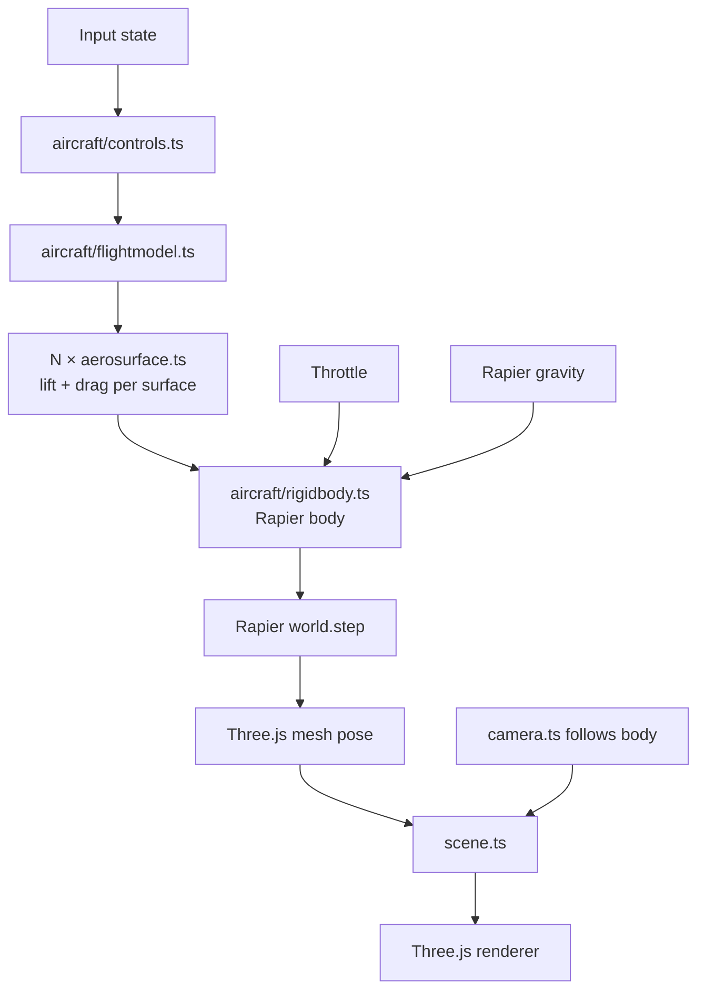

# Architecture

**Phase:** Phase 1 — Flight PoC. Architecture targets Phase 1 explicitly; decisions are chosen to not foreclose Phase 2 (missions) or Phase 3 (polish/ship), but Phase 2-specific systems (mission framework, AI, weapons) are only sketched, not designed.

## Tech Stack

- **Language: TypeScript** (strict mode) — per research. Aircraft physics math benefits from type safety; Three.js + Rapier both ship strong TS types.
- **Framework: none (vanilla Three.js)** — per research. We have minimal DOM UI. A render loop + ECS-lite module layout is simpler than a framework.
- **Rendering: Three.js** (latest stable, r170+) — per research.
- **Physics: Rapier3D** (`@dimforge/rapier3d-compat` for easy bundling; swap to `rapier3d-simd` in Phase 3 if perf needs it) — per research.
- **Build tool: Vite** (TypeScript template) — per research.
- **Dev UI: lil-gui** behind `?debug=true` — per research.
- **Perf: Stats.js** — FPS counter enabled from day one to catch regressions.
- **Database: none** — v1 is stateless. No persistence, no accounts.
- **Infrastructure: static hosting** (Vercel / Netlify / Cloudflare Pages — decide at deploy time; all are equivalent for a static build). No backend in v1.

## System Design

### Module layout

```
src/
  main.ts              # entry: bootstraps engine, starts loop
  engine/
    loop.ts            # fixed-timestep physics + variable-framerate render
    input.ts           # keyboard + mouse state, rebindable map
    assets.ts          # Three.js GLTF / texture loader wrapper
    debug.ts           # lil-gui + Stats.js, gated by ?debug=true
  world/
    scene.ts           # Three.js scene root, lighting, skybox
    terrain.ts         # Phase 1: flat textured plane + landmarks. Phase 3: swap in heightmap.
    camera.ts          # chase + cockpit cameras, swap via key
  aircraft/
    rigidbody.ts       # Rapier rigid body + Three.js mesh binding
    aerosurface.ts     # single lift/drag surface — computes force from local airflow
    flightmodel.ts     # composes aerosurfaces into an aircraft, applies to rigidbody
    controls.ts        # maps input state → control surface deflections
  mission/             # Phase 2 — stub in Phase 1, empty dir
  hud/                 # Phase 2 — stub in Phase 1, empty dir
  index.html
public/
  models/              # GLTF aircraft, textures
  config/
    aircraft.json      # tunable flight model constants (lift, drag, mass, thrust)
```

### Runtime structure



### Game loop

Fixed-timestep physics (60 Hz), variable-timestep render with interpolation:

1. **Input poll** — read keyboard + mouse, update input state.
2. **Controls** — map input → control deflections (elevator, aileron, rudder, throttle).
3. **Flight model** — for each aerosurface: compute local airflow velocity in surface frame, compute angle of attack, look up piecewise-linear CL/CD, produce force + application point.
4. **Apply forces** — sum aerosurface forces + thrust + gravity on the Rapier rigid body.
5. **Physics step** — `world.step()` at fixed dt = 1/60s. Accumulator pattern: run N steps per render frame if behind, skip if ahead.
6. **Sync mesh** — copy Rapier body pose to Three.js mesh transform.
7. **Camera** — chase camera lerps toward target pose; cockpit camera rigidly follows.
8. **Render** — Three.js renderer draws scene.

Separating physics tick from render tick is the standard game-loop pattern ("Fix Your Timestep!" / Glenn Fiedler) and is required for stable aircraft dynamics — Rapier produces wrong results at variable dt.

### Data flow

- **Config** (`public/config/aircraft.json`) → loaded once at boot → flight-model constants.
- **Input** → controls (per-frame) → flight model → rigid body (per physics tick).
- **Rapier world** → body pose (per physics tick) → Three.js mesh (per render frame).
- **No network I/O.** No persistence. Everything in memory.

## Key Decisions

- **D1 — Fixed-timestep physics.** Non-negotiable for flight dynamics. Variable timestep makes aerodynamic integration unstable (stalls oscillate, control response feels laggy on frame drops). Accumulator pattern decouples physics from render framerate.
- **D2 — Aerosurface as first-class primitive.** Every lift-producing part of the aircraft (main wing L, main wing R, horizontal stabilizer, vertical stabilizer, optional control surfaces) is an `AeroSurface` instance with its own position, orientation, area, and CL/CD curves. The flight model is a composition, not a monolith. Rationale: matches Khan & Nahon 2015 model from research; per-surface gives correct-feeling dynamics (banking-to-turn, stall, adverse yaw) automatically without hand-coded rules.
- **D3 — Flight model constants in JSON, not code.** Enables hot-tuning via lil-gui + "Export preset" button that writes back to the config shape. Addresses R2 (flight-feel tuning is iterative) from research. The biggest feel risk is tuning, so we architect for fast iteration.
- **D4 — Flat terrain in Phase 1.** Resolves R3 from research. Phase 1 scope is "plane flies plausibly," not "beautiful world." Flat textured plane + skybox + 2–3 placed landmarks (e.g. a runway, a tower) gives enough spatial reference for flying. Phase 3 polish can swap `terrain.ts` for a heightmap without changing anything else (well-defined interface: provide height-at-xz, provide a Three.js mesh, provide a Rapier collider).
- **D5 — Empty `mission/` and `hud/` dirs in Phase 1.** Explicit Phase 2 stubs. The module layout is intentionally chosen so Phase 2 work is additive — the flight model doesn't need to know about missions, the mission system reads read-only aircraft state.
- **D6 — No ECS.** Single aircraft, flat terrain, no AI in Phase 1. A full ECS (BitECS, miniplex) is overkill. Revisit at Phase 2 if multiple entities (AI enemies, waypoint markers, projectiles) push us past ~5 dynamic things. Swapping in miniplex later is well-scoped — it operates on plain objects.
- **D7 — Three.js + Rapier coordinate alignment.** Both libraries use right-handed Y-up coordinates by default — no transform needed at the sync boundary. One less bug class. Document this in a short `CONVENTIONS.md` when Phase 1 starts so nobody re-derives it.
- **D8 — No framework (React/R3F).** Per research. Revisit if mission-select / HUD grows beyond basic DOM overlays.
- **D9 — Static deploy, backend-less.** Whole game runs client-side. Simplifies infra, aligns with "no-install" vision principle (also: zero server cost).
- **D10 — Per-surface incidence (β1) is the trim mechanism.** Each `AeroSurface` carries an optional `incidenceRad` (default 0) representing the surface's fixed mount angle relative to the fuselage longitudinal axis. At zero body pitch, a wing with `incidenceRad = +2°` sees +2° AoA (positive lift); an h-stab with `incidenceRad = -1°` sees -1° AoA (small downward force behind CG, nose-up moment). This is the textbook airframe-level trim mechanism in real aircraft, and is the schema extension required to make the Phase 1 airframe expressible as a level-trim equilibrium. Rationale + sub-option comparison: see archived Revision 2026-05-11.
- **D11 — Missions are declarative JSON + optional script hook.** Each mission is a JSON file conforming to a `Mission` schema (objectives, win/fail conditions, spawn). Combat (WP16) registers a `scriptHook` for AI enemy behavior; the other three mission types (free flight, waypoint, takeoff/landing) are declarative-pure. Rationale + alternatives: see archived Revision 2026-05-12.
- **D12 — HUD is a DOM overlay.** CSS-absolute `<div>` layered over the canvas, with waypoint arrows positioned via `THREE.Vector3.project()`. Three.js ortho camera is rejected for v1 (no shader-based HUD elements planned). The `HUD` interface is the Phase 3 swap point. Rationale: see archived Revision 2026-05-12.
- **D13 — Per-surface AoA-rate damping (`clAlphaDot`, β5) is the phugoid-mode mechanism.** Each `AeroSurface` carries an optional `clAlphaDot` (default 0) that augments CL by `clAlphaDot · dα/dt`. Damps the phugoid mode (long-period coupled airspeed/AoA oscillation) that SURFACE-2026-05-11-04 logged. Default-zero ships in WP10.5; tuning is Phase 2 per-mission. Rationale + verification: see archived Revision 2026-05-12.
- **D14 — Headless physics harness + automated parameter search is the tuning methodology.** Physics mechanism tuning (β5 first; future βN extensions next) runs against a Node-side headless harness that steps the shipped Rapier physics + flight model at many multiples of wall-clock, scored against an envelope-probing fitness function, driven by a gradient-free optimizer (Nelder-Mead start; CMA-ES fallback). Replaces the manual `build → verify-self → guess` loop for any WP that adjusts `aircraft.json` physics constants. A harness↔browser parity test guards against drift. Rationale + cascade: see archived Revision 2026-05-12 (afternoon).

## Unknowns / deferred to Phase 2 arch pass

- **Mission framework shape** — declarative config? scripted? state-machine? Deferred; Phase 1 proves flight and answers "what does the aircraft expose?" which constrains the mission API.
- **AI enemy architecture** — behavior tree? hand-coded state machine? Deferred. Dependent on mission framework decision.
- **Damage model** — hitpoints? component damage? Deferred.
- **HUD framework** — DOM overlays vs Three.js orthographic layer. Deferred to Phase 2 — depends on what information the HUD needs to render (primarily numeric/iconic → DOM; mixed-world elements like waypoint arrows → Three.js).

These are explicitly Phase 2 concerns. The Phase 1 architecture does not pre-commit to any of them.

## Phase 2 / 3 forward-compat notes

- **Multiple aircraft:** `flightmodel.ts` already takes an aircraft config; multiple instances is just multiple bodies. Rapier handles N dynamic bodies cleanly.
- **Terrain swap:** `terrain.ts` interface (`getHeight(x, z): number`, `getMesh(): Three.Mesh`, `getCollider(): Rapier.Collider`) is chosen so a heightmap implementation is a drop-in.
- **Networking (explicit out-of-scope):** Not forward-compat with v1. Multiplayer would require rewriting physics authority, inputs, and sync. Not a goal.

## Revision history (archived)

The D10-D27 cascade — all architect-cycle decisions from Phase 1→Phase 2 boundary through cascade-end — is archived verbatim at [`archive/phase-2-physics-cascade/arch-cycle-D10-D27.md`](archive/phase-2-physics-cascade/arch-cycle-D10-D27.md). One-line summaries below:

- **Revision 2026-05-11 — D10 per-surface incidence (trim-spawn schema extension).** Resolves the static-margin gap surfaced by `arch-handoff-trim-spawn.md`. Schema extension to `AeroSurface` adding optional `incidenceRad`. Shipped at WP6.5.
- **Revision 2026-05-12 — Phase 2 arch (D11/D12/D13).** D11 mission framework (declarative JSON + optional script hook). D12 HUD as DOM overlay. D13 β5 (`clAlphaDot`) AoA-rate damping for phugoid mode. Shipped at WP10/WP10.5/WP11/WP12.
- **Revision 2026-05-12 (afternoon) — D14: physics tuning harness + automated parameter search.** Headless Node-side harness running Rapier; Nelder-Mead optimizer; harness↔browser parity test. Codified as CLAUDE.md Rule #3. Shipped at WP14.6/14.7/14.8.
- **Revision 2026-05-16 — D15 + D16: numerical-integration fixes for β4 and β5.** D15 implicit-Euler integration for β4 pitch-rate damping (REFUTED at verify-self, superseded by D17). D16 non-dimensional form for β5 AoA-rate damping (shipped at WP14.10).
- **Revision 2026-05-17 — D17: β4 non-dimensional pitch-rate damping.** Textbook non-dim form `cl += clQ · ω_along_dampAxis · c̄ / (2·max(V, V_REF))`. Supersedes D15. Shipped at WP14.9b.
- **Revision 2026-05-23 — D18: drag polar revision.** Per-surface optional `inducedDragK?` (CL² induced drag) + top-level optional `fuselageDrag?: {cd0, area}` (body parasitic drag at body origin). Shipped at WP14.11.5.
- **Revision 2026-05-24 — D19: widen D18 drag-polar bounds + re-tune.** Optimizer bound-pressure signal (k_wing 86%, area 79%); 3× upper bounds. WP14.13 ESCALATED Branch B.
- **Revision 2026-05-24 (PM) — D20: re-tune under `--link` constraint with further-widened bounds.** Symmetric-mirror constraint + 2× further widening. WP14.14 ESCALATED — further widening REGRESSED.
- **Revision 2026-05-24 (evening) — D21: score-function revision (criterion 0 level-flight + per-regime target-AS recalibration).** Adds physical-quantity-derived envelope targets. WP14.14b DONE; WP14.15 ESCALATED Branch B.
- **Revision 2026-05-24 (late evening) — D22: narrow drag-knob bounds to physical-realism range.** Reframes optimizer's bound-pressure signal as score-function gaming. WP14.16 ESCALATED with first all-3-regime criterion-0 PASS.
- **Revision 2026-05-24 (night) — D23: per-regime throttle-mode reframe + T=D regime guard.** `low=controlled-descent / mid=slow-flight / high=level-cruise`. WP14.17/WP14.18 superseded by integrator fix at `46f9b42`.
- **Revision 2026-05-25 — D24: cascade walk-back post-integrator-fix + initial-condition recalibration.** `fix-resetforces-bug` (commit `46f9b42`) cleared Rapier per-tick force accumulator; deployed score collapsed -2.999e9 → -26,306 (114,000× improvement); 13-SURFACE cascade walked back. Adds CLAUDE.md Rule #7 (per-tick energy-budget sanity check on integrator) + Rule #9 (initial-condition-equilibrium-consistency).
- **Revision 2026-05-25 (afternoon) — D25: spawn-AS uniformization to L=W trim AS.** Corrects D24's per-throttle-T=D derivation; L=W trim AS is throttle-invariant at 78 m/s for this airframe. Amends CLAUDE.md Rule #9.
- **Revision 2026-05-25 (late afternoon) — D26: per-regime `ALT_ENVELOPE`.** Per-throttle alt behavior is legitimately regime-dependent (T>>D climbs, T<<D descends); per-regime envelope reflects natural physics. Tooling-only change to `tools/tune/score.ts`.
- **Revision 2026-05-25 (evening) — D27: mission JSON spawn AS recalibration to V_trim.** Recency-bias close-out for the player-facing surface; all 5 mission JSONs updated from `linvel.z: -30` to `linvel.z: -78` per Rule #9 (extended scope from score-function fixtures to all spawn-into-level-flight initial conditions). Cascade end on Branch B-accept at WP14.19 (ship commit `eafc91e`).
